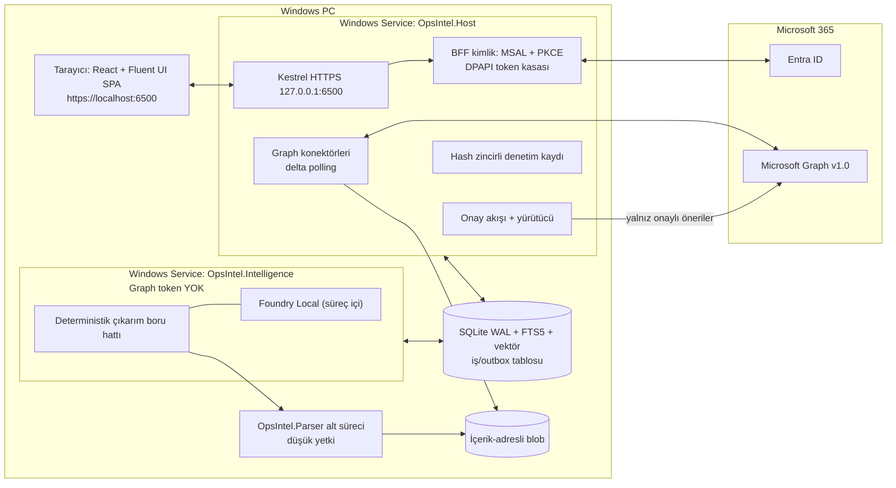

# OpsIntel

**OpsIntel**, Microsoft 365 kiracısındaki e-posta, SharePoint/OneDrive belgeleri ve takvim verisinden kurumun operasyonel kaydını çıkaran, **Windows'a yerel olarak kurulan** bir "kurumsal operasyon zekâsı" web uygulaması ve posta ajanıdır. Kararları, riskleri, açık soruları, taahhütleri, talepleri, proje aşamalarını ve olay akışlarını **kaynağa bağlı alıntı kanıtıyla** birinci sınıf kayıtlar olarak tutar. Her dışa dönük aksiyonu (yanıt taslağı, görev, takvim kaydı) yalnızca kullanıcı onayından sonra yürütür ve her adımı denetim kaydına yazar. Konumlandırma cümlesi: **"Şirketin operasyonel hafızası, kendi makinenizde."**

> **Durum: Faz 0 iskeleti — Kod eklendi (5–23 Ekim 2026).**
> Bu depo araştırma raporunu, mimari karar kayıtlarını (ADR), yol haritasını, uyum/işletim dokümanlarını ve Faz 0 keşif döneminde oluşturulan walking skeleton kodunu içerir. Skeleton spike'lar validasyondadır; kod üretim hazırlığında değildir.

## Temel kısıtlar

| Kısıt | Açıklama |
|---|---|
| Yerel Windows kurulumu | Windows 11 23H2+ ve Windows Server 2022/2025 desteklenir; Windows 10 22H2 en iyi çaba ([ADR-0024](docs/adr/0024-os-support-matrix.md)) |
| Windows Services | İki servis: `OpsIntel.Host` ve `OpsIntel.Intelligence`, ayrıca düşük yetkili `OpsIntel.Parser` alt süreci ([ADR-0001](docs/adr/0001-modular-monolith-two-services.md)) |
| Yerel HTTPS arayüz | `https://localhost:6500` — yalnızca `127.0.0.1` / `::1` üzerinde dinler ([ADR-0003](docs/adr/0003-kestrel-loopback-https-6500.md)) |
| Tek MSI | `OpsIntel-x64.msi` tek başına kurar; dış ön gereksinim yoktur. Opsiyonel Burn `OpsIntelSetup.exe` yalnızca isteğe bağlı parçalar içindir ([ADR-0005](docs/adr/0005-single-msi-wix-v7.md)) |
| Yerel önce, KVKK | Varsayılan LLM süreç içi Foundry Local'dır; bulut katmanı SS-2 imzalanıp bildirilmeden açılamaz ([ADR-0014](docs/adr/0014-foundry-local-model-hosting.md), [KVKK](docs/compliance/kvkk/README.md)) |
| Gönderme yetkisi yok | Microsoft Graph erişimi yalnızca delegated; `Mail.Send` hiçbir fazda istenmez ([ADR-0008](docs/adr/0008-delegated-graph-no-mail-send.md)) |

## Mimari özet

.NET 10 LTS ile yazılmış, tek depodan üretilen bir **modüler monolit** iki Windows servisi olarak çalışır. Host servisi arayüzü, API'yi, kimliği, Graph bağlantısını, onay akışını ve denetim kaydını taşır. Intelligence servisi yapay zekâ işlemesini yapar ve **hiçbir Graph token'ı tutmaz**. Veri SQLite (WAL, FTS5, vektör indeksi) ve içerik-adresli blob dosyalarında durur. Değişiklikler delta sorgusuyla yoklanır; webhook veya genel erişime açık uç nokta yoktur. Ayrıntı: [docs/architecture/overview.md](docs/architecture/overview.md).



## Doküman haritası

| Alan | Doküman | İçerik |
|---|---|---|
| Dizin | [docs/README.md](docs/README.md) | Tüm dokümanların dizini |
| Araştırma | [docs/research/README.md](docs/research/README.md) | Araştırma raporu ve not dosyalarının açıklaması |
| Mimari | [overview.md](docs/architecture/overview.md) | Mimari karar özeti, süreç topolojisi, bileşenler, katman seçimleri |
| Mimari | [c4-context.md](docs/architecture/c4-context.md) | C4 bağlam diyagramı |
| Mimari | [c4-container.md](docs/architecture/c4-container.md) | C4 konteyner diyagramı |
| Mimari | [data-model.md](docs/architecture/data-model.md) | Kanıt zinciri veri modeli, ER diyagramı |
| Mimari | [threat-model.md](docs/architecture/threat-model.md) | Yapay zekâ ve yerel uç nokta tehditleri, kontroller |
| Mimari | [m365-integration.md](docs/architecture/m365-integration.md) | Kimlik, izinler, delta, throttling, yazma kuralları |
| Kararlar | [docs/adr/README.md](docs/adr/README.md) | ADR 0001–0025 dizini ve şablon |
| Yol haritası | [roadmap.md](docs/roadmap/roadmap.md) | Fazlar, takvim, ekip, Faz 0 spike'ları, sprintler |
| Yol haritası | [mvp-scope.md](docs/roadmap/mvp-scope.md) | MVP kapsam içi / dışı |
| Yol haritası | [quality-targets.md](docs/roadmap/quality-targets.md) | Pilot kabul kalite hedefleri |
| Yol haritası | [risk-register.md](docs/roadmap/risk-register.md) | Risk kaydı |
| Uyum | [kvkk/README.md](docs/compliance/kvkk/README.md) | KVKK çerçevesi ve gerekli belgeler |
| Uyum | [ai-act-kapsam.md](docs/compliance/ai-act-kapsam.md) | AB AI Act Annex III 4(b) kapsam dışı tasarım gerekçesi |
| İşletim | [installation.md](docs/operations/installation.md) | MSI'ın yaptıkları, sertifika, sessiz kurulum, imzalama |
| İşletim | [intune.md](docs/operations/intune.md) | Intune Win32/LOB dağıtımı |
| İşletim | [troubleshooting.md](docs/operations/troubleshooting.md) | Sorun giderme (taslak) |
| Ürün | [features.md](docs/product/features.md) | Özellik kataloğu |
| Ürün | [competitive-analysis.md](docs/product/competitive-analysis.md) | Rakip analizi ve ayrışma |
| Ürün | [additional-developments.md](docs/product/additional-developments.md) | Ek geliştirme önerileri (değer/fizibilite) |
| Ürün | [personas.md](docs/product/personas.md) | Kullanıcı personaları |
| Süreç | [CONTRIBUTING.md](CONTRIBUTING.md) · [SECURITY.md](SECURITY.md) · [CHANGELOG.md](CHANGELOG.md) | Katkı, güvenlik bildirimi, değişiklik günlüğü |

## Planlanan depo yapısı

İşaretler: **[mevcut]** bu depoda şu an var; **[Faz 0]** Faz 0'da oluşturulacak; **[sonra]** ilgili sprintte eklenecek. Kaynak: [rapor §5](docs/research/rapor-m365-operasyon-zekasi-platform-plani.md).

```text
opsintel/
├─ .github/
│  ├─ ISSUE_TEMPLATE/ PULL_REQUEST_TEMPLATE.md       [mevcut]
│  ├─ workflows/ (ci, installer, eval, codeql, release) [mevcut]
│  └─ CODEOWNERS  dependabot.yml                      [mevcut]
├─ docs/
│  ├─ adr/  architecture/  compliance/  operations/   [mevcut]
│  ├─ product/  roadmap/  research/                   [mevcut]
│  └─ api/ (üretilmiş openapi.json)                   [sonra]
├─ src/          README.md [mevcut]; projeler         [mevcut]
├─ installer/    README.md [mevcut]; WiX projeleri    [mevcut]
├─ tests/        README.md [mevcut]; test projeleri   [mevcut]
├─ prompts/      README.md [mevcut]; şablonlar         [S5]
├─ models/       README.md [mevcut]; model-manifest.json [mevcut]
├─ tools/        README.md [mevcut]; betikler         [mevcut]
├─ global.json  Directory.Build.props  Directory.Packages.props  OpsIntel.slnx [mevcut]
├─ .editorconfig  .gitignore                          [mevcut]
└─ README.md  SECURITY.md  CONTRIBUTING.md  CHANGELOG.md [mevcut]
   THIRD-PARTY-NOTICES.md  LICENSE                    [sonra; lisans henüz belirlenmedi]
```

### Planlanan CI iş akışları

Henüz derlenecek kod olmadığı için `.github/workflows/` altında YAML dosyası yoktur. Faz 0'da şu iş akışları eklenecektir (rapor §5):

| İş akışı | Amaç |
|---|---|
| `ci.yml` | Derleme, birim/entegrasyon testleri, web lint/test, mimari testleri |
| `installer.yml` | publish → imzalama → WiX MSI/bundle → Pester kurulum matrisi |
| `eval.yml` | Altın set + kırmızı takım korpusu; gizli veri nedeniyle self-hosted runner'da |
| `codeql.yml` | SAST; dependabot ve SBOM |
| `release.yml` | Etiket → imzalı MSI/EXE, winget manifesti, `.intunewin` |

## Yol haritası özeti

| Faz | Hafta | Tarih | Çıkış kapısı |
|---|---|---|---|
| 0 – Keşif | H1–H3 | 5–23 Eki 2026 | 5 spike için git/gitme ADR'leri |
| 1 – MVP | H4–H20 (8 sprint) | 26 Eki 2026 – 19 Şub 2027 | `1.0.0-pilot` imzalı MSI |
| Pilot | H21–H24 | 22 Şub – 19 Mar 2027 | Kalite hedefleri karşılanır, Faz 2 kararı |
| 2 – Kurumsal genişleme | H25–H38 (7 sprint) | 22 Mar – 25 Haz 2027 | 1.1 GA |
| 3 – İş zekâsı ve ekosistem | H39–H54 (8 sprint) | Tem – Eki 2027 | 1.2/2.0; AI Act değerlendirmesi 2 Ara 2027'den önce |
| 4 – Ekip/sunucu sürümü (öneri) | 2028 | — | — |

Ayrıntı: [docs/roadmap/roadmap.md](docs/roadmap/roadmap.md).

## Sonraki adımlar: Faz 0 spike'ları (5–23 Ekim 2026)

| Spike | Soru | Başarısızlık durumunda |
|---|---|---|
| A | WiX v7 walking skeleton: 2 servis + sertifika + `/health` çalışıyor mu? | [ADR-0004](docs/adr/0004-https-certificate-strategy.md) / [ADR-0005](docs/adr/0005-single-msi-wix-v7.md) revize edilir |
| B | Servis tarafı public client PKCE + DPAPI cache + CAE claims challenge, uyumlu cihaz ve Token Protection (report-only) altında çalışıyor mu? | Tray/WAM yardımcısı MVP'ye çekilir ([ADR-0007](docs/adr/0007-delegated-auth-bff-pkce.md)) |
| C | Foundry Local `NT SERVICE` hesabıyla servis içinde çalışıyor mu; VC++ bağımlılığı var mı? | Ollama standalone + WinSW'ye geçilir ([ADR-0014](docs/adr/0014-foundry-local-model-hosting.md)) |
| D | `vec0.dll` LoadExtension + SQLite3MC şifrelemesi birlikte çalışıyor mu? | [ADR-0010](docs/adr/0010-sqlite-fts5-vector-blob-storage.md) / [ADR-0011](docs/adr/0011-encryption-at-rest.md) revize edilir |
| E | Türkçe çıkarım ön ölçümü (50 başlık; Qwen3.5-9B / Gemma 4 12B / Qwen3-30B-A3B / bulut modeli) | CPU'lu makineler için katman politikası belirlenir |

Ek Faz 0 işleri: Entra uygulama kaydı, depo ve CI iskeleti, ADR 0001–0012'nin kesinleştirilmesi, KVKK iş paketinin başlatılması, altın set için rıza ve maskeleme prosedürü.

## Hızlı başlangıç

Faz 0 skeleton'u derlemek ve test etmek için:

```bash
# .NET projeleri, birim/entegrasyon/mimari testleri derle ve çalıştır
dotnet build OpsIntel.slnx
dotnet test OpsIntel.slnx

# React web SPA'yı çalıştır
cd src/web
pnpm install
pnpm dev

# Değerlendirme/sentetik testleri çalıştır (Linux/macOS)
cd tests/eval
python3 run_eval.py --predictions baseline_predictions.json

# Windows'ta MSI'yı derle ve imzala
pwsh tools/build.ps1   # veya ./tools/sign.ps1
```

**Not:** Skeleton henüz MSI kurulum testleri, NT SERVICE hesapları, Foundry Local servis modu, gerçek Entra tenant'ı ve real Outlook veri erişimi gerektirmez. Bkz. [CONTRIBUTING.md](CONTRIBUTING.md).

## Katkı ve güvenlik

- Katkı süreci, dal/PR/ADR kuralları: [CONTRIBUTING.md](CONTRIBUTING.md)
- Güvenlik açığı bildirimi: [SECURITY.md](SECURITY.md)
- **Gerçek e-posta verisi, müşteri verisi veya kişisel veri bu depoya asla konmaz.**
