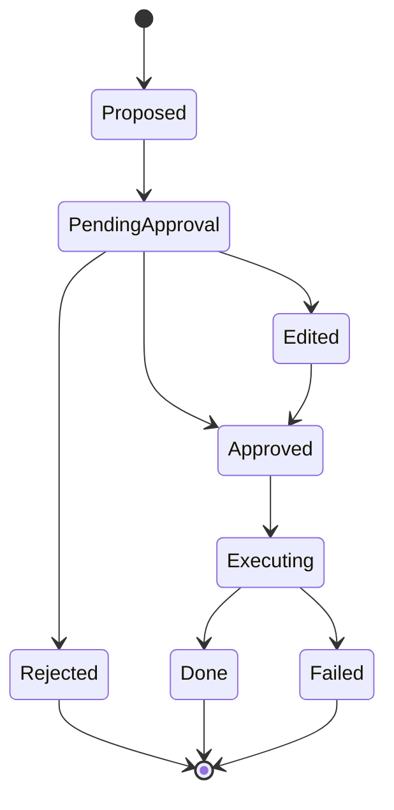

# ADR-0017: Onay iş akışı kendi durum makinemizde; MAF checkpoint'leri kaynak-gerçek değil

- **Durum:** Kabul edildi
- **Tarih:** 2026-09-27
- **Karar vericiler:** Teknik lider, güvenlik mühendisi
- **İlgili ADR'ler:** [0008](0008-delegated-graph-no-mail-send.md), [0012](0012-db-job-outbox-quartz.md), [0013](0013-microsoft-extensions-ai-maf.md), [0018](0018-hash-chained-audit-log.md)

## Bağlam

Her dışa dönük aksiyon (yanıt taslağı, görev, takvim kaydı, hatırlatma, durum raporu) insan onayından geçmelidir. MAF iş akışları `RequestPort` ile HITL ve checkpoint sunar; ancak checkpoint'ler yürütücü ID'lerine ve topolojiye bağlıdır ve Microsoft'a göre checkpoint deposu "is a trust boundary … Never load checkpoints from untrusted or potentially tampered sources" ([MAF Checkpoints](https://learn.microsoft.com/en-us/agent-framework/workflows/checkpoints)).

Ajan izin araştırması, kullanıcı düzeyinde ve eylem türü başına izin politikalarını önerir ([Michael & Roesner](https://arxiv.org/abs/2607.13718)).

## Değerlendirilen alternatifler

| Seçenek | Artılar | Eksiler |
|---|---|---|
| **Kendi tablolarımızda açık durum makinesi (seçilen)** | Denetlenebilir, sürümden bağımsız, sorgulanabilir | Kendimiz yazarız |
| MAF checkpoint'lerini kaynak-gerçek yapmak | Hazır HITL | Güven sınırı, şema/ID bağımlılığı, denetim kaydı değil |
| Harici orkestratör (Temporal vb.) | Olgun | Her PC'ye sunucu ([ADR-0012](0012-db-job-outbox-quartz.md)) |

## Karar

- `ActionProposal` / `Approval` / `Execution` varlıkları kendi veritabanımızdadır. Durumlar:

- Reddetme gerekçe kodu ister ("not a task", "wrong owner", "wrong project", "duplicate", "already done"); kabul/düzenleme/ret geri alınabilir (undo).
- Onay bir yürütme işi (`Job`) tetikler. **Yürütücü, politikayı yürütme anında yeniden denetler**: yeni harici alıcı açık onay gerektirir; yapay zekâ ek iliştiremez; uç nokta izin listesi dışındaki Graph çağrıları reddedilir.
- Yürütmede Graph request-id, immutable ID ve ETag saklanır; `If-Match` ile kullanıcı düzenlemelerinin üzerine yazılmaz.
- Her durum geçişi `audit_event`'e yazılır (önce/sonra farkı + kanıt ID'leri).
- MVP'de aksiyonlar **yerel** taslaklardır (kopyala/.eml/.md dışa aktarım); M365'e yazma Faz 2 (S9–S10). Faz 2'de eylem türü başına otonomi seviyesi (0: yalnız öneri, 1: onaylı taslak, 2: bildirimli otomatik yerel eylem), çok adımlı onay ve acil durdurma anahtarı eklenir. Harici e-posta asla otomatik gönderilmez.
- MAF `RequestPort` bir ajan çalışması içinde kullanılabilir, ancak bekleyen istek kendi tablolarımızda tutulur.

## Sonuçlar

### Olumlu

- Onay durumu SQL ile sorgulanır; arayüz ve denetim tek kaynaktan beslenir.
- Framework sürüm yükseltmeleri onay geçmişini bozmaz.

### Olumsuz

- Durum makinesi ve eşzamanlılık kuralları kendi test yükümüzdür.

## Doğrulama / açık noktalar

- S7 kabul kriteri: her onay kaydında önce/sonra farkı ve kanıt ID'leri var.
- Faz 2: uç nokta izin listesi sözleşme testleri (`/send`, `/reply`, `/forward`, katılımcılı etkinlik engellenir).

## Kaynaklar

- [Araştırma raporu §1 — Arka plan işleme; §3 — varlık tablosu](../research/rapor-m365-operasyon-zekasi-platform-plani.md)
- [Teknoloji yığını notları §5](../research/notes/teknoloji_yigini.md), [Graph notları §8](../research/notes/graph_entegrasyonu.md), [Özellikler/UX notları §5](../research/notes/ozellikler_ux.md)
