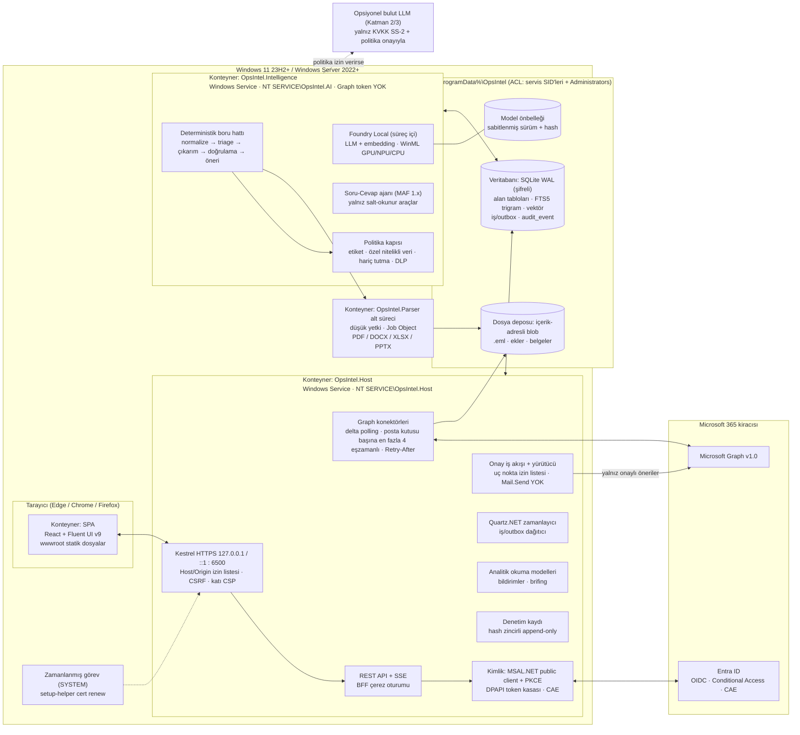

# C4 Konteyner Diyagramı (Seviye 2)

*Kaynak: [araştırma raporu §1](../research/rapor-m365-operasyon-zekasi-platform-plani.md) mimari diyagramı ve bileşen listesi. Bir üst seviye: [c4-context.md](c4-context.md).*

## Konteyner sorumlulukları

| Konteyner | Hesap | Tuttuğu sırlar | Güven düzeyi |
|---|---|---|---|
| SPA | Kullanıcının tarayıcısı | Yalnızca oturum çerezi (`HttpOnly`) | Güvenilir kod, güvenilmeyen içerik gösterir |
| `OpsIntel.Host` | `NT SERVICE\OpsIntel.Host` | Graph refresh token (DPAPI), sertifika özel anahtarı | Yetkili süreç; model çıktısını talimat olarak işlemez |
| `OpsIntel.Intelligence` | `NT SERVICE\OpsIntel.AI` | Graph token yok; bulut katmanı açıksa sağlayıcı kimliği | Güvenilmeyen içeriği okur; araçsız çıkarım |
| `OpsIntel.Parser` | Düşük yetkili alt süreç, Job Object | Yok | Güvenilmeyen girdiyi ayrıştırır; çökebilir |
| SetupHelper / zamanlanmış görev | SYSTEM (yalnızca kurulum ve sertifika yenileme) | Yok (sertifika deposuna yazar) | İmzalı yardımcı |

## Süreçler arası iletişim

| Kanal | Kullanım | Durum |
|---|---|---|
| SQLite iş/outbox tablosu | Kalıcı iş devri (Host ↔ Intelligence) | Karar: [ADR-0012](../adr/0012-db-job-outbox-quartz.md) |
| Named pipe (servis SID ACL'li) | Düşük gecikmeli uyandırma; Faz 2'de tray yardımcısından token köprüsü | Faz 0'da doğrulanacak |
| Alt süreç stdin/stdout veya yerel kanal | Intelligence → Parser | Ayrıntı Faz 0'da belirlenecek (kaynaklarda tanımlı değil) |

İlgili: [overview.md](overview.md), [threat-model.md](threat-model.md), [ADR-0001](../adr/0001-modular-monolith-two-services.md).
