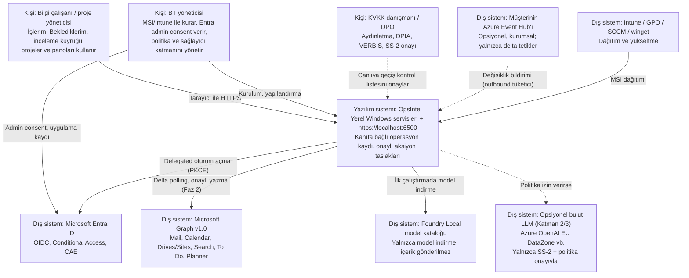

# C4 Bağlam Diyagramı (Seviye 1)

*Kaynak: [araştırma raporu §1 ve §4](../research/rapor-m365-operasyon-zekasi-platform-plani.md). Diyagram GitHub uyumluluğu için Mermaid `flowchart` ile C4 tarzında çizilmiştir.*

Bu diyagram OpsIntel'i tek bir sistem kutusu olarak ve onunla etkileşen kişileri/dış sistemleri gösterir.

## Sınırlar ve güven notları

| Etkileşim | Not |
|---|---|
| Kullanıcı → OpsIntel | Yalnızca loopback; LAN modu Faz 2'de ve kurumsal PKI ile ([ADR-0003](../adr/0003-kestrel-loopback-https-6500.md)) |
| OpsIntel → Graph | Yalnızca delegated; `Mail.Send` hiçbir fazda yok ([ADR-0008](../adr/0008-delegated-graph-no-mail-send.md)) |
| OpsIntel → bulut LLM | Varsayılan kapalı; SS-2 imzalanıp bildirilmeden açılamaz ([KVKK](../compliance/kvkk/README.md)) |
| Event Hub → OpsIntel | Genel URL gerekmez; bildirim içeriğine güvenilmez, yalnızca delta turu tetiklenir ([ADR-0009](../adr/0009-delta-polling-change-detection.md)) |
| Model kataloğu | Model indirme kişisel veri aktarımı değildir; tanı paylaşımı politikayla kapatılır ([güvenlik notları §8](../research/notes/guvenlik_uyum.md)) |

Bir alt seviye için bkz. [c4-container.md](c4-container.md).
