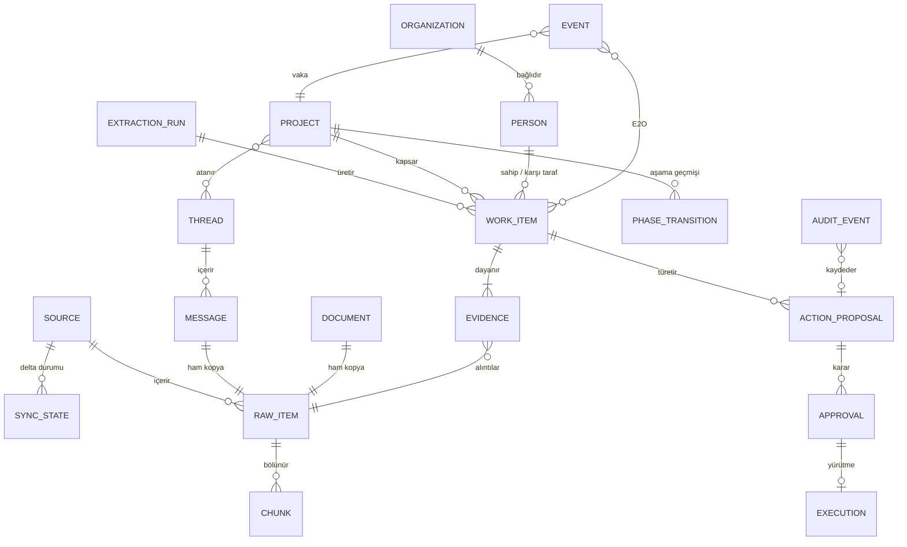
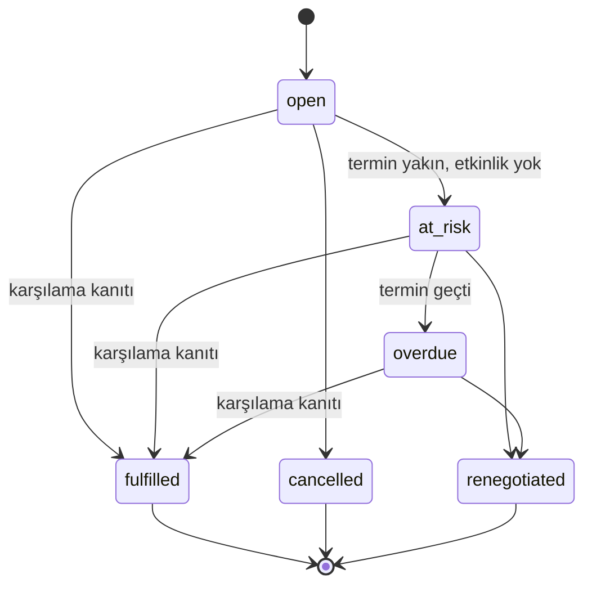

# Veri Modeli: Kanıt Zinciri

*Kaynak: [araştırma raporu §3](../research/rapor-m365-operasyon-zekasi-platform-plani.md), [özellikler ve UX notları §1–§3](../research/notes/ozellikler_ux.md), [teknoloji yığını notları §1 ve §6](../research/notes/teknoloji_yigini.md). Alan listeleri taslaktır; kesin şema S1–S6 sprintlerinde EF Core geçişleriyle belirlenecektir.*

## İlke

Çıkarılan her şey, bir **kanıt çapasına** bağlı birinci sınıf bir nesnedir; serbest metin olarak saklanmaz. Model üç standarttan beslenir:

| Standart | Kullanım |
|---|---|
| **W3C Web Annotation** — `TextQuoteSelector` (tam alıntı + önek/sonek) ve `TextPositionSelector` (karakter ofsetleri) | İçerik yeniden işlendiğinde bile vurgulanabilir, derin bağlantılı alıntılar ([W3C](https://www.w3.org/TR/annotation-model/)) |
| **OCEL 2.0** — nitelikli olay-nesne (E2O) ve nesne-nesne (O2O) ilişkileri | Tek bir e-postanın aynı anda projeye, sözleşmeye, müşteriye ve birkaç taahhüde dokunması ([arXiv 2403.01975](https://arxiv.org/abs/2403.01975)) |
| **ADR tarzı karar kayıtları** | Kabul edilmiş karar değişmez; değişen karar yeni kayıtla eskisinin yerini alır ([Nygard şablonu](https://github.com/joelparkerhenderson/architecture-decision-record/blob/main/locales/en/templates/decision-record-template-by-michael-nygard/index.md)) |

Microsoft'un Viva Briefing görev taksonomisi (Commitment, Request, Follow-up) "İşlerim" ve "Beklediklerim" görünümlerine birebir eşlenir ([Viva Briefing](https://learn.microsoft.com/en-us/viva/insights/personal/Briefing/be-overview)).

## ER diyagramı

## Varlık tablosu

| Varlık | Temel alanlar (taslak) | Not |
|---|---|---|
| `Source` / `SyncState` | kaynak türü (mail klasörü, drive, takvim penceresi), container_id, `delta_link` (opak URL), last_success_utc, last_full_sync_utc, error_count | 410 Gone veya `syncStateNotFound` alınırsa tam yeniden senkronizasyon ve silme uzlaştırması ([Delta query](https://learn.microsoft.com/en-us/graph/delta-query-overview)) |
| `RawItem` | graph_id (immutable), internetMessageId, conversationId, conversationIndex, In-Reply-To/References, change_key, content_sha256, blob_path, sensitivity_label, has_protection, policy_state | `conversationId` bazen değişebilir; başlık zinciriyle birleştirilir |
| `Message` / `Thread` / `Document` | temiz metin (`uniqueBody` + TR/EN soyucu), ham↔temiz ofset haritası, dil, yazar, zaman | `uniqueBody` yalnızca `$select` ile gelir |
| `Chunk` | parça ID, kaynak, karakter aralığı, FTS5 satırı, vektör (int8/float) | Kararlı ID'ler alıntı doğrulamasını ucuzlatır |
| `Evidence` | work_item_id, raw_item_id, exact_quote, prefix/suffix, char_start/end, sayfa/slayt/hücre konumu, source_timestamp, author, verified (bool), verifier | W3C seçicileriyle uyumlu |
| `WorkItem` (üst tür) | kind ∈ {task, commitment, request, follow_up, decision, risk, assumption, issue, dependency, open_question, obligation}, title, project_id, owner, counterparty, due_at, due_text ("Cuma'ya kadar"), status, confidence {High/Med/Low}, review_state {suggested, accepted, edited, rejected}, supersedes_id, extractor_version | Tek liste/kuyruk arayüzü; türe özgü alanlar ek tablolarda |
| `Commitment` ek tablosu | direction {i_owe, owed_to_me, third_party}, durum: open → at_risk → overdue → fulfilled / cancelled / renegotiated, fulfilled_evidence_id | "İşlerim" ve "Beklediklerim" kaynağı |
| `Decision` ek tablosu | rationale, decided_by, decided_at, durum {Proposed, Accepted, Superseded, Reversed}, superseded_by_id | Kabul edilmiş karar değişmez |
| `Risk` ek tablosu | olasılık 1–5, etki 1–5, maruziyet = O×E, trend, azaltım, tetikleyici, risk→issue bayrağı | RAID/RAIDD adlandırması yapılandırılabilir |
| `Project` / `PhaseTransition` | ad, takma adlar, kodlar (PO/sözleşme), müşteri org, üye listesi, yaşam döngüsü şablonu, current_phase, health {score, band, drivers[]}; geçiş: from→to, olasılık, evidence_ids, inferred / confirmed | Aşama sonlu durum makinesi; kural dışı sıçramalar reddedilir ([ADR-0016](../adr/0016-project-registry-phase-fsm.md)) |
| `Person` / `Organization` | SMTP adresleri, Entra objectId, org alan adları, tür {customer, vendor, partner, internal}, proje bazında RACI | Kişi kimliğinin temeli dizin verisidir; LLM yalnızca serbest metindeki anmaları eşler |
| `Event` (OCEL biçimli) | activity (OfferSent, POReceived, ContractSigned, KickoffHeld, UATStarted, Delivered, InvoiceSent…), timestamp, actor, E2O niteleyicileri | Zaman çizelgesi, süreç haritası, OCEL dışa aktarımı |
| `ActionProposal` / `Approval` / `Execution` | tür {reply_draft, task, calendar_hold, nudge, status_report}, payload, rationale, evidence_ids, risk_flags, policy_decision; durum: Proposed → PendingApproval → Approved / Rejected / Edited → Executing → Done / Failed; yürütmede Graph request-id, immutable ID, ETag | Yürütücü politikayı yürütme anında yeniden denetler ([ADR-0017](../adr/0017-approval-state-machine.md)) |
| `ExtractionRun` | model_id, model_hash, prompt_version, girdi kanıt ID'leri, token/süre, sağlayıcı katmanı | Tekrar üretilebilirlik ve KVKK hesap verebilirliği |
| `AuditEvent` | event_id, ts_utc, actor {user oid, service, model}, event_type, subject, payload JSON, prev_hash, hash = SHA-256(prev_hash ‖ kanonik payload) | Append-only; periyodik imzalı özet ([ADR-0018](../adr/0018-hash-chained-audit-log.md)) |
| `Job` | type, payload, idempotency_key UNIQUE, status, attempts, next_run_at, locked_by/until, last_error | Dead-letter işler arayüzde görünür ([ADR-0012](../adr/0012-db-job-outbox-quartz.md)) |
| `PolicyRule` | hariç tutulan posta kutusu/klasör/site/alan adı/konu terimi, etiket kuralları, özel nitelikli veri sınıflandırıcı eşikleri, sağlayıcı katmanı izinleri | KVKK md. 6 ve AYM ölçülülük ilkesinin teknik karşılığı |

## Durum makineleri

*Taahhüt (Commitment) durum makinesi. Geçiş koşulları rapor §3'teki durum listesine dayanır; ayrıntılı kurallar S6–S7'de belirlenecektir.*

Onay akışı durum makinesi için bkz. [ADR-0017](../adr/0017-approval-state-machine.md).

## Tasarım kuralları

1. **Saklama:** Türetilmiş kayıtlar kaynaklarından uzun yaşamaz. Delta'dan gelen `@removed` işaretleri ilgili kanıtı ve ondan türeyen öğeleri siler veya referanssız bırakır.
2. **Proje ataması** serbest kümeleme değil, kullanıcının düzenlediği **proje kayıt defterine karşı sınıflandırmadır.** Adaylar katılımcı örtüşmesi, konu kodları ve embedding kNN ile seçilir; LLM ilk 3–5 aday ile "yeni/hiçbiri" arasından seçer. Atanamayan başlıklar birikir ve periyodik kümeleme yalnızca kullanıcı onayına sunulan proje *önerileri* üretir. Taahhüt tespit modelleri alan kaymasında bozulur ([Azarbonyad vd., WSDM 2019](https://www.microsoft.com/en-us/research/publication/domain-adaptation-for-commitment-detection-in-email/)).
3. **Doğrulanamayan gösterilmez:** `Evidence.verified = false` olan öğe "gerçek" olarak gösterilmez; "needs review" durumunda kalır ([ADR-0015](../adr/0015-extraction-contract-evidence.md)).
4. **Kişi verisi:** Kişi bazlı performans veya duygu puanı alanı tutulmaz ([ADR-0023](../adr/0023-no-individual-performance-scoring.md)).
5. **Veri sahibi hakları:** Kişi bazında arama, dışa aktarma, düzeltme ve silme tüm yerel depolara (türetilmiş kayıtlar, embedding'ler, önbellekler, loglar) uygulanabilir olmalıdır ([veri sahibi talepleri](../compliance/kvkk/veri-sahibi-talepleri.md)).

## Fiziksel yerleşim

| Yol | İçerik |
|---|---|
| `%ProgramData%\OpsIntel\data\` | SQLite veritabanı (WAL, şifreli) |
| `%ProgramData%\OpsIntel\blobs\sha256\ab\cd\<hash>` | Ham `.eml`/MIME ve ekler, içerik-adresli, tekilleştirilmiş |
| `%ProgramData%\OpsIntel\models\` | Sabitlenmiş model sürümleri |
| `%ProgramData%\OpsIntel\backup\` | Şema geçişi öncesi `VACUUM INTO` yedekleri |
| `%ProgramData%\OpsIntel\{config,logs}\` | Yapılandırma, içeriksiz loglar |

Boyut kestirimi (teknoloji yığını notlarından, doğrulanmamış çıkarım): 200 bin e-posta × ~3 parça = 600 bin vektör; 1024 boyutta float32 ≈ 2,4 GB, int8 ≈ 0,6 GB.
