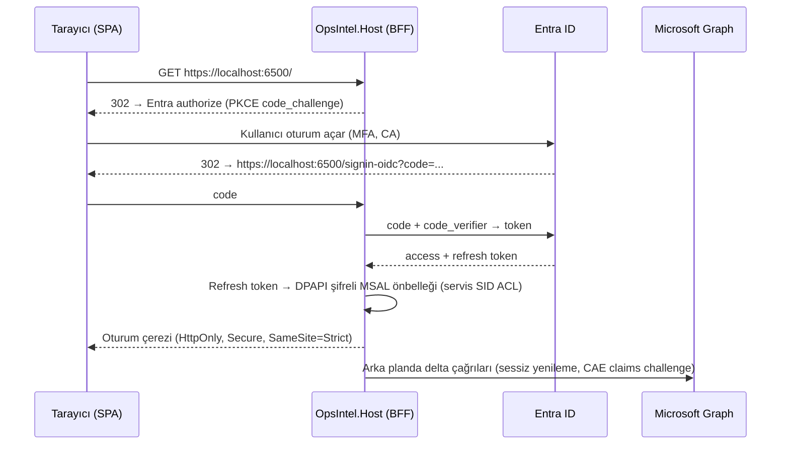

# Microsoft 365 Entegrasyonu

*Kaynak: [Graph entegrasyonu notları](../research/notes/graph_entegrasyonu.md) (kaynaklar 27 Eylül 2026'da doğrudan Microsoft Learn'den alındı), [araştırma raporu §1 ve §4](../research/rapor-m365-operasyon-zekasi-platform-plani.md). İlgili ADR'ler: [0007](../adr/0007-delegated-auth-bff-pkce.md), [0008](../adr/0008-delegated-graph-no-mail-send.md), [0009](../adr/0009-delta-polling-change-detection.md), [0025](../adr/0025-shared-content-discovery.md).*

## 1. Kimlik doğrulama

### WAM sınırı

MSAL.NET'in Windows kimlik aracısı (WAM) cihaza bağlı token, Windows Hello ve Conditional Access desteği sunar; ancak:

> "Attempting to acquire tokens using WAM while running as a Windows service, using task scheduler (unless specifically running as a logged in user) or while using runas to impersonate another account will result in errors by design." — [MSAL.NET WAM](https://learn.microsoft.com/en-us/entra/msal/dotnet/acquiring-tokens/desktop-mobile/wam)

Device code akışı Microsoft tarafından "a high-risk authentication method" olarak nitelenir ve mümkün olan her yerde engellenmesi önerilir ([CA: authentication flows](https://learn.microsoft.com/en-us/entra/identity/conditional-access/concept-authentication-flows)).

### Seçilen desen: Host'ta BFF

- Uygulama Entra'da **public client** olarak kaydedilir; PC'lere asla client secret dağıtılmaz.
- MSAL.NET'in özel web-UI genişletme noktası kod değişimi için bir yoldur; **Faz 0 spike B'de doğrulanacaktır.**
- Tarayıcı token görmez; yalnızca çerez.

### Token davranışı

| Konu | Davranış | Kaynak |
|---|---|---|
| Refresh token ömrü | Varsayılan 90 gün; her kullanımda yenilenir, eskisi iptal edilmez (güvenli silinmeli) | [Refresh tokens](https://learn.microsoft.com/en-us/entra/identity-platform/refresh-tokens) |
| CAE | CAE farkındalığı olan istemcide access token 28 saate kadar uzar; istemci "claims challenge" işleyebilmelidir; kritik olaylar ≤15 dk içinde uygulanır | [CAE](https://learn.microsoft.com/en-us/entra/identity/conditional-access/concept-continuous-access-evaluation) |
| Token Protection | Desteklenen uygulama listesi yalnızca Microsoft'un yerel uygulamalarıdır; "tüm uygulamalar" için zorlayan kiracılarda servis tarafı token engellenebilir | [Token Protection – Windows](https://learn.microsoft.com/en-us/entra/identity/conditional-access/deployment-guide-token-protection-windows) |
| Yönlendirme URI | localhost için port eşleştirmede yok sayılır; diğer host adlarında port birebir eşleşmeli (LAN modunda her makine adı ayrı kayıt) | [Redirect URI kuralları](https://learn.microsoft.com/en-us/entra/identity-platform/reply-url) |

**Risk azaltımı (Faz 2):** Kullanıcı oturumunda çalışan küçük bir **tray yardımcısı** WAM ile cihaza bağlı token edinir ve ACL'li named pipe üzerinden Host'a verir. Aynı yardımcı, oturum 0'daki servisin gösteremeyeceği Windows bildirimlerini de üstlenir. Spike B başarısız olursa bu yardımcı MVP'ye çekilir.

**Doğrulanamayan nokta:** WAM ile edinilen token'ları bir Windows servisiyle paylaşmak için Microsoft'un belgelediği desteklenen bir desen bulunamamıştır ([Graph notları §1 Gaps](../research/notes/graph_entegrasyonu.md)).

## 2. İzinler

Microsoft'un yeni kiracılarda varsayılan olan yönetilen onay politikası (`microsoft-user-default-recommended`), kullanıcı onayını Mail.*, Calendars.*, Files.Read.All, Sites.Read.All, Tasks.* ve diğerleri için engeller ([App consent policies](https://learn.microsoft.com/en-us/entra/identity/enterprise-apps/manage-app-consent-policies)). Pratikte her kurumsal kiracıda **yönetici onayı** gerekir; kurulum sihirbazı admin-consent bağlantısı sunar ve yayıncı doğrulaması tamamlanır.

| Faz | Kapsam (delegated) | Amaç | Not |
|---|---|---|---|
| MVP | `User.Read` | Oturum ve profil | |
| MVP | `offline_access` | Refresh token | |
| MVP | `Mail.Read` | Posta delta, gövde, ekler | Yalnızca meta veri için en az yetki `Mail.ReadBasic` |
| MVP | `Calendars.Read` | Takvim penceresi delta | |
| MVP | `Files.Read.All` | Seçili OneDrive/SharePoint sürücüleri | |
| MVP | `Sites.Read.All` | Site/sürücü keşfi, `followedSites` | Kısıtlama isteyen müşteri için `Sites.Selected` modu (doğrulanmadı) |
| Faz 2 | `Mail.ReadWrite` | Taslaklar (`createReply`), kategoriler | "Does not include permission to send mail" ([Permissions reference](https://learn.microsoft.com/en-us/graph/permissions-reference)) |
| Faz 2 | `Tasks.ReadWrite` | To Do / Planner görevleri | To Do için application izin desteklenmez |
| Faz 2 | `Calendars.ReadWrite` | Yalnızca katılımcısız "hold" kayıtları | |
| Faz 2 (opsiyonel) | `OnlineMeetingTranscript.Read.All` | Teams transkriptleri | Admin consent + kiracı ayarı gerekir |
| **Hiçbir faz** | ~~`Mail.Send`~~ | — | "Gönderimi insan yapar" garantisi token düzeyinde |

Artımlı onay: opsiyonel kapsamlar yalnızca kullanıcı ilgili modülü açtığında istenir.

**App-only yok:** PC'lere kiracı genelinde application izni verilmez. Merkezi bir mod gerekirse tek bir yönetilen sunucuda çalışır ve Exchange RBAC for Applications ile kapsamlandırılır ([RBAC for Applications](https://learn.microsoft.com/en-us/exchange/permissions-exo/application-rbac)).

## 3. Değişiklik tespiti: delta polling

Webhook'lar kullanılmaz; çünkü "publicly accessible, HTTPS-secured endpoint" ister, 3 saniye içinde yanıt bekler, yavaş uç noktaların bildirimleri düşürülür ve "Dropped notifications can't be recovered" ([Webhook teslimi](https://learn.microsoft.com/en-us/graph/change-notifications-delivery-webhooks)). Uykuya geçen dizüstü için bu kabul edilemez.

| Kaynak | Uç nokta | Önerilen aralık (notlardan çıkarım) |
|---|---|---|
| Posta klasörü | `/me/mailFolders/{id}/messages/delta` (klasör başına ayrı takip) | Gelen/Gönderilen 1–2 dk; diğer klasörler 10–15 dk |
| Sürücü | `/drives/{id}/root/delta` | 5–15 dk |
| Takvim | `/me/calendarView/delta?startDateTime&endDateTime` (pencere başına; pencere token'a gömülü) | 5 dk; örn. −30 / +180 gün kayan pencere |

Kurallar:

- `@odata.deltaLink` opak durum olarak saklanır; `nextLink` sayfalaması `deltaLink` görünene kadar sürer.
- Tüm Outlook isteklerinde `Prefer: IdType="ImmutableId"` gönderilir ([Immutable IDs](https://learn.microsoft.com/en-us/graph/outlook-immutable-id)).
- Tekrarlar ve yinelenen öğeler beklenir; işleme idempotenttir (immutable ID ile upsert).
- **410 Gone** veya `syncStateNotFound` → tam yeniden senkronizasyon + küme farkıyla silme uzlaştırması ([Delta query](https://learn.microsoft.com/en-us/graph/delta-query-overview)).
- `@removed` işaretleri türetilmiş kayıtları siler veya referanssız bırakır.
- `uniqueBody` yalnızca `$select` ile gelir; gövde ve ekler tembel (lazy) çekilir.
- Uykudan dönüşte saklanan deltaLink'ten devam edilir.

**Kurumsal opsiyon:** Müşteri kendi Azure Event Hub'ını sağlarsa genel URL gerekmeden neredeyse gerçek zamanlı tetikleme mümkündür ([Event Hubs teslimi](https://learn.microsoft.com/en-us/graph/change-notifications-delivery-event-hubs)). Bildirim yalnızca bir delta turunu tetikler; doğruluğun kaynağı delta'dır. SAS kimlik doğrulaması kullanımdan kalkmıştır; RBAC kullanılır.

## 4. Throttling ve bütçe

| Sınır | Değer | Kaynak |
|---|---|---|
| Outlook (uygulama + posta kutusu başına) | 10 dakikada 10.000 istek; **4 eşzamanlı istek**; 5 dakikada 150 MB yükleme | [Throttling limits](https://learn.microsoft.com/en-us/graph/throttling-limits) |
| SharePoint/OneDrive (kullanıcı) | 5 dakikada 3.000 istek | [SharePoint throttling](https://learn.microsoft.com/en-us/sharepoint/dev/general-development/how-to-avoid-getting-throttled-or-blocked-in-sharepoint-online) |
| SharePoint (uygulama/kiracı, 0–1.000 lisans) | 1.250 RU/dk, 1.200.000 RU/24 sa; token'lı delta = 1 RU | aynı |
| JSON batching | En fazla 20 istek; her istek ayrı değerlendirilir | [JSON batching](https://learn.microsoft.com/en-us/graph/json-batching) |

Beş klasörü dakikada bir yoklamak 10 dakikada ≈52 istek eder: **darboğaz istek sayısı değil eşzamanlılıktır.** Uygulama:

- Posta kutusu başına 3–4'lük semafor; yazmalar serileştirilir.
- 429/503'te `Retry-After`'a uyulur; başlık yoksa üstel geri çekilme + jitter. Batch içindeki 429'lar da ele alınır.
- SharePoint IETF RateLimit başlıklarını döndürmez.
- User-Agent: `ISV|CompanyName|AppName/Version` biçimi.
- S2 kabul kriteri: 10.000 e-postalık ilk senkronizasyonda ele alınmamış 429 kalmaz.

## 5. Geri yazma (write-back) kuralları — Faz 2

Her şey yalnızca uygulama içi onaydan sonra oluşturulan, **kendiliğinden yürümeyen** nesnelerdir ([ADR-0017](../adr/0017-approval-state-machine.md)):

| İzinli | Yasak |
|---|---|
| `createReply` / `createReplyAll` taslakları | `/send`, `/reply`, `/replyAll`, `/forward`, `sendMail` |
| `POST /messages` (taslak) | Katılımcılı etkinlik oluşturma (davetler anında ve yapılandırılamaz biçimde gönderilir — [Create event](https://learn.microsoft.com/en-us/graph/api/user-post-events?view=graph-rest-1.0)) |
| Yalnızca kategori/bayrak `PATCH` | |
| To Do / Planner görevi oluşturma | |
| Katılımcısız, `showAs: tentative` takvim "hold" kaydı | |

- Uç nokta izin listesi kodda tanımlıdır; `Mail.Send` istenmediği için gönderme engeli token düzeyinde zorunludur.
- Taslak immutable ID ile oluşturulur; kullanıcı gönderdikten sonra Gönderilmiş Öğeler kopyası aynı ID ile bulunur.
- `If-Match` ETag ile kullanıcı düzenlemelerinin üzerine yazılmaz.
- Her Graph yazması request-id, kapsam ve önce/sonra anlık görüntüsüyle denetim kaydına yazılır.

## 6. Paylaşılan içerik keşfi

`drive/sharedWithMe` kullanımdan kalkmıştır ve **Kasım 2026'dan sonra veri döndürmeyecektir** ([Graph docs](https://learn.microsoft.com/en-us/graph/api/drive-sharedwithme?view=graph-rest-1.0)). Keşif: kullanıcının seçtiği siteler + `/me/followedSites` (bilinen sorunu var, "might return incorrect results") + `/search/query` + ekip/grup sürücüleri; ardından keşfedilen her sürücüde delta ([ADR-0025](../adr/0025-shared-content-discovery.md)).

## 7. Duyarlılık etiketleri ve korumalı içerik

- Dosyalar: `extractSensitivityLabels` (v1.0, Files.Read.All).
- E-posta: v1.0 `message` kaynağında etiket alanı bulunamamıştır; etiket muhtemelen yalnızca başlık/genişletilmiş özelliklerden (`msip_labels`) alınabilir — **en iyi çaba, ampirik doğrulama gerekir.**
- Şifreli (IRM/OME) içerik çözülmez; "korumalı, içerik kullanılamaz" + etiket meta verisi kaydedilir. MIP SDK entegrasyonu yalnızca müşteri açıkça isterse.

## 8. Kullanımdan kalkanlar ve dış takvim

| Öğe | Tarih | OpsIntel'e etkisi |
|---|---|---|
| EWS (Exchange Online) | 1 Ekim 2026 varsayılan kapanma başlar; **1 Nisan 2027** istisnasız son ([Exchange Team](https://techcommunity.microsoft.com/blog/exchange/exchange-online-ews-your-time-is-almost-up/4492361)) | Kullanılmaz; satış görüşmelerinde avantaj |
| `drive/sharedWithMe` | Kasım 2026'dan sonra veri yok | [ADR-0025](../adr/0025-shared-content-discovery.md) |
| SMTP AUTH Basic | Aralık 2026 sonu varsayılan kapalı; son kaldırma 2027 2. yarı (tarih ilan edilecek) ([Exchange Team](https://techcommunity.microsoft.com/blog/exchange/updated-exchange-online-smtp-auth-basic-authentication-deprecation-timeline/4489835)) | Kullanılmaz |
| Outlook REST v2 | Mart 2024'te kapatıldı | Kullanılmaz |
| Azure AD Graph | 31 Ağustos 2025'te tamamen emekli | Kullanılmaz |
| VSTO/COM eklentileri | Yeni Outlook'ta desteklenmez | Outlook entegrasyonu gerekirse web eklentisi (Faz 3) |
| Event Hubs SAS kimlik doğrulaması | Kullanımdan kalktı | RBAC kullanılır |
| Phi Silica → Aion | Kasım 2026 ([Windows AI APIs](https://learn.microsoft.com/en-us/windows/ai/apis/)) | Windows AI API'leri çekirdek bağımlılık yapılmaz |

## 9. SDK ve yığın

- `Microsoft.Graph` **6.7.0** (net10.0 hedefler) + MSAL.NET **4.90.1**; SDK'nın RetryHandler'ı + posta kutusu başına eşzamanlılık sınırlayıcısı.
- Delta döngüleri için ince bir **ham HTTP yolu**: deltaLink URL'leri birebir tekrar oynatılır, `Prefer` başlıkları kesin kontrol edilir.
- Microsoft CSS SDK'ları değil HTTP API'leri destekler; birçok Learn sayfası hâlâ C# için "Current version is 5.x" der — sürümler sabitlenir, SDK büyük sürüm geçişlerinde test edilir.
- Copilot API'leri (Retrieval, Chat, Search), Work IQ MCP ve Enterprise MCP sunucusu **ingestion omurgası değildir** (kullanıcı başına Copilot lisansı, preview durumları, saatlik sınırlar); yalnızca Copilot lisanslı kiracılarda opsiyonel zenginleştirme olabilir.
