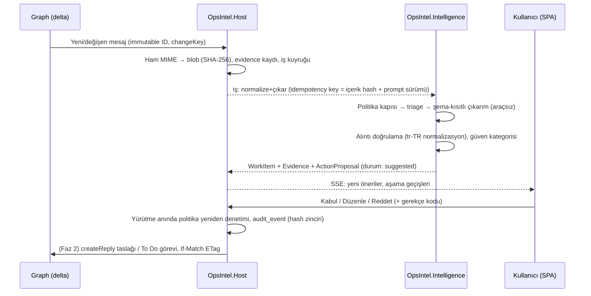

# Mimari Genel Bakış

*Durum: Planlama · Tarih: 27 Eylül 2026 · Kaynak: [araştırma raporu §1](../research/rapor-m365-operasyon-zekasi-platform-plani.md), [teknoloji yığını notları](../research/notes/teknoloji_yigini.md)*

## 1. Karar özeti

Önerilen mimari, tek depodan üretilen bir **.NET 10 LTS modüler monolitidir** ve **iki Windows servisi** olarak çalışır ([ADR-0001](../adr/0001-modular-monolith-two-services.md), [ADR-0002](../adr/0002-dotnet-10-lts-self-contained.md)):

- **`OpsIntel.Host`**: Kestrel üzerinden `https://localhost:6500`, REST API + SSE, BFF oturumu, kimlik, Microsoft Graph konektörleri, zamanlayıcı, onay iş akışı/yürütücü, analitik, bildirim ve denetim kaydı.
- **`OpsIntel.Intelligence`**: Yapay zekâ işleme (normalizasyon, triage, çıkarım, doğrulama, embedding, Soru-Cevap). Foundry Local'ı süreç içinde çalıştırır ve **hiçbir Graph token'ı tutmaz**.
- **`OpsIntel.Parser`**: Intelligence'ın başlattığı, düşük yetkili ve Job Object ile sınırlanmış belge ayrıştırma alt süreci.

Arayüz, Kestrel'in statik olarak sunduğu React + TypeScript + Fluent UI v9 SPA'dır ([ADR-0020](../adr/0020-react-fluent-ui-spa.md)). Veri SQLite (WAL, FTS5, vektör indeksi) ve diskte içerik-adresli blob dosyalarında tutulur ([ADR-0010](../adr/0010-sqlite-fts5-vector-blob-storage.md)). M365 verisi kullanıcının yetkisiyle (delegated) delta sorgularıyla çekilir; webhook ve genel erişime açık uç nokta yoktur ([ADR-0008](../adr/0008-delegated-graph-no-mail-send.md), [ADR-0009](../adr/0009-delta-polling-change-detection.md)).

Bu seçim üç zorunlu kısıtı aynı anda çözer:

1. .NET'in yerel Windows Service desteği servisleri doğrudan barındırır.
2. Self-contained yayın ve süreç içi LLM çalışma zamanı, kurulacak dış ön gereksinim bırakmaz.
3. Bu sayede **tek bir MSI** servisleri kaydedip sertifikayı üretip uygulamayı kullanıma hazırlayabilir ([ADR-0005](../adr/0005-single-msi-wix-v7.md)).

Türkiye bağlamında belirleyici kısıt hukukidir: KVKK md. 9 (7499 sonrası) bulut LLM'e giden her e-posta içeriğini düzenli yurt dışı aktarıma çevirir. Bu nedenle ürün **"yerel önce, bulut istisnayla"** çalışır ([KVKK](../compliance/kvkk/README.md), [ADR-0014](../adr/0014-foundry-local-model-hosting.md)).

## 2. Süreç topolojisi

Araştırma notlarında iki eğilim vardı: küçük ekipler için tek servis ([teknoloji yığını §1](../research/notes/teknoloji_yigini.md)) ve güvenilmeyen içeriği işleyen süreci yetkili süreçten ayırmak (CaMeL/FIDES tarzı "karantinaya alınmış çıkarıcı"). Seçilen denge **iki servis + bir alt süreçtir**:

| Gerekçe | Açıklama |
|---|---|
| Çökme yalıtımı | Foundry Local GPU/NPU sürücülerine bağlı yerel bir kütüphanedir; çöküşü web arayüzünü düşürmemelidir |
| En az yetki | Saldırganın kontrol edebildiği e-posta/belge metnini okuyan süreç Graph token'larını hiç görmemelidir (EchoLeak dersi) |
| Güvenilmeyen ayrıştırıcılar | Belge ayrıştırıcıları ayrı, düşük yetkili, Job Object ile sınırlanmış alt süreçte çalışır |

Daha fazla servise bölünmez: .NET 6'dan beri `BackgroundService` hatası host'u *temiz* biçimde durdurur ve SCM kurtarma eylemleri devreye girmez; her servis ölümcül hatada `Environment.Exit(1)` ile sonlanmalıdır. Her ek servis yönetilecek yaşam döngüsü sayısını artırır.

**Süreçler arası iletişim:**

- Kalıcı iş devri: SQLite içindeki iş/outbox tablosu ([ADR-0012](../adr/0012-db-job-outbox-quartz.md)).
- Düşük gecikmeli uyandırma: servis SID'lerine ACL'lenmiş named pipe (**Faz 0'da doğrulanacak**).
- Mesaj aracısı (RabbitMQ vb.) kurulmaz.

Diyagramlar: [c4-context.md](c4-context.md), [c4-container.md](c4-container.md).

### Uçtan uca akış: kanıttan onaylı aksiyona

## 3. Bileşen listesi

| Bileşen | Süreç / konum | Sorumluluk | Temel teknoloji |
|---|---|---|---|
| `OpsIntel.Host` | Windows Service, `NT SERVICE\OpsIntel.Host`, otomatik başlatma | HTTPS 6500, SPA sunumu, REST+SSE, BFF oturumu, kimlik, Graph konektörleri, zamanlayıcı, onay/yürütücü, analitik, bildirim, denetim | ASP.NET Core 10 Kestrel, `AddWindowsService`, EF Core, Quartz.NET, Microsoft.Graph 6.x, MSAL.NET 4.90 |
| `OpsIntel.Intelligence` | Windows Service, `NT SERVICE\OpsIntel.AI`, Host'a bağımlı | Normalizasyon, dil tespiti, triage, çıkarım, doğrulama, proje/aşama sınıflandırma, embedding, Soru-Cevap ajanı | Microsoft.Extensions.AI, MAF 1.x, Foundry Local C# SDK, ONNX Runtime |
| `OpsIntel.Parser` | Intelligence'ın başlattığı alt süreç, düşük yetki | Ek ve belge metin çıkarımı; çökse bile servisleri düşürmez | .NET-yerel ayrıştırıcılar; Faz 2'de opsiyonel gömülü Python + Docling |
| `OpsIntel.SetupHelper` | İmzalı konsol exe; MSI özel eylemleri ve SYSTEM zamanlanmış görevi çağırır | Sertifika oluştur/güven/kaldır/yenile, port 6500 kontrolü, DB yedeği | .NET 10, CNG, X509Store |
| SPA | `wwwroot` içinde statik dosyalar | Projeler, İşlerim, İnceleme kuyruğu, Zaman çizelgesi/olay akışı, Panolar, Arama/Sor, Yönetim | React, Vite, TypeScript, Fluent UI React v9, TanStack Query, ECharts, React Flow, vis-timeline, AG Grid Community |
| Veri deposu | `%ProgramData%\OpsIntel\data` | Sistem kaydı, FTS5, vektör, iş/outbox, audit | SQLite WAL + SQLite3 Multiple Ciphers / SQLCipher |
| Blob deposu | `%ProgramData%\OpsIntel\blobs\sha256\..` | Ham .eml, ekler, belge anlık görüntüleri (tekilleştirilmiş) | NTFS + ACL |
| Model önbelleği | `%ProgramData%\OpsIntel\models` | Sabitlenmiş model sürümleri; ilk çalıştırmada indirme veya çevrimdışı paket | Foundry Local katalog |
| Gözlemlenebilirlik | Host + Intelligence | Yapılandırılmış JSON loglar (içeriksiz), Event Log (Warning+), OTel metrikleri, `/health/live`, `/health/ready`, tanı paketi | OpenTelemetry, Serilog, EventLog |
| Kurulum | `OpsIntel-x64.msi` (+ opsiyonel `OpsIntelSetup.exe`) | Dosyalar, servisler, ACL'ler, registry yapılandırması, sertifika, kısayol, yükseltme/kaldırma | WiX Toolset v7 SDK, Util/Firewall uzantıları |

Kaynak koddaki planlanan modül yapısı için bkz. [src/README.md](../../src/README.md).

## 4. Katman katman seçimler

### Web sunucusu ve HTTPS

- Kestrel yalnızca `127.0.0.1:6500` ve `[::1]:6500` adreslerine bağlanır; sertifikayı `LocalMachine\My` deposundan registry'deki thumbprint ile yükler ([ADR-0003](../adr/0003-kestrel-loopback-https-6500.md)).
- **Tuzak:** Kestrel'in depo tabanlı sertifika yapılandırmasında `Location` varsayılan olarak `CurrentUser`'dır; servis hesabı için bu servis profilinin deposu demektir.
- ASP.NET Core geliştirme sertifikasıyla servis uç noktası korumak desteklenmez. HTTP.sys yalnızca Windows Integrated Authentication veya port paylaşımı gerektiğinde anlamlıdır ve `netsh` ile ek kalıcı durum getirir.
- DNS rebinding'e karşı: katı `Host` izin listesi, durum değiştiren isteklerde `Origin` + `Sec-Fetch-Site: same-origin`, senkronizör CSRF token'ı, `SameSite=Strict; HttpOnly; Secure` çerezler, CORS başlığı yok, `default-src 'self'` ile başlayan katı CSP. Ayrıntı: [threat-model.md](threat-model.md).
- Sertifika stratejisi: [ADR-0004](../adr/0004-https-certificate-strategy.md), [installation.md](../operations/installation.md).

### Kimlik doğrulama ve token yönetimi

- WAM, servis bağlamında **tasarım gereği çalışmaz**; device code akışı Microsoft tarafından "high-risk" olarak nitelenir.
- Desen: Host'ta çalışan **BFF**; Entra'da secret taşımayan **public client**; PKCE'li yetkilendirme kodu; `https://localhost:6500/signin-oidc` dönüşü; refresh token DPAPI ile şifrelenmiş ve servis SID'ine ACL'lenmiş MSAL önbelleğinde; tarayıcı yalnızca çerez görür ([ADR-0007](../adr/0007-delegated-auth-bff-pkce.md)).
- Token Protection riskine karşı Faz 2'de kullanıcı oturumunda çalışan **tray yardımcısı** (WAM ile cihaza bağlı token → ACL'li named pipe → Host).
- Ayrıntı: [m365-integration.md](m365-integration.md).

### Microsoft 365 entegrasyonu

- Yalnızca Microsoft Graph v1.0; EWS, webhook, COM/VSTO ve PC'de app-only yok.
- Delta polling: klasör başına, sürücü başına ve takvim penceresi başına; `Prefer: IdType="ImmutableId"`.
- Darboğaz istek sayısı değil eşzamanlılıktır: posta kutusu başına 3–4'lük semafor.
- Kurumsal opsiyon: müşterinin Azure Event Hub'ı yalnızca delta turunu tetikler.
- Ayrıntı: [m365-integration.md](m365-integration.md), [ADR-0009](../adr/0009-delta-polling-change-detection.md), [ADR-0025](../adr/0025-shared-content-discovery.md).

### Veri katmanı

- SQLite (WAL) + FTS5 trigram + `IVectorIndex` soyutlaması + içerik-adresli blob ([ADR-0010](../adr/0010-sqlite-fts5-vector-blob-storage.md)).
- `sqlite-vec` "pre-v1" uyarısı taşır; SQLite'ın resmi Vec1 eklentisi henüz yayımlanmadı. Yerel ölçekte kaba kuvvet arama kabul edilebilir (600 bin parça int8 ≈ 0,6 GB); FTS5 + vektör sonuçları Reciprocal Rank Fusion ile birleştirilir.
- Şifreleme: BitLocker ön kontrolü + SQLite3 Multiple Ciphers (MIT) veya ticari SQLCipher + DPAPI anahtar sarma ([ADR-0011](../adr/0011-encryption-at-rest.md)).
- Veri modeli: [data-model.md](data-model.md).

### Arka plan işleme

- İş/outbox tablosu: durum değişikliği ve iş kaydı aynı transaction'da; *niyet* tam bir kez, *yürütme* en az bir kez. İşleyiciler idempotenttir (Graph ID + changeKey; içerik hash'i + prompt sürümü).
- Cron benzeri zamanlama: Quartz.NET (`SQLite-Microsoft` sağlayıcısı). Temporal/Dapr/Hangfire yok ([ADR-0012](../adr/0012-db-job-outbox-quartz.md)).
- Onay akışı kendi tablolarımızda açık bir durum makinesidir; MAF checkpoint'leri yalnızca operasyonel durumdur ([ADR-0017](../adr/0017-approval-state-machine.md)).

### Yapay zekâ katmanı

- Çekirdek otonom ajan değil, **deterministik iş akışıdır**: ingest → temizle → triage → çıkar → doğrula → sakla → öner. Ajan döngüsü yalnızca salt-okunur araçlarla Soru-Cevap içindir ([ADR-0013](../adr/0013-microsoft-extensions-ai-maf.md)).
- Küçük düz JSON şemaları; her öğe `{message_id, quote}` kanıtı taşır; alıntı tr-TR normalizasyonuyla deterministik doğrulanır; doğrulanamayan öğe "gerçek" olarak gösterilmez ([ADR-0015](../adr/0015-extraction-contract-evidence.md)).
- Varsayılan çalışma zamanı süreç içi Foundry Local; model katmanları donanım profiline göre (4–12B triage/embedding; GPU'lu iş istasyonlarında 30B-A3B sınıfı MoE) ([ADR-0014](../adr/0014-foundry-local-model-hosting.md)).
- Proje ataması kullanıcının düzenlediği kayıt defterine karşı sınıflandırmadır ([ADR-0016](../adr/0016-project-registry-phase-fsm.md)).

### Arayüz

React + Vite + TypeScript SPA; Fluent UI React v9, Apache ECharts, React Flow, vis-timeline, AG Grid Community; .NET 10 yerel SSE ile canlı güncellemeler. Next.js elenir (hedef makinede Node çalışma zamanı gerektirir) ([ADR-0020](../adr/0020-react-fluent-ui-spa.md)).

### Gözlemlenebilirlik ve güncelleme

- OTel + Serilog JSON + Event Log; içeriksiz loglar; tanı paketi ([ADR-0021](../adr/0021-observability.md)).
- MSI major upgrade (Intune/winget/SCCM); başlangıçta `VACUUM INTO` yedeği ve şema geçişi ([ADR-0022](../adr/0022-msi-major-upgrade-updates.md)).

## 5. Karar özeti tablosu

| Konu | Seçim | İkinci seçenek | Elenen (neden) |
|---|---|---|---|
| Çalışma zamanı | .NET 10 LTS, self-contained x64 (Arm64 opsiyonel) | — | Node (SEA kararlı değil, servis sarmalayıcı), Python (paketleme/servis), Go/Rust (SDK boşlukları) |
| Süreç modeli | Modüler monolit, 2 servis + parser alt süreci | Ölçülen ihtiyaçta 3. servis | Mikroservis/mesaj aracısı (PC'de işletim yükü) |
| Web | Kestrel, LocalMachine sertifikası, loopback:6500 | HTTP.sys (yalnız Windows Auth gerekirse) | IIS, dev-cert, mkcert |
| UI | React/Vite/TS + Fluent v9 + ECharts/React Flow/vis-timeline/AG Grid + SSE | Blazor Server + Fluent UI Blazor | Next.js (Node çalışma zamanı) |
| Veri | SQLite WAL + FTS5 + `IVectorIndex` + blob | SQL Server 2025 (sunucu/ekip sürümü) | PostgreSQL+pgvector (Windows'ta derleme), LocalDB (kullanıcı başına) |
| İşler | DB iş/outbox + Channels + Quartz.NET + açık durum makinesi | Durable Task + MSSQL (SQL Server seçilirse) | Temporal/Dapr (ek sunucu), Hangfire (LGPL/Pro) |
| AI | MEAI + deterministik boru hattı + MAF (yalnız Soru-Cevap) + Foundry Local | Ollama (standalone zip + sarmalayıcı) | Yeni kodda Semantic Kernel (bakım modu) |
| M365 | Graph .NET SDK v6 + ham HTTP delta yolu, delegated | Event Hubs (kurumsal opsiyon) | EWS, webhook, COM/VSTO, app-only (PC'de) |
| Güncelleme | MSI major upgrade (Intune/winget/SCCM) | Uygulama içi "güncelleme var" bildirimi | Velopack (servis desteği yok) |

## 6. Açık noktalar (Faz 0'da doğrulanacak)

- Servis tarafı PKCE/BFF token edinimi Conditional Access ve Token Protection altında çalışıyor mu? (spike B, [ADR-0007](../adr/0007-delegated-auth-bff-pkce.md))
- Foundry Local `NT SERVICE` hesabıyla servis içinde çalışıyor mu; VC++ veya Windows App SDK runtime istiyor mu? (spike C, [ADR-0014](../adr/0014-foundry-local-model-hosting.md))
- `vec0.dll` + SQLite3MC birlikte yükleniyor mu? (spike D, [ADR-0010](../adr/0010-sqlite-fts5-vector-blob-storage.md), [ADR-0011](../adr/0011-encryption-at-rest.md))
- Named pipe uyandırma tasarımı ve servis SID ACL'leri.
- `ServiceInstall`'ın `NT SERVICE\…` hesabını parolasız kabul etmesi (resmi olarak belgelenmemiş).
