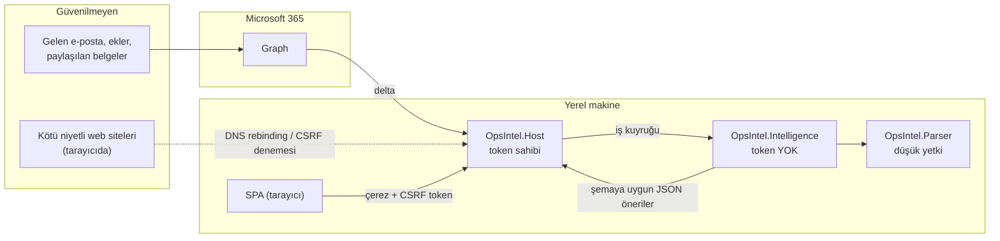

# Tehdit Modeli

*Kaynak: [araştırma raporu §1 ve §4](../research/rapor-m365-operasyon-zekasi-platform-plani.md), [güvenlik ve uyum notları §6–§7](../research/notes/guvenlik_uyum.md), [AI mimarisi notları §9](../research/notes/ai_agent_mimarisi.md). Bu doküman canlı bir belgedir; S8'deki localhost pen testi ve kırmızı takım çalışmalarıyla güncellenecektir.*

## 1. Kapsam ve varlıklar

| Varlık | Nerede | Neden değerli |
|---|---|---|
| Graph refresh token | Host, DPAPI ile şifreli MSAL önbelleği | 90 gün yaşar, kullanıcının posta/belge erişimini temsil eder |
| E-posta ve belge içeriği, türetilmiş kayıtlar | SQLite (şifreli), blob deposu | KVKK kapsamında kişisel veri; özel nitelikli veri içerebilir |
| HTTPS sertifikası özel anahtarı | `LocalMachine\My`, ACL yalnızca `NT SERVICE\OpsIntel.Host` | Yerel MITM riski |
| Onay/yürütme yetkisi | Host yürütücüsü | Kullanıcı adına M365'e yazma (Faz 2) |
| Denetim kaydı | `audit_event` | Hesap verebilirlik, KVKK md. 12 kanıtı |
| Model ve prompt bütünlüğü | Model önbelleği, `prompts/` | Tedarik zinciri, çıkarım doğruluğu |

## 2. Güven sınırları

Temel ilke: **içerik okuyan süreç yetki taşımaz; yetki taşıyan süreç içeriği talimat olarak işlemez.**

## 3. Yapay zekâya özgü tehditler

### EchoLeak dersi

EchoLeak (CVE-2025-32711), M365 Copilot'ta tek bir e-postayla sıfır tıklamalı veri sızdırmaydı ([arXiv 2509.10540](https://arxiv.org/html/2509.10540v1)). Saldırı zinciri:

1. Sınıflandırıcıyı atlatan, insana yönelik gibi yazılmış talimatlar
2. Referans tarzı Markdown bağlantıları
3. Otomatik yüklenen görseller
4. CSP'deki izinli bir proxy üzerinden sızdırma

Makalenin sonucu: yalnızca katmanlı, derinlemesine savunma bu tehdit sınıfını sınırlayabilir. CVSS 9,3 puanı ikincil kaynaklardan gelir ([güvenlik notları §7](../research/notes/guvenlik_uyum.md)).

### OWASP eşlemesi ve kontroller

| Tehdit (OWASP LLM 2025 / Agentic 2026) | OpsIntel'deki senaryo | Kontroller |
|---|---|---|
| LLM01 Prompt Injection / ASI01 Agent Goal Hijack | Gelen e-posta, çıkarım modeline talimat gömer | Karantinaya alınmış çıkarıcı (araçsız, yalnızca şemaya uygun JSON); spotlighting/datamarking ([arXiv 2403.14720](https://arxiv.org/abs/2403.14720): saldırı başarısı %50+ → %2 altı); ayrı enjeksiyon sınıflandırıcısı yalnızca sinyal olarak |
| ASI02 Tool Misuse / LLM06 Excessive Agency | Model M365'te aksiyon tetikler | Modelde M365 aracı yok; aksiyonlar öneri olarak üretilir ve deterministik kodla yalnızca insan onayından sonra yürütülür; `Mail.Send` hiç istenmez; acil durdurma anahtarı |
| ASI03 Identity & Privilege Abuse | İçerik okuyan süreç token'a erişir | Intelligence servisinde Graph token yok; ayrı servis SID'leri; PC'de app-only yok |
| LLM05 Improper Output Handling | Model çıktısı sızdırma kanalına dönüşür | Düz metin gösterim; uzak görsel yüklenmez; bağlantılar otomatik açılmaz; referans tarzı Markdown silinir; izin listesindeki alan adları dışında bağlantı gösterilmez; katı CSP |
| LLM02 Sensitive Information Disclosure | Özel nitelikli veri buluta gider | Politika kapısı (hariç tutma, etiket, yerel sınıflandırıcı); bulut katmanı SS-2 kilidi; mümkünse takma adlandırma |
| LLM08 Vector and Embedding Weaknesses | Kullanıcı başka birinin içeriğini arama ile görür | Arama anında ACL uygulanır: kullanıcı yalnızca M365'te açabildiği parçaları görür |
| LLM09 Misinformation | Uydurma karar/taahhüt | Zorunlu alıntı + deterministik doğrulama; "doğrulanamayan gösterilmez" ([ADR-0015](../adr/0015-extraction-contract-evidence.md)) |
| ASI06 Memory & Context Poisoning | Önceki LLM özetleri kaynak gibi kullanılır | Türetilmiş özetler kaynaksız "gerçek" sayılmaz; öğe bazında silme ve kaynaktan yeniden türetme |
| LLM03 / ASI04 Supply Chain | Değiştirilmiş model veya bağımlılık | Model ID + SHA-256 sabitleme (`models/model-manifest.json`); SDK sürüm sabitleme; SBOM; MCP/eklenti kullanılmaz |
| LLM10 Unbounded Consumption | PC kilitlenir, bulut maliyeti patlar | Yerel çıkarımda toplu iş boyutu/süre sınırı; bulut çağrılarında token ve maliyet tavanı |
| LLM07 System Prompt Leakage | Prompt'ta sır | Prompt'larda sır tutulmaz; prompt'lar depoda açık ve incelemeden geçer |

MAF'ın bilgi akışı denetimi uygulaması FIDES henüz yalnızca Python'da ve deneysel durumda ([MAF FIDES](https://devblogs.microsoft.com/agent-framework/fides/)); .NET tarafında aynı ilke süreç ayrımı ve şema kısıtıyla uygulanır.

### Çıkış (egress) kısıtı

Servis SID'ine göre giden bağlantı izin listesi: Graph, oturum açma uç noktaları, model kataloğu (yalnızca indirme) ve seçilmiş LLM uç noktası (katman 2/3 açıksa). Uygulama mekanizması (Windows Firewall servis SID kuralları vb.) Faz 0/S8'de belirlenecektir; kaynaklarda ayrıntılandırılmamıştır.

### Kırmızı takım

Microsoft'un LLMail-Inject korpusundan (839 katılımcı, 208.095 saldırı; [arXiv 2506.09956](https://arxiv.org/html/2506.09956v1)) örnekler ve Türkçeye çevrilmiş enjeksiyonlar her sürümde CI'da koşturulur. Hedef: enjeksiyon saldırı başarı oranı < %2 ([kalite hedefleri](../roadmap/quality-targets.md)). Not: Türkçe enjeksiyonlarda spotlighting etkinliğine dair yayımlanmış değerlendirme bulunamamıştır ([AI notları §9](../research/notes/ai_agent_mimarisi.md)).

## 4. Yerel uç nokta tehditleri

| Tehdit | Senaryo | Kontroller |
|---|---|---|
| DNS rebinding | Kötü niyetli sitenin JavaScript'i 127.0.0.1:6500'e ulaşır ([GitHub Security Blog](https://github.blog/security/application-security/dns-rebinding-attacks-explained-the-lookup-is-coming-from-inside-the-house/)) | Yalnızca `localhost:6500` / `127.0.0.1:6500` Host değerleri kabul edilir; localhost'ta bile Entra kimlik doğrulaması |
| CSRF | Başka sekme durum değiştiren istek gönderir | `Origin` + `Sec-Fetch-Site: same-origin` şartı; senkronizör CSRF token; `SameSite=Strict` çerez |
| CORS kötüye kullanımı | Dış origin API'yi okur | CORS başlığı gönderilmez; Origin yansıtılmaz, `*` kullanılmaz |
| XSS / içerik enjeksiyonu | E-posta içeriği SPA'da script çalıştırır | `default-src 'self'` ile başlayan katı CSP; model çıktısı ve e-posta içeriği düz metin |
| Diğer yerel süreçler / kullanıcılar | Aynı PC'deki başka süreç loopback portuna erişir | Oturum doğrulaması zorunlu; ProgramData ACL'leri yalnızca servis SID'leri + Administrators |
| Kök CA kötüye kullanımı | Kurulan kök CA ile MITM (Dell VU#925497 örneği) | Ortak kök CA yok; makineye özel CA=false uç sertifika; anahtar dışa aktarılamaz ([ADR-0004](../adr/0004-https-certificate-strategy.md)) |
| Cihaz kaybı | Dizüstü çalınır | BitLocker ön kontrolü, DB şifrelemesi (DPAPI sarmalı anahtar, crypto-shred), Intune protected wipe runbook'u, Entra oturum iptali ([ADR-0011](../adr/0011-encryption-at-rest.md)) |
| Token hırsızlığı | Refresh token diskten okunur | DPAPI + servis SID ACL; düz metin yedek modu reddedilir; Faz 2'de WAM ile cihaza bağlı token |
| Ayrıştırıcı istismarı | Kötü amaçlı PDF/DOCX ayrıştırıcıyı ele geçirir | Parser ayrı, düşük yetkili, Job Object ile sınırlı alt süreç |
| Log sızıntısı | Loglarda e-posta gövdesi | İçerik içermeyen loglar; S2 kabul kriteri: log taramasında gövde metni bulunmaz |

Chrome Local Network Access (LNA), Chrome 142'den itibaren genel sitelerin loopback'e istek göndermesi için kullanıcı izni ister ([Chrome](https://developer.chrome.com/blog/local-network-access)); bu ek bir savunmadır, uygulamanın kendi kontrollerinin yerine geçmez.

## 5. M365 tarafı kontroller

- Yönetici onayı + yayıncı doğrulaması; kullanıcı onayının "verified publishers" ile sınırlanması önerilir.
- Conditional Access: uyumlu cihaz, MFA; Token Protection report-only modda test edilir.
- Defender for Cloud Apps app governance ile uygulamanın Graph kullanımı izlenir.
- Faz 2: Purview `processContent` (satır içi DLP) ve `contentActivities` (denetim) — lisanslama doğrulanmadı.

Ayrıntı: [m365-integration.md](m365-integration.md).

## 6. Açık noktalar

- Token Protection'ın üçüncü taraf public client için uygulanıp uygulanamayacağı belgelenmemiş (spike B).
- IRM/OME ile korunan iletilerin Graph'ta nasıl döndüğü birincil kaynaktan doğrulanmadı; şifreli öğeler "atla" olarak ele alınır.
- Egress kısıtının teknik uygulaması ve named pipe ACL tasarımı Faz 0'da netleşecek.
- Pen test kapsamı (DNS rebinding, CSRF, Host başlığı) S8'de; açık yüksek/kritik bulgu kalmaması pilot çıkış kriteridir.
