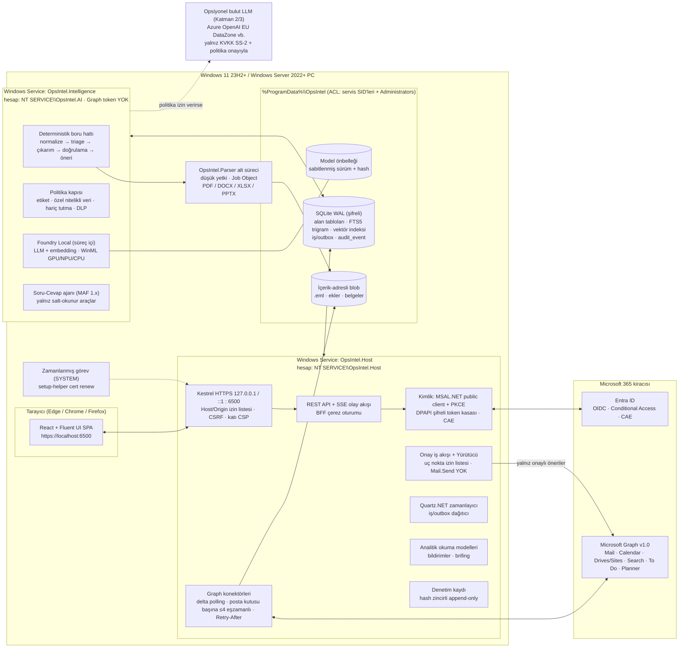
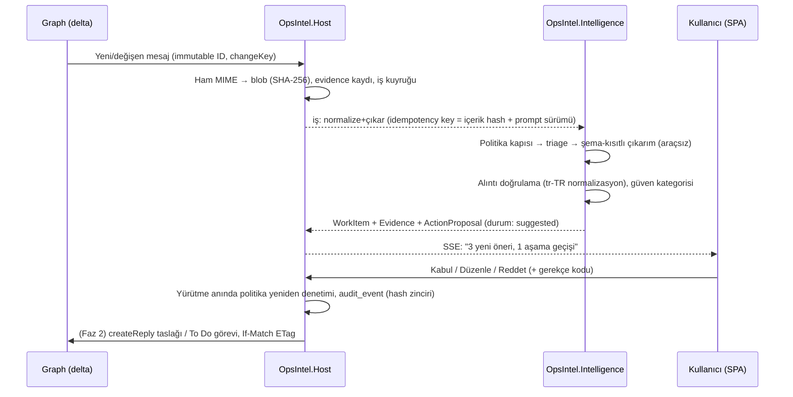
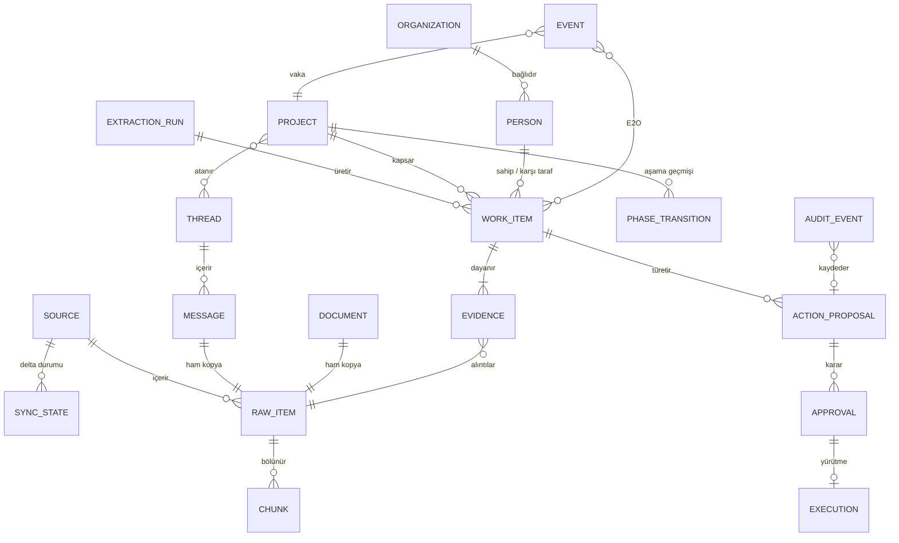

# Kurumsal operasyon zekâsını yerelde kanıtla inşa etmek

*Araştırma raporu · Tarih: 27 Eylül 2026 · Çalışma adı: **OpsIntel***

**Önerilen mimari, tek depodan üretilen bir .NET 10 LTS modüler monolitidir. Bu monolit iki Windows servisi olarak çalışır.** Birinci servis `OpsIntel.Host`'tur. Kestrel üzerinden `https://localhost:6500` adresini, API'yi, Microsoft Graph bağlantısını, onay iş akışını ve denetim kaydını taşır. İkinci servis `OpsIntel.Intelligence`'tır. Yapay zekâ işlemesini yapar, Foundry Local'ı süreç içinde çalıştırır ve hiçbir Graph token'ı tutmaz. Arayüz, Kestrel'in statik olarak sunduğu React + TypeScript + Fluent UI v9 SPA'dır. Veri; SQLite (WAL, FTS5, vektör indeksi) ile diskte içerik-adresli blob dosyalarında tutulur. M365 verisi, kullanıcının yetkisiyle (delegated) delta sorgularıyla çekilir. Webhook ve genel erişime açık uç nokta kullanılmaz. Bu seçim üç zorunlu kısıtı aynı anda çözüyor:

- **.NET'in yerel Windows Service desteği** servisleri doğrudan barındırır.
- **Self-contained yayın ve süreç içi LLM çalışma zamanı**, kurulacak dış ön gereksinim bırakmaz.
- Bunun sonucunda **tek bir MSI**, servisleri kaydedip, sertifikayı üretip, uygulamayı kullanıma hazır hale getirebilir.

Önemli teknik sınır şudur: **Bir MSI başka bir yükleyiciyi (VC++ redistributable, PostgreSQL, Ollama gibi) zincirleyemez.** Windows Installer'ın iç içe kurulum özelliği resmen kullanımdan kaldırılmıştır. Bu nedenle en iyi çözüm, ön gereksinimleri mimari düzeyde ortadan kaldırmaktır. Buna ek olarak yalnızca isteğe bağlı bileşenler için bir WiX Burn `Setup.exe` sarmalayıcısı sunulmalıdır. Türkiye bağlamında asıl belirleyici kısıt hukukidir. KVKK'nın 7499 sonrası 9. maddesi, bulut LLM'e giden her e-posta içeriğini düzenli bir yurt dışı aktarım haline getirir. Böyle bir aktarım standart sözleşme (SS-2) ve 5 iş günü içinde bildirim ister. Bu yüzden ürün **"yerel önce, bulut istisnayla"** çalışmalıdır. Yol planı şöyledir:

- 3 haftalık bir keşif fazı, en riskli varsayımları söker. Bunlar servis tarafında token edinimi, Foundry Local'ın servis içinde çalışması ve Türkçe çıkarım kalitesidir.
- Ardından 16 haftalık bir MVP gelir (Şubat 2027 ortasında pilot sürüm).
- MVP'yi kurumsal genişleme ve iş zekâsı fazları izler.

Rakiplerden ayrışma özetlerde veya taslak yazımında değildir, çünkü bunlar hızla metalaşıyor. Ayrışma, **kanıta bağlı, yaşam döngüsü olan, denetlenebilir bir operasyon kaydını yerelde ve Türkçe öncelikli** tutmaktadır.

---

## 1. Mimari kararı: iki Windows servisli .NET 10 modüler monoliti

### Çalışma zamanı seçimi: .NET'in öne geçtiği yer Windows servis entegrasyonu

Beklenen kullanım ömrü boyunca desteklenen çalışma zamanı **.NET 10 LTS**'tir. Kasım 2025'te yayımlanmıştır ve **14 Kasım 2028'e kadar** desteklenir ([.NET destek politikası](https://dotnet.microsoft.com/en-us/platform/support/policy/dotnet-core)). ASP.NET Core, IIS olmadan `AddWindowsService()` ile Windows Service olarak barındırılabilir ([MS Learn: Host ASP.NET Core in a Windows Service](https://learn.microsoft.com/en-us/aspnet/core/host-and-deploy/windows-service?view=aspnetcore-10.0)).

Rakip çalışma zamanlarının her biri, Windows servisi olma noktasında sürtünme üretir:

- **Node.js:** Single Executable Application özelliği resmi dokümantasyonda hâlâ "Stability: 1.1 – Active development" durumundadır ([Node.js SEA](https://nodejs.org/api/single-executable-applications.html)).
- **Python:** Servis olarak çalışmak için NSSM gibi sarmalayıcılara dayanır. NSSM'nin son kararlı sürümü 2014 tarihlidir ([nssm.cc](https://nssm.cc/download)).
- **Go / Rust:** Rust için resmi bir Graph SDK yok. Go'da MSAL.NET düzeyinde bir Entra/WAM desteği bulunmuyor ([Graph SDK genel bakış](https://learn.microsoft.com/en-us/graph/sdks/sdks-overview)).

.NET tarafında ise gereken tüm bileşenler güncel ve olgun:

- `Microsoft.Graph` **6.7.0**, net10.0'ı hedefler ([NuGet](https://www.nuget.org/packages/Microsoft.Graph)).
- MSAL.NET **4.90.1** sürümündedir ([NuGet](https://www.nuget.org/packages/Microsoft.Identity.Client)).
- Sağlayıcıdan bağımsız `IChatClient` / `IEmbeddingGenerator` soyutlamaları (Microsoft.Extensions.AI) GA'dır ([MS Learn](https://learn.microsoft.com/en-us/dotnet/ai/microsoft-extensions-ai)).
- **Microsoft Agent Framework 1.0** Nisan 2026'da GA oldu ([MAF 1.0 duyurusu](https://devblogs.microsoft.com/agent-framework/microsoft-agent-framework-version-1-0/)). Semantic Kernel artık bakım modundadır ([SK tartışması #13215](https://github.com/microsoft/semantic-kernel/discussions/13215)).
- **Foundry Local** 9 Nisan 2026'da GA oldu. Uygulamanın içine gömülen bir yerel kütüphane olarak gelir: "no separate CLI or service required", "small enough to bundle directly inside your application installer" ([Foundry blog](https://devblogs.microsoft.com/foundry/foundry-local-ga/)).

Tek bir çalışma zamanının web sunucusunu, arka plan işçilerini, Graph istemcisini, kimlik doğrulamayı ve yerel LLM'i birlikte taşıması, MSI'ı sade tutan asıl etkendir.

### Süreç topolojisi: iki servis ve korumalı bir ayrıştırıcı

Araştırma notları iki farklı eğilim gösteriyor:

- **Tek servis:** Küçük ekipler için dağıtık sistem yükünden kaçınan tek bir servis.
- **Ayrılmış süreçler:** Güvenilmeyen içeriği işleyen süreci, yetkili süreçten ayırmak. CaMeL/FIDES tarzı "karantinaya alınmış çıkarıcı" yaklaşımı buna örnektir.

Önerilen denge **iki Windows servisi ve bir alt süreçtir**. Gerekçeler somuttur:

1. **Çökme yalıtımı:** Foundry Local, GPU/NPU sürücülerine bağlı yerel bir kütüphanedir. Onun çöküşü web arayüzünü düşürmemelidir.
2. **En az yetki:** Saldırganın kontrol edebildiği e-posta ve belge metnini okuyan süreç, Graph token'larını hiç görmemelidir. Bu, EchoLeak dersinin doğrudan uygulamasıdır ([arXiv 2509.10540](https://arxiv.org/html/2509.10540v1)).
3. **Belge ayrıştırıcıları:** Ayrıştırıcılar güvenilmeyen girdiyle çalışır. Bu yüzden ayrı, düşük yetkili ve Job Object ile sınırlanmış bir alt süreçte (`OpsIntel.Parser`) koşmalıdır.

Daha fazla servise bölmek yanlış olur. .NET 6'dan beri `BackgroundService` hatası host'u *temiz* biçimde durdurur. Bu durumda SCM kurtarma eylemleri devreye girmez. Her servis ölümcül hatada sıfır dışı çıkış koduyla (`Environment.Exit(1)`) sonlanmak zorundadır ([MS Learn: Windows service with BackgroundService](https://learn.microsoft.com/en-us/dotnet/core/extensions/windows-service)). Her ek servis, doğru yönetilmesi gereken yaşam döngüsü sayısını artırır.

Süreçler arası kalıcı iş devri, SQLite içindeki bir iş/outbox tablosuyla yapılır. Düşük gecikmeli uyandırma, servis SID'lerine ACL'lenmiş bir named pipe ile sağlanır (bu tasarım keşif fazında doğrulanacaktır). RabbitMQ gibi bir mesaj aracısı kurulmaz.

### Mimari diyagramı



Uçtan uca "kanıttan onaylı aksiyona" akışı, sistemin güven modelini özetliyor:



### Bileşen listesi

| Bileşen | Süreç / konum | Sorumluluk | Temel teknoloji |
|---|---|---|---|
| `OpsIntel.Host` | Windows Service, `NT SERVICE\OpsIntel.Host`, otomatik başlatma | HTTPS 6500, SPA sunumu, REST+SSE, BFF oturumu, kimlik, Graph konektörleri, zamanlayıcı, onay/yürütücü, analitik, bildirim, denetim | ASP.NET Core 10 Kestrel, `AddWindowsService`, EF Core, Quartz.NET, Microsoft.Graph 6.x, MSAL.NET 4.90 |
| `OpsIntel.Intelligence` | Windows Service, `NT SERVICE\OpsIntel.AI`, Host'a bağımlı | Normalizasyon, dil tespiti, triage, çıkarım, doğrulama, proje/aşama sınıflandırma, embedding, Soru-Cevap ajanı | Microsoft.Extensions.AI, MAF 1.x, Foundry Local C# SDK, ONNX Runtime |
| `OpsIntel.Parser` | Intelligence'ın başlattığı alt süreç, düşük yetki | Ek ve belge metin çıkarımı; çökse bile servisleri düşürmez | .NET-yerel ayrıştırıcılar; Faz 2'de opsiyonel gömülü Python + Docling |
| `OpsIntel.SetupHelper` | İmzalı konsol exe; MSI özel eylemleri ve SYSTEM zamanlanmış görevi çağırır | Sertifika oluştur/güven/kaldır/yenile, port 6500 kontrolü, DB yedeği | .NET 10, CNG, X509Store |
| SPA | `wwwroot` içinde statik dosyalar | Projeler, İşlerim, İnceleme kuyruğu, Zaman çizelgesi/olay akışı, Panolar, Arama/Sor, Yönetim | React, Vite, TypeScript, Fluent UI React v9, TanStack Query, ECharts, React Flow, vis-timeline, AG Grid Community |
| Veri deposu | `%ProgramData%\OpsIntel\data` | Sistem kaydı, FTS5, vektör, iş/outbox, audit | SQLite WAL + SQLite3 Multiple Ciphers / SQLCipher |
| Blob deposu | `%ProgramData%\OpsIntel\blobs\sha256\..` | Ham .eml, ekler, belge anlık görüntüleri (tekilleştirilmiş) | NTFS + ACL |
| Model önbelleği | `%ProgramData%\OpsIntel\models` | Sabitlenmiş model sürümleri, ilk çalıştırmada indirme veya çevrimdışı paket | Foundry Local katalog |
| Gözlemlenebilirlik | Host + Intelligence | Yapılandırılmış JSON loglar (içerik içermez), Event Log (Warning+), OTel metrikleri, `/health/live` ve `/health/ready`, tanı paketi | OpenTelemetry, Serilog, EventLog |
| Kurulum | `OpsIntel-x64.msi` (+ opsiyonel `OpsIntelSetup.exe`) | Dosyalar, servisler, ACL'ler, registry yapılandırması, sertifika, kısayol, yükseltme/kaldırma | WiX Toolset v7 SDK, Util/Firewall uzantıları |

### Katman katman seçimler ve gerekçeleri

**Web sunucusu ve HTTPS.** Kestrel, varsayılan olarak yalnızca `127.0.0.1:6500` ve `[::1]:6500` adreslerine bağlanır. Sertifikayı `LocalMachine\My` deposundan registry'deki thumbprint ile yükler. Burada yaygın bir tuzak vardır: Kestrel'in depo tabanlı sertifika yapılandırmasında `Location` **varsayılan olarak CurrentUser**'dır. Servis hesabı için bu, servis profilinin deposu demektir ([Kestrel endpoints](https://learn.microsoft.com/en-us/aspnet/core/fundamentals/servers/kestrel/endpoints?view=aspnetcore-10.0)).

ASP.NET Core geliştirme sertifikasıyla bir servis uç noktasını korumak desteklenmez ([MS Learn](https://learn.microsoft.com/en-us/aspnet/core/host-and-deploy/windows-service?view=aspnetcore-10.0)). HTTP.sys yalnızca Windows Integrated Authentication veya port paylaşımı gerektiğinde anlamlıdır, ama `netsh` ile ek kalıcı durum yönetimi getirir ([HTTP.sys](https://learn.microsoft.com/en-us/aspnet/core/fundamentals/servers/httpsys?view=aspnetcore-10.0)). Bu ürün Entra ile oturum açtığı için Kestrel yeterlidir.

Localhost arayüzü de gerçek bir saldırı yüzeyidir. DNS rebinding, kötü niyetli bir sitenin JavaScript'inin 127.0.0.1'e ulaşmasını sağlar. Önerilen savunmalar katı `Host` başlığı denetimi ve iç servislerde bile güçlü kimlik doğrulamadır ([GitHub Security Blog](https://github.blog/security/application-security/dns-rebinding-attacks-explained-the-lookup-is-coming-from-inside-the-house/)). Bu yüzden Host şu kontrolleri uygular:

- Yalnızca `localhost:6500` / `127.0.0.1:6500` Host değerlerini kabul eder.
- Durum değiştiren isteklerde `Origin` ve `Sec-Fetch-Site: same-origin` şartı arar ve senkronizör CSRF token'ı kullanır.
- Oturum çerezleri `SameSite=Strict`, `HttpOnly` ve `Secure` olarak ayarlanır.
- CORS başlığı gönderilmez.
- `default-src 'self'` ile başlayan katı bir CSP uygulanır.

**Kimlik doğrulama ve token yönetimi.** Bu, mimarinin en ince noktasıdır. Windows'un kimlik aracısı WAM, servis bağlamında **tasarım gereği çalışmaz**: "Attempting to acquire tokens using WAM while running as a Windows service … will result in errors by design" ([MSAL.NET WAM](https://learn.microsoft.com/en-us/entra/msal/dotnet/acquiring-tokens/desktop-mobile/wam)). Device code akışı ise Microsoft tarafından "high-risk" olarak nitelenir ve engellenmesi önerilir ([CA: authentication flows](https://learn.microsoft.com/en-us/entra/identity/conditional-access/concept-authentication-flows)).

Önerilen desen, **Host'ta çalışan bir BFF (backend-for-frontend)**'dir:

- Uygulama Entra'da gizli anahtar (secret) taşımayan bir **public client** olarak kaydedilir. PC'lere asla client secret dağıtılmaz.
- Host, tarayıcıdaki kullanıcıyı Entra'ya PKCE'li yetkilendirme koduyla yönlendirir ve `https://localhost:6500/signin-oidc` dönüşünde kodu token'a çevirir. MSAL.NET'in özel web-UI genişletme noktası bunun için bir yoldur; keşif fazında doğrulanacaktır.
- Refresh token'ı DPAPI ile şifrelenmiş ve servis SID'ine ACL'lenmiş bir MSAL önbelleğinde tutar. Tarayıcı yalnızca çerez görür.

Entra, localhost yönlendirme URI'lerinde portu eşleştirmede yok sayar. Diğer host adlarında ise port birebir eşleşmelidir ([Redirect URI kuralları](https://learn.microsoft.com/en-us/entra/identity-platform/reply-url)). Bu durum `https://localhost:6500` kısıtıyla uyumludur. LAN modu ise her makine adı için ayrı kayıt ister.

Token davranışına dair üç nokta tasarımı etkiler:

- Refresh token'lar varsayılan olarak **90 gün** yaşar ve her kullanımda yenilenir ([Refresh tokens](https://learn.microsoft.com/en-us/entra/identity-platform/refresh-tokens)).
- CAE farkındalığı olan istemcilerde access token **28 saate** kadar uzar, ama istemcinin "claims challenge" işleyebilmesi gerekir ([CAE](https://learn.microsoft.com/en-us/entra/identity/conditional-access/concept-continuous-access-evaluation)).
- Token Protection ilkesinin desteklediği uygulama listesi yalnızca Microsoft'un kendi yerel uygulamalarından oluşur ([Token Protection – Windows](https://learn.microsoft.com/en-us/entra/identity/conditional-access/deployment-guide-token-protection-windows)). Bu ilkeyi "tüm uygulamalar" için zorlayan kiracılarda servis tarafı token'ı engellenebilir.

Bu riskin çözümü, Faz 2'de eklenecek, kullanıcı oturumunda çalışan küçük bir **tepsi (tray) yardımcısıdır**. Bu yardımcı WAM ile cihaza bağlı token edinip ACL'li bir named pipe üzerinden Host'a verir. Aynı yardımcı, oturum 0'daki servisin gösteremeyeceği Windows bildirimlerini de üstlenir.

**Microsoft 365 entegrasyonu.** Yalnızca Microsoft Graph v1.0 kullanılır. Eski protokollerin takvimi şöyledir:

- Exchange Online'da EWS, **1 Ekim 2026**'dan itibaren varsayılan olarak kapatılıyor ve **1 Nisan 2027**'de istisnasız sonlanıyor ([Exchange Team](https://techcommunity.microsoft.com/blog/exchange/exchange-online-ews-your-time-is-almost-up/4492361)).
- `drive/sharedWithMe` Kasım 2026'dan sonra veri döndürmeyecek ([Graph docs](https://learn.microsoft.com/en-us/graph/api/drive-sharedwithme?view=graph-rest-1.0)).

Değişiklik tespiti **delta sorgusuyla yoklama (polling)** üzerinedir. Bunun nedeni webhook'un gereksinimleridir:

- Webhook'lar "publicly accessible, HTTPS-secured endpoint" ister ve 3 saniye içinde yanıt bekler.
- Yavaş uç noktaların bildirimleri düşürülür ve "Dropped notifications can't be recovered" ([Webhook teslimi](https://learn.microsoft.com/en-us/graph/change-notifications-delivery-webhooks)).
- Uyku moduna geçen bir dizüstü bilgisayar için bu kabul edilemez.

Delta, klasör başına (`/me/mailFolders/{id}/messages/delta`), sürücü başına (`/drives/{id}/root/delta`) ve takvim penceresi başına tutulur. Tüm Outlook isteklerinde `Prefer: IdType="ImmutableId"` başlığı gönderilir ([Immutable IDs](https://learn.microsoft.com/en-us/graph/outlook-immutable-id)).

Bütçe açısından belirleyici sınırlar şunlardır:

- Outlook için **uygulama + posta kutusu başına 10 dakikada 10.000 istek ve 4 eşzamanlı istek** ([Throttling limits](https://learn.microsoft.com/en-us/graph/throttling-limits)).
- SharePoint/OneDrive tarafında token'lı delta sorgusu **1 kaynak birimi (RU)** tutar ([SharePoint throttling](https://learn.microsoft.com/en-us/sharepoint/dev/general-development/how-to-avoid-getting-throttled-or-blocked-in-sharepoint-online)).

Beş klasörü dakikada bir yoklamak, 10 dakikada yaklaşık 52 istek eder. Yani darboğaz istek sayısı değil, eşzamanlılıktır. Bu yüzden posta kutusu başına 3–4'lük bir semafor kullanılır.

Kurumsal seçenek olarak müşteri kendi Azure Event Hub'ını sağlarsa, genel URL gerekmeden neredeyse gerçek zamanlı tetikleme mümkündür ([Event Hubs teslimi](https://learn.microsoft.com/en-us/graph/change-notifications-delivery-event-hubs)). Bu durumda bildirim yalnızca bir delta turunu tetikler, çünkü doğruluğun kaynağı delta'dır.

**Veri katmanı.** Tek PC için en az sürtünmeli seçim, gömülü **SQLite (WAL) + FTS5 + vektör indeksi + diskte içerik-adresli blob**'dur. Alternatifler zayıf kalıyor:

- **SQL Server 2025 Express** güçlü bir alternatiftir, ama **50 GB veritabanı sınırı** ve 1.410 MB buffer pool ile gelir. DiskANN vektör indeksi hâlâ preview'dur ([SQL Server 2025 sürümleri](https://learn.microsoft.com/en-us/sql/sql-server/editions-and-components-of-sql-server-2025?view=sql-server-ver17)). Ayrı bir yükleyici olduğu için tek MSI kısıtını da bozar.
- **PostgreSQL + pgvector**, Windows'ta pgvector'ın Visual Studio araçlarıyla kaynak koddan derlenmesini gerektirir ([pgvector](https://github.com/pgvector/pgvector)).

SQLite yolunun olgunluk riski vektör tarafındadır. `sqlite-vec` "pre-v1, so expect breaking changes" uyarısı taşır ([sqlite-vec](https://github.com/asg017/sqlite-vec)). SQLite ekibinin resmi Vec1 eklentisi ise henüz yayımlanmadı ([SQLite forum](https://sqlite.org/forum/info/c9d69d74c6644dd19614851e46e2bd29615b922407fdb730529a755e2630d652)). Çözüm, vektör işlemlerini `IVectorIndex` soyutlamasının arkasına koymaktır.

Yerel ölçekte kaba kuvvet (brute-force) arama kabul edilebilir. 600 bin parçalık bir sette int8 vektörler yaklaşık 0,6 GB tutar. FTS5 trigram ile vektör sonuçları Reciprocal Rank Fusion ile birleştirilir. Bu hibrit arama tek dosyada kurulabilir ([Simon Willison](https://simonwillison.net/2024/Oct/4/hybrid-full-text-search-and-vector-search-with-sqlite/)). Trigram tokenizer, Türkçe gövdeleyici eksikliğini de dolaylı olarak telafi eder.

Veritabanı şifrelemesinde paketleme değişkenliği vardır. `SQLitePCLRaw.bundle_e_sqlcipher` kullanımdan kalktı. Seçenekler MIT lisanslı SQLite3 Multiple Ciphers veya ticari SQLCipher'dır ([SQLitePCL.raw wiki](https://github.com/ericsink/SQLitePCL.raw/wiki/SQLite-encryption-options-for-use-with-SQLitePCLRaw)).

**Arka plan işleme.** Kalıcı işler veritabanındaki iş/outbox tablosunda tutulur. Durum değişikliği ile iş kaydı aynı transaction'da yazılır. Böylece *niyet* tam bir kez, *yürütme* en az bir kez gerçekleşir. İşleyiciler idempotent olmak zorundadır; anahtarlar örneğin Graph ID + changeKey veya içerik hash'i + prompt sürümüdür.

Cron benzeri zamanlamalar için **Quartz.NET** kullanılır. Quartz'ın `SQLite-Microsoft` sağlayıcısı vardır ([Quartz.NET](https://github.com/quartznet/quartznet/blob/main/src/Quartz/Impl/AdoJobStore/Common/dbproviders.properties)). Temporal'ın tek süreçli sunucusu açıkça "not intended for production use" diye işaretlenmiştir ([Temporal](https://docs.temporal.io/develop/run-a-development-server)). Her müşteri PC'sine bir orkestratör sunucusu kurmak da gereksizdir.

Onay akışı kendi tablolarımızda açık bir durum makinesi olarak modellenir. MAF checkpoint'leri ise yalnızca operasyonel durumdur. Microsoft'un kendi uyarısı şudur: checkpoint deposu "is a trust boundary … Never load checkpoints from untrusted or potentially tampered sources" ([MAF Checkpoints](https://learn.microsoft.com/en-us/agent-framework/workflows/checkpoints)).

**Yapay zekâ katmanı.** Çekirdek bir otonom ajan değil, **deterministik bir iş akışıdır**: ingest → temizle → triage → çıkar → doğrula → sakla → öner. Ajan döngüsü yalnızca bilgi tabanı üzerinde, salt-okunur araçlarla etkileşimli Soru-Cevap için kullanılır. Bunun üç kanıtı var:

- **Karmaşık şemalar güvenilmez.** ExtractBench'te öncü modeller gerçekçi şemalarda "remain unreliable" kaldı. 369 alanlı bir şemada **%0 geçerli çıktı** üretildi ([arXiv 2602.12247](https://arxiv.org/abs/2602.12247)).
- **Gelen e-posta saldırgan girdisidir.** Tek bir e-posta ile M365 Copilot'tan sıfır tıklamalı veri sızdırılabildi ([EchoLeak](https://arxiv.org/html/2509.10540v1)).
- **OWASP'ın 2026 Ajan Top 10 listesi** "Agent Goal Hijack" ve "Tool Misuse"ı ilk sıralara koyar ([OWASP](https://genai.owasp.org/resource/owasp-top-10-for-agentic-applications-for-2026/)).

Çıkarım küçük ve düz JSON şemalarıyla yapılır. Kararlar/riskler, taahhütler/talepler ve proje sinyalleri ayrı çağrılardır. Her öğe `{message_id, quote}` kanıtı taşımak zorundadır. Alıntı, temizlenmiş metinde tr-TR normalizasyonuyla **deterministik olarak doğrulanır**. Doğrulanamayan öğe asla "gerçek" olarak gösterilmez.

Anthropic Citations API geçerli işaretçiler garanti eder, ama yapılandırılmış çıktıyla birlikte kullanılınca HTTP 400 döner ([Claude Citations](https://platform.claude.com/docs/en/build-with-claude/citations)). Bu yüzden sağlayıcıdan bağımsız "yapılandırılmış çıktı + yerel doğrulama" ana yoldur. Doğrulama merdivenine MiniCheck sınıfı küçük bir NLI denetleyici eklenebilir. MiniCheck, GPT-4 düzeyinde topraklama doğruluğuna yaklaşık 400 kat düşük maliyetle ulaşır ([arXiv 2404.10774](https://arxiv.org/abs/2404.10774)).

**Model barındırma ve Türkçe.** Varsayılan çalışma zamanı süreç içi **Foundry Local**'dır. Ollama'nın Windows yükleyicisi kullanıcı başınadır ve servis olarak çalıştırmak için ayrı bir sarmalayıcı ister ([Ollama Windows](https://docs.ollama.com/windows)).

Türkçe performansında büyük çok dilli modeller öne çıkıyor. TurkBench'te Qwen3-30B-A3B-Instruct 73,4 puan alırken Türkçeye özel TR-Gemma-9b 65,3'te kaldı ([TurkBench](https://arxiv.org/html/2601.07020v1)). Bu nedenle model katmanları şöyle kurulur:

- **Triage ve embedding:** 4–12B sınıfı bir model (Qwen3.5-9B veya Apache 2.0 lisanslı Gemma 4 12B) ile `qwen3-embedding-0.6b` ([Foundry Local 1.1](https://devblogs.microsoft.com/foundry/foundry-local-v1-1/)).
- **GPU'lu iş istasyonlarında tam yerel çıkarım:** 30B-A3B sınıfı bir MoE modeli.

Kapasite hesabı şöyledir. RTX 4070 sınıfı bir GPU'da 8B Q4 modeli yaklaşık 76 token/sn üretir ([LocalScore](https://www.localscore.ai/accelerator/147)). Günde 200 e-postalık yük bu hızla yaklaşık 40 GPU-dakikası tutar. Yalnızca CPU'lu dizüstülerde 30B sınıfı çıkarım pratik değildir. Bu makineler için seçenek, KVKK aktarım paketi tamamlandıktan sonra bulut katmanıdır.

Türkçe metin İngilizceye göre **1,40–2,21 kat daha fazla token** tüketir ([token-toll](https://github.com/mtalhasahin/token-toll)). Buna göre, yerel triage sonrası Batch fiyatlandırmasıyla bulut maliyeti kullanıcı başına ayda kabaca şöyle olur (liste fiyatları, [Claude pricing](https://platform.claude.com/docs/en/about-claude/pricing)):

- Claude Haiku 4.5 ile yaklaşık **14 $**
- Sonnet 5 ile yaklaşık **28 $**

**Arayüz.** Önerilen yığın React + Vite + TypeScript SPA'dır. Next.js elenir, çünkü hedef makinede bir Node sunucu çalışma zamanı gerektirir. Bileşenler:

- **Fluent UI React v9:** M365 ile tutarlı görünüm ve erişilebilirlik ([microsoft/fluentui](https://github.com/microsoft/fluentui)).
- **Apache ECharts:** BI grafikleri.
- **React Flow:** Olay akışı ve kanıt→öngörü→aksiyon grafikleri. MIT lisanslıdır ([xyflow LICENSE](https://github.com/xyflow/xyflow/blob/main/LICENSE)).
- **vis-timeline:** Proje zaman çizelgeleri.
- **AG Grid Community:** Tablolar. MIT lisanslıdır ([AG Grid](https://www.ag-grid.com/eula/community/)).
- **.NET 10'un yerel Server-Sent Events desteği:** Canlı güncellemeler ([SSE in .NET 10](https://milanjovanovic.tech/blog/server-sent-events-in-aspnetcore-and-dotnet-10)).

Blazor, yalnızca C# bilen bir ekip için meşru bir alternatiftir. Ancak zaman çizelgesi ve akış bileşenlerinde yine JS kütüphanelerini sarmak gerekir.

### Karar özeti

| Konu | Seçim | İkinci seçenek | Elenen (neden) |
|---|---|---|---|
| Çalışma zamanı | .NET 10 LTS, self-contained x64 (Arm64 opsiyonel) | — | Node (SEA kararlı değil, servis sarmalayıcı), Python (paketleme/servis), Go/Rust (SDK boşlukları) |
| Süreç modeli | Modüler monolit, 2 servis + parser alt süreci | Ölçülen ihtiyaçta 3. servis | Mikroservis/mesaj aracısı (PC'de işletim yükü) |
| Web | Kestrel, LocalMachine sertifikası, loopback:6500 | HTTP.sys (yalnız Windows Auth gerekirse) | IIS, dev-cert, mkcert |
| UI | React/Vite/TS + Fluent v9 + ECharts/React Flow/vis-timeline/AG Grid + SSE | Blazor Server + Fluent UI Blazor | Next.js (Node çalışma zamanı) |
| Veri | SQLite WAL + FTS5 + `IVectorIndex` + blob | SQL Server 2025 (sunucu/ekip sürümü) | PostgreSQL+pgvector (Windows'ta derleme), LocalDB (kullanıcı başına) |
| İşler | DB iş/outbox + Channels + Quartz.NET + açık durum makinesi | Durable Task + MSSQL (SQL Server seçilirse) | Temporal/Dapr (ek sunucu), Hangfire (LGPL/Pro) |
| AI | MEAI + deterministik boru hattı + MAF (yalnız Soru-Cevap) + Foundry Local | Ollama (standalone zip + sarmalayıcı) | Yeni kodda Semantic Kernel (bakım modu) |
| M365 | Graph .NET SDK v6 + ham HTTP delta yolu, delegated | Event Hubs (kurumsal opsiyon) | EWS, webhook, COM/VSTO, app-only (PC'de) |
| Güncelleme | MSI major upgrade (Intune/winget/SCCM) | Uygulama içi "güncelleme var" bildirimi | Velopack (servis desteği yok) |

---

## 2. MSI ön gereksinimleri zincirleyemez; çözüm ön gereksinimleri ortadan kaldırmak

### Teknik sınır açıkça ortada

Windows Installer'ın iç içe (nested / concurrent) kurulum özelliği resmen kullanımdan kaldırılmıştır. Microsoft'un ifadesi nettir: "Do not use concurrent installations to install products that are intended to be released to the public" ([MS Learn: Concurrent Installations](https://learn.microsoft.com/en-us/windows/win32/msi/concurrent-installations)). Yani bir MSI, `vc_redist.exe`, PostgreSQL EDB yükleyicisi veya `OllamaSetup.exe` gibi **başka bir yükleyiciyi güvenli biçimde çalıştıramaz**. Ön gereksinim zincirlemenin desteklenen yolu, WiX **Burn** ile üretilen bir bundle `.exe`'dir. Burn, `ExePackage`/`MsiPackage` öğelerini sıralar ve her `ExePackage` için tespit koşulu ister ([FireGiant Burn](https://docs.firegiant.com/wix/tools/burn/); [ExePackage](https://docs.firegiant.com/wix/schema/wxs/exepackage/)).

Kurumsal dağıtım kanalları ise MSI'ı tercih eder:

- **GPO yazılım dağıtımı** yalnızca `.msi` kurar ([GPO](https://learn.microsoft.com/en-us/troubleshoot/windows-server/group-policy/use-group-policy-to-install-software)).
- **Intune LOB** tek bir `.msi` kabul eder ve "Only one command-line argument can be specified" ([Intune LOB](https://learn.microsoft.com/en-us/intune/app-management/deployment/add-lob-windows)).

### En iyi çözüm: sıfır ön gereksinim ve iki çıktı

Kısıtı aşmanın yolu, dış ön gereksinimleri mimariyle yok etmektir:

| Bileşen | Yaklaşım | Sonuç |
|---|---|---|
| .NET çalışma zamanı | Self-contained yayın, paylaşımlı framework gerekmez ([MS Learn](https://learn.microsoft.com/en-us/aspnet/core/host-and-deploy/windows-service?view=aspnetcore-10.0)) | MSI içinde dosya |
| ASP.NET Core Hosting Bundle | Yalnızca IIS için gereklidir; Kestrel'de gerekmez | Yok |
| Veritabanı | Gömülü SQLite (yerel kütüphane yayın çıktısında) | MSI içinde dosya |
| LLM çalışma zamanı | Foundry Local SDK süreç içinde, ayrı servis yok ([Foundry GA](https://devblogs.microsoft.com/foundry/foundry-local-ga/)) | MSI içinde dosya |
| Web arayüzü | Statik SPA (`wwwroot`) | MSI içinde dosya |
| Modeller | GB'larca veri; MSI'a gömülmez. İlk çalıştırma sihirbazı indirir, çevrimdışı sitelerde `MODEL_SOURCE=\\paylaşım\models` kullanılır | Kurulum sonrası |

Sonuçta ortaya **iki teslimat** çıkar:

1. **`OpsIntel-x64.msi`**: Birincil, kurumsal ürün. Intune Win32/LOB, GPO, SCCM ve winget (`InstallerType: wix`) için tek başına yeterlidir. Tüm bağımlılıkları dosya olarak içerir, servisleri kaydeder, sertifikayı üretir ve uygulamayı kullanıma hazırlar.
2. **`OpsIntelSetup.exe`**: WiX Burn bundle. Yalnızca gerçekten ayrı bir yükleyici gerektiren isteğe bağlı parçalar için kullanılır ve ardından aynı MSI'ı çalıştırır. Bu parçalar şunlardır:
   - Foundry Local'ın veya bir yerel kütüphanenin VC++ runtime istediği anlaşılırsa, VC++ v14 redistributable. VC++ merge module'leri kullanımdan kalkmıştır ([VC++ yeniden dağıtım](https://learn.microsoft.com/en-us/cpp/windows/redistributing-visual-cpp-files?view=msvc-170)).
   - Opsiyonel Ollama.
   - İleride ekip sürümü için PostgreSQL.

Foundry Local'ın hedef makinede VC++ veya Windows App SDK runtime isteyip istemediği notlarda doğrulanamamıştır. Bu, keşif fazının ilk sorusudur. Cevap "hayır" ise tek MSI hedefi eksiksiz karşılanır.

**MSIX elenir.** Paketlenmiş servisler yalnızca `localSystem`, `localService` veya `networkService` hesabıyla çalışabilir ve kısıtlı bir yetenek (capability) ister ([desktop6:Service](https://learn.microsoft.com/en-us/uwp/schemas/appxpackage/uapmanifestschema/element-desktop6-service)). Bu, sanal servis hesabı ve sertifika özel eylemleri gerektiren bu ürüne uymaz.

### MSI'ın yaptığı işler

Araç olarak **WiX Toolset v7.0.0** (6 Nisan 2026) kullanılır. `dotnet build` ile derlenen SDK tarzı bir projedir. Heat v7'de kaldırıldı; yerine yerleşik `Files` toplayıcısı var ([FireGiant sürüm notları](https://docs.firegiant.com/wix/whatsnew/releasenotes/)). Yıllık geliri 10.000 $'ı aşan kuruluşlar Open Source Maintenance Fee ödemekle yükümlüdür. v7, `<AcceptEula>wix7</AcceptEula>` olmadan derleme yapmaz ([FireGiant OSMF](https://docs.firegiant.com/wix/osmf/)).

| Sıra | İş | WiX mekanizması | Not |
|---|---|---|---|
| 1 | Başlatma koşulları: x64, Windows 11 23H2+/Server 2022+, yönetici, TCP 6500 boş | `Launch` koşulları + anlık (immediate) CA `setup-helper port check` | Port doluysa net bir mesajla erken başarısız olur |
| 2 | İkili dosyalar `Program Files\OpsIntel\{host,ai,parser,web}` | `Files` toplama, `Package Id="OpsIntel.Platform"` | Salt-okunur |
| 3 | Veri klasörleri `ProgramData\OpsIntel\{config,data,blobs,logs,models,backup}` | `CreateFolder` + `util:PermissionEx` | SYSTEM/Administrators tam, servis SID'leri modify, Users yok |
| 4 | Servisler | `ServiceInstall` + `ServiceControl Start="install" Stop="both" Remove="uninstall"` + `util:ServiceConfig` (restart/restart/none) + `ServiceDependency` ([ServiceInstall](https://docs.firegiant.com/wix/schema/wxs/serviceinstall/); [util:ServiceConfig](https://docs.firegiant.com/wix/schema/util/serviceconfig/)) | Hesap: `NT SERVICE\OpsIntel.Host` / `NT SERVICE\OpsIntel.AI`; geri dönüş seçeneği `LocalService`. LocalSystem kullanılmaz |
| 5 | Event Log kaynağı | `util:EventSource` | Yalnızca yöneticiler kaynak oluşturabilir ([MS Learn](https://learn.microsoft.com/en-us/aspnet/core/host-and-deploy/windows-service?view=aspnetcore-10.0)) |
| 6 | Yapılandırma: `PORT`, `TENANTID`, `CLIENTID`, `CERT_THUMBPRINT`, `LLM_PROVIDER`, `MODEL_SOURCE`, `LAN_ENABLED` | `RegistryValue` → `HKLM\SOFTWARE\OpsIntel` + "Remember Property" | WiX'te JSON düzenleme öğesi yoktur; uygulama registry'den okur |
| 7 | HTTPS sertifikası | Ertelenmiş, `Impersonate="no"` CA → `setup-helper cert create/trust`, rollback karşılığıyla ([Deferred CA](https://learn.microsoft.com/en-us/windows/win32/msi/deferred-execution-custom-actions); [WixQuietExec](https://docs.firegiant.com/wix/tools/wixext/quietexec/)) | PowerShell CA kullanılmaz; imzalı C# yardımcı çalıştırılır |
| 8 | Sertifika yenileme görevi | CA ile SYSTEM zamanlanmış görevi (`setup-helper cert renew`, aylık) | Süresine 30 günden az kalan sertifikayı yeniler |
| 9 | Güvenlik duvarı | `fw:FirewallException` yalnızca `LAN_ENABLED=1` olduğunda (domain/private, localSubnet) ([FirewallException](https://docs.firegiant.com/wix/schema/firewall/firewallexception/)) | Localhost modunda kural yok |
| 10 | Kısayol | Başlat menüsüne "OpsIntel (https://localhost:6500)" internet kısayolu; etkileşimli kurulum sonunda tarayıcıyı aç | Sessiz kurulumda tarayıcı açılmaz |
| 11 | Yükseltme | `MajorUpgrade Schedule="afterInstallInitialize"` + `DowngradeErrorMessage` ([MajorUpgrade](https://docs.firegiant.com/wix/schema/wxs/majorupgrade/)) | MSI sürümün 4. alanını yok sayar; ilk üç alan artırılır |
| 12 | Kaldırma | Veri varsayılan olarak korunur; `REMOVE_DATA=1` verilirse `util:RemoveFolderEx` ile veri ve sertifika silinir ([RemoveFolderEx](https://docs.firegiant.com/wix/schema/util/removefolderex/)) | Yükseltmede (`UPGRADINGPRODUCTCODE`) sertifika silinmez |

Bilinen üç WiX pürüzü için baştan önlem alınır:

- `util:ServiceConfig` gecikmeli başlatmayı desteklemez. MSI'ın yerel `ServiceConfig DelayedAutoStart` yolu ise WIX1149 uyarısı üretir ([WiX #8721](https://github.com/orgs/wixtoolset/discussions/8721)). Önerilen yol düz `auto` başlatmadır.
- `NT SERVICE\…` sanal hesaplarını gruba eklemek 0x8007056b hatası verir. Bu yüzden ACL işlemleri `InstallServices`'ten sonra çalışan bir CA ile yapılır ([WiX #8722](https://github.com/orgs/wixtoolset/discussions/8722)).
- `ServiceInstall`'ın `NT SERVICE\…` hesabını parolasız kabul ettiği resmi olarak belgelenmemiştir. Keşif fazında test edilecektir.

Veritabanı şema geçişleri MSI özel eylemiyle değil, servis başlarken çalışır. Geçişten önce `VACUUM INTO` ile otomatik bir yedek alınır. Böylece MSI'ın geri alınması veritabanından bağımsız kalır.

### HTTPS sertifikası: ortak kök CA dağıtmadan tarayıcı güveni

Bu konuda iki not seti farklı yön gösteriyordu. Birincisi isim kısıtlı yerel bir kök CA öneriyordu. İkincisi hiç kök CA dağıtmamayı savunuyordu. İkincisinin gerekçesi, Dell'in özel anahtarıyla birlikte kök sertifika kurduğu ve ortadaki adam (MITM) saldırısına kapı açtığı olaydı ([CERT/CC VU#925497](https://www.kb.cert.org/vuls/id/925497)).

Önerilen sentez şu adımlardan oluşur:

1. **Kurumsal PKI önceliklidir.** `CERT_THUMBPRINT` verilirse o sertifika kullanılır. LAN modu için bu fiilen zorunludur.
2. **Kurumsal sertifika yoksa**, kurulum makineye özel ve kendinden imzalı bir **uç (leaf) sertifika** üretir. Özellikleri:
   - `basicConstraints CA=false`
   - EKU: serverAuth
   - SAN: `localhost`, `127.0.0.1`, `::1`, makine adı ve FQDN
   - Anahtar dışa aktarılamaz; özel anahtar ACL'i yalnızca `NT SERVICE\OpsIntel.Host`'a açıktır.
3. **Yalnızca bu uç sertifika** `LocalMachine\Root`'a eklenir. CA=false olduğu için başka sertifika imzalamak için kullanılamaz. Bu, standart X.509 yol doğrulamasına dayanan bir tasarım çıkarımıdır ve test edilmelidir.

`New-SelfSignedCertificate` varsayılan olarak bir yıllık sertifika üretir ve anahtar ACL'ini `-SecurityDescriptor` ile ayarlar ([MS Learn](https://learn.microsoft.com/en-us/powershell/module/pki/new-selfsignedcertificate)). Yenileme bu yüzden SYSTEM zamanlanmış görevine bırakılır. Tarayıcı tarafında durum şöyledir:

- Chrome, Windows'ta LocalMachine ve CurrentUser kök depolarına eklenen sertifikaları otomatik tüketir ([Chrome Root Store FAQ](https://chromium.googlesource.com/chromium/src/+/main/net/data/ssl/chrome_root_store/faq.md)).
- Firefox 120 ve sonrası, Windows'ta işletim sistemi köklerini varsayılan olarak içe aktarır ([Firefox 120](https://www.firefox.com/en-US/firefox/120.0/releasenotes/)).

### Kod imzalama: Türkiye'ye özgü bir tuzak

Burn bundle'larda imzalama iki parçalıdır:

1. Engine ayrılır (detach).
2. Engine imzalanır.
3. Engine geri eklenir (reattach).
4. Nihai bundle imzalanır ([FireGiant signing](https://docs.firegiant.com/wix/tools/signing/)).

Azure **Artifact Signing** (eski adıyla Trusted Signing) GitHub Actions ile OIDC üzerinden entegre olur ve aylık 9,99 $'dan başlar ([Azure pricing](https://azure.microsoft.com/en-us/pricing/details/artifact-signing/)). Ancak Public Trust sertifikaları yalnızca ABD, Kanada, AB, İngiltere, Avustralya, Yeni Zelanda, Japonya, Güney Kore, Singapur, İsviçre, Norveç ve İsrail'deki kuruluşlara verilir. **Türkiye listede yoktur** ([Artifact Signing quickstart](https://learn.microsoft.com/en-us/azure/artifact-signing/quickstart)).

Buna göre iki seçenek kalır:

- **Türk tüzel kişiliği için:** Bulut HSM üzerinde bir OV kod imzalama sertifikası. 1 Mart 2026'dan itibaren yeni sertifikaların geçerliliği en fazla **460 gündür** ([DigiCert](https://www.digicert.com/blog/understanding-the-new-code-signing-certificate-validity-change)).
- **Yalnızca kurum içi dağıtım için:** Kurumun AD CS kod imzalama sertifikası, GPO/Intune ile güvenilir yayıncı olarak dağıtılır.

EV sertifikalar artık SmartScreen uyarısını atlatmaz. Windows 11'deki Smart App Control ise olumlu itibarı olmayan imzasız dosyaları engeller ([SmartScreen itibarı](https://learn.microsoft.com/en-us/windows/apps/package-and-deploy/smartscreen-reputation)).

### Dağıtım, CI ve kurulum testleri

Kurumsal dağıtımda **Intune Win32** tercih edilir. Tespit kuralı, bağımlılık, supersedence ve dönüş kodu eşlemesi sunar ([Intune Win32](https://learn.microsoft.com/en-us/intune/intune-service/apps/apps-win32-add)). Autopilot sırasında Win32 ve LOB uygulamalarını karıştırmak kurulum hatasına yol açabilir.

Belgelenecek sessiz kurulum ve kaldırma komutları:

```text
msiexec /i "OpsIntel-x64.msi" /qn /norestart /l*v "%ProgramData%\OpsIntel\install.log" ^
        PORT=6500 TENANTID=<guid> CLIENTID=<guid> CERT_THUMBPRINT=<opsiyonel> ^
        LLM_PROVIDER=foundry MODEL_SOURCE=\\srv\opsintel\models LAN_ENABLED=0

msiexec /x "OpsIntel-x64.msi" /qn REMOVE_DATA=1        :: veriyi de silerek kaldırma
OpsIntelSetup.exe /quiet /norestart /log setup.log      :: opsiyonel Burn bundle
```

CI tarafında dikkat edilecek bir nokta var. GitHub'ın `windows-2025` imajında yalnızca eski **WiX 3.14.1** kurulu gelir ([runner imajı](https://github.com/actions/runner-images/blob/main/images/windows/Windows2025-VS2026-Readme.md)). Bu yüzden WiX v7, NuGet'ten gelen `WixToolset.Sdk/7.0.x` ile sabitlenir.

Pester 5 kurulum matrisi şu adımları doğrular:

1. `/qn` kurulumu 0 veya 3010 koduyla biter.
2. Servisler doğru hesapla çalışır.
3. `https://localhost:6500/health/ready`, sertifika doğrulamasıyla birlikte başarılı döner.
4. Güvenlik duvarı kuralı yalnızca LAN modunda oluşur.
5. ProgramData ACL'leri beklenen şekildedir.
6. N-1 sürümden yükseltmede veri korunur.
7. Onarım çalışır.
8. `REMOVE_DATA` ile ve onsuz kaldırmada geriye servis, sertifika veya kural kalmaz.

Geliştiriciler aynı testleri `.wsb` dosyasıyla Windows Sandbox'ta yerel olarak çalıştırabilir ([Windows Sandbox](https://learn.microsoft.com/en-us/windows/security/application-security/application-isolation/windows-sandbox/windows-sandbox-configure-using-wsb-file)).

**İşletim sistemi desteği.** .NET 10'un resmi listesinde Windows 10 yalnızca Enterprise LTSC/IoT kanallarıyla yer alıyor. Tüketici ve Pro sürümlü **Windows 10 22H2 listede yok** ([.NET 10 desteklenen OS](https://github.com/dotnet/core/blob/main/release-notes/10.0/supported-os.md)). Destek beyanı şöyle olmalıdır: "Windows 11 23H2+ ve Windows Server 2022/2025 desteklenir; Windows 10 22H2 en iyi çaba (best effort)".

---

## 3. Kanıt zinciri veri modelinin omurgasıdır

Veri modelinin ilkesi şudur: çıkarılan her şey, bir **kanıt çapasına** bağlı birinci sınıf bir nesnedir. Serbest metin olarak saklanmaz. Model üç standarttan beslenir:

- **W3C Web Annotation**'ın `TextQuoteSelector` (tam alıntı + önek/sonek) ve `TextPositionSelector` (karakter ofsetleri) seçicileri. İçerik yeniden işlendiğinde bile vurgulanabilir, derin bağlantılı alıntıları mümkün kılar ([W3C](https://www.w3.org/TR/annotation-model/)).
- **OCEL 2.0**'ın nitelikli olay-nesne ve nesne-nesne ilişkileri. Tek bir e-postanın aynı anda bir projeye, bir sözleşmeye, bir müşteriye ve birkaç taahhüde dokunmasını modelleyebilir ([arXiv 2403.01975](https://arxiv.org/abs/2403.01975)).
- **ADR tarzı karar kayıtları.** Kabul edilmiş karar değişmezdir; değişen karar yeni bir kayıtla eskisinin yerini alır ([Nygard şablonu](https://github.com/joelparkerhenderson/architecture-decision-record/blob/main/locales/en/templates/decision-record-template-by-michael-nygard/index.md)).

Microsoft'un kendi görev taksonomisi (Viva Briefing: Commitment, Request, Follow-up) "İşlerim" ve "Beklediklerim" görünümlerine birebir eşlenir ([Viva Briefing](https://learn.microsoft.com/en-us/viva/insights/personal/Briefing/be-overview)).



| Varlık | Temel alanlar (taslak) | Not |
|---|---|---|
| `Source` / `SyncState` | kaynak türü (mail klasörü, drive, takvim penceresi), container_id, `delta_link` (opak URL), last_success_utc, last_full_sync_utc, error_count | 410 Gone veya `syncStateNotFound` alınırsa tam yeniden senkronizasyon ve silme uzlaştırması yapılır ([Delta query](https://learn.microsoft.com/en-us/graph/delta-query-overview)) |
| `RawItem` | graph_id (immutable), internetMessageId, conversationId, conversationIndex, In-Reply-To/References, change_key, content_sha256, blob_path, sensitivity_label, has_protection, policy_state | `conversationId` bazen değişebilir; bu yüzden başlık zinciriyle birleştirilir ([MS Q&A](https://learn.microsoft.com/en-sg/answers/questions/5629315/sometimes-the-conversation-id-changes-when-a-user)) |
| `Message` / `Thread` / `Document` | temiz metin (`uniqueBody` + TR/EN soyucu), ham↔temiz ofset haritası, dil, yazar, zaman | `uniqueBody` ancak `$select` ile gelir ([message](https://learn.microsoft.com/en-us/graph/api/resources/message?view=graph-rest-1.0)) |
| `Chunk` | parça ID, kaynak, karakter aralığı, FTS5 satırı, vektör (int8/float) | Kararlı ID'ler sayesinde alıntı doğrulaması ucuza yapılır |
| `Evidence` | work_item_id, raw_item_id, exact_quote, prefix/suffix, char_start/end, sayfa/slayt/hücre konumu, source_timestamp, author, verified(bool), verifier | W3C seçicileriyle uyumludur |
| `WorkItem` (üst tür) | kind ∈ {task, commitment, request, follow_up, decision, risk, assumption, issue, dependency, open_question, obligation}, title, project_id, owner, counterparty, due_at, due_text ("Cuma'ya kadar"), status, confidence {High/Med/Low}, review_state {suggested, accepted, edited, rejected}, supersedes_id, extractor_version | Tek bir liste/kuyruk arayüzü sağlar; türe özgü alanlar ek tablolarda tutulur |
| `Commitment` ek tablosu | direction {i_owe, owed_to_me, third_party}, durum: open → at_risk → overdue → fulfilled / cancelled / renegotiated, fulfilled_evidence_id | "İşlerim" ve "Beklediklerim" görünümlerinin kaynağıdır |
| `Decision` ek tablosu | rationale, decided_by, decided_at, durum {Proposed, Accepted, Superseded, Reversed}, superseded_by_id | Kabul edilmiş karar değişmez |
| `Risk` ek tablosu | olasılık 1–5, etki 1–5, maruziyet = O×E, trend, azaltım, tetikleyici, risk→issue bayrağı | RAID/RAIDD adlandırması yapılandırılabilir |
| `Project` / `PhaseTransition` | ad, takma adlar, kodlar (PO/sözleşme), müşteri org, üye listesi, yaşam döngüsü şablonu, current_phase, health {score, band, drivers[]}; geçiş: from→to, olasılık, evidence_ids, inferred / confirmed | Aşama sonlu durum makinesi olarak modellenir; kural dışı sıçramalar reddedilir |
| `Person` / `Organization` | SMTP adresleri, Entra objectId, org alan adları, tür {customer, vendor, partner, internal}, proje bazında RACI | Kişi kimliğinin temeli dizin verisidir; LLM yalnızca serbest metindeki anmaları eşler |
| `Event` (OCEL biçimli) | activity (OfferSent, POReceived, ContractSigned, KickoffHeld, UATStarted, Delivered, InvoiceSent…), timestamp, actor, E2O niteleyicileri | Zaman çizelgesini, süreç haritasını ve OCEL dışa aktarımını besler |
| `ActionProposal` / `Approval` / `Execution` | tür {reply_draft, task, calendar_hold, nudge, status_report}, payload, rationale, evidence_ids, risk_flags, policy_decision; durum: Proposed → PendingApproval → Approved / Rejected / Edited → Executing → Done / Failed; yürütmede Graph request-id, immutable ID, ETag | Yürütücü, politikayı yürütme anında yeniden denetler |
| `ExtractionRun` | model_id, model_hash, prompt_version, girdi kanıt ID'leri, token/süre, sağlayıcı katmanı | Tekrar üretilebilirlik ve KVKK hesap verebilirliği için tutulur |
| `AuditEvent` | event_id, ts_utc, actor {user oid, service, model}, event_type, subject, payload JSON, prev_hash, hash = SHA-256(prev_hash ‖ kanonik payload) | Append-only tutulur; periyodik imzalı özet dışa aktarılır |
| `Job` | type, payload, idempotency_key UNIQUE, status, attempts, next_run_at, locked_by/until, last_error | Dead-letter işler arayüzde görünür |
| `PolicyRule` | hariç tutulan posta kutusu/klasör/site/alan adı/konu terimi, etiket kuralları, özel nitelikli veri sınıflandırıcı eşikleri, sağlayıcı katmanı izinleri | KVKK md. 6 ve AYM ölçülülük ilkesinin teknik karşılığıdır |

İki tasarım kuralı modeli tamamlar:

- **Saklama:** Türetilmiş kayıtlar kaynaklarından uzun yaşamamalıdır. Delta'dan gelen `@removed` işaretleri, ilgili kanıtı ve ondan türeyen öğeleri siler veya referanssız bırakır.
- **Proje ataması:** Proje ataması serbest bir kümeleme değildir. Kullanıcının düzenlediği bir **proje kayıt defterine karşı sınıflandırmadır**. Adaylar katılımcı örtüşmesi, konu kodları ve embedding kNN ile seçilir, LLM ilk 3–5 aday ile "yeni/hiçbiri" arasından seçer. Atanamayan başlıklar birikir ve periyodik kümeleme yalnızca kullanıcı onayına sunulan yeni proje *önerileri* üretir. Taahhüt tespit modelleri alan kaymasında (domain shift) belirgin biçimde bozulur ([Azarbonyad vd., WSDM 2019](https://www.microsoft.com/en-us/research/publication/domain-adaptation-for-commitment-detection-in-email/)). Bu nedenle kiracıya özgü kayıt defteri yaklaşımı daha sağlamdır.

---

## 4. KVKK ve güvenlik, özellik kapsamını mimariden fazla şekillendiriyor

### Hukuki çerçeve: yerel önce, bulut istisnayla

Temel yükümlülükler 6698 sayılı Kanun'un üç maddesinden gelir:

- **Md. 9(4)–(5) (7499 sonrası):** Yeterlilik kararı yoksa düzenli yurt dışı aktarım, Kurul'un ilan ettiği standart sözleşme gibi uygun bir güvenceye bağlıdır. Sözleşme **imzadan itibaren 5 iş günü içinde** Kurum'a bildirilmelidir.
- **Md. 9(6):** Açık rıza yalnızca "arızi" aktarımlar için kullanılabilir.
- **Md. 6:** Meşru menfaat, özel nitelikli kişisel veriler için bir işleme şartı değildir.

([6698 sayılı Kanun](https://mevzuat.gov.tr/MevzuatMetin/1.5.6698.pdf)). KVKK'nın Aktarım Rehberi, "arızi" kavramını tek seferlik veya birkaç kez olarak tanımlar. Yurt dışındaki bir bulutta depolamayı da aktarım sayar ([KVKK Aktarım Rehberi](https://www.kvkk.gov.tr/Icerik/8142/Kisisel-Verilerin-Yurt-Disina-Aktarilmasi-Rehberi)). Microsoft'un Türk müşterilerle KVKK standart sözleşmesi imzalama pratiği Aralık 2025 itibarıyla belirsizdi ([Microsoft Q&A](https://learn.microsoft.com/tr-tr/answers/questions/5664711/kvkk-standart-s-zle-me-hk)).

Ürün tasarımına yansıyan sonuçlar üç tanedir:

1. **Varsayılan sağlayıcı yerel Foundry Local'dır.** Microsoft'a göre bu senaryoda "Your data never leaves the device" ([Foundry Local](https://learn.microsoft.com/en-us/azure/ai-foundry/foundry-local/what-is-foundry-local)).
2. **Bulut katmanı kilitlidir.** Yönetici; ilgili sağlayıcıyla SS-2'nin imzalandığını ve bildirildiğini bir kontrol listesiyle onaylamadan bulut katmanı açılamaz.
3. **Özel nitelikli içerik LLM'e gitmeden elenir.** Sağlık, sendika, ceza kaydı gibi içerikler için İK, Hukuk ve İSG posta kutuları hariç tutulur, etiket kuralları uygulanır ve yerel bir sınıflandırıcı çalışır.

Bulut sağlayıcı katmanları şöyle tanımlanır:

| Katman | Model konumu | İşleyebileceği içerik | Ön koşullar |
|---|---|---|---|
| 1 (varsayılan) | Foundry Local, süreç içi | Politika kapısını geçen tüm içerik | — |
| 2 | Azure OpenAI, AB bölgesi, Standard veya EU DataZone | Etiket/DLP kontrolünden geçmiş, mümkünse takma adlandırılmış içerik | SS-2 imzalanmış ve bildirilmiş; değiştirilmiş kötüye kullanım izlemesi onaylı (`ContentLogging=false`); `store=false`; Global/Batch-Global kullanılmaz ([Azure veri gizliliği](https://learn.microsoft.com/en-us/azure/ai-foundry/responsible-ai/openai/data-privacy); [Abuse monitoring](https://learn.microsoft.com/en-us/azure/ai-foundry/openai/concepts/abuse-monitoring)) |
| 3 | Anthropic / OpenAI doğrudan | Opsiyonel | ZDR + SS-2. Anthropic'in "Covered Models" modelleri ZDR'yi geçersiz kılarak 30 gün saklama zorunluluğu getirir ([Anthropic Covered Models](https://privacy.claude.com/en/articles/15425996-data-retention-practices-for-covered-models)). Anthropic'in birinci taraf API'sinde AB çıkarım bölgesi yoktur ([Claude data residency](https://platform.claude.com/docs/en/manage-claude/data-residency)) |

**Çalışan e-postasının analizi**, Anayasa Mahkemesi'nin 12 Ocak 2021 kararındaki ölçütlere tabidir: önceden bilgilendirme, meşru amaç, ölçülülük, daha az müdahaleci yöntem tercihi ve amaçla sınırlılık ([Erdem & Erdem](https://www.erdem-erdem.av.tr/bilgi-bankasi/isverenin-calisanin-e-postalarini-denetlemesi-1212021-tarihli-anayasa-mahkemesi-karari-ile-getirilen-kistaslar)). Kurul kararları iki yönde de örnek sunuyor:

- **2021/1187:** Önceden bilgilendirme olmadan kurumsal posta kutusuna erişime **250.000 TL** idari para cezası verildi ([KVKK 2021/1187](https://www.kvkk.gov.tr/Icerik/7269/2021-1187)).
- **2023/86:** Çalışanın imzalı politika referansı belirleyici oldu ve ihlal bulunmadı ([KVKK 2023/86](https://www.kvkk.gov.tr/Icerik/7593/2023-86)).

Bu yüzden **imzalı aydınlatma ve BT/AI kullanım politikası, canlıya geçişin önkoşuludur**. Yol haritasında bu bir sprint kabul kriteridir.

**AB AI Act bağlamı.** AB bağlantısı olduğunda Annex III 4(b) devreye girer. Bu madde "monitor and evaluate the performance and behaviour of persons" amaçlı sistemleri yüksek riskli sayar ([Annex III](https://artificialintelligenceact.eu/annex/3/)). Digital Omnibus ile bu yükümlülükler **2 Aralık 2027**'ye ertelendi ([Hunton](https://www.hunton.com/privacy-and-cybersecurity-law-blog/eu-digital-omnibus-on-ai-enters-into-force)). Ürün bu kapsamın dışında tasarlanır: kişi bazlı verimlilik, yanıt hızı veya duygu puanı yoktur, bireyleri sıralayan yönetici panosu yoktur. KVKK md. 11(1)(g)'deki "münhasıran otomatik analiz" itiraz hakkı da aynı yöne işaret eder. Ekip ve organizasyon metriklerinde Viva Insights'ın **en az 5 kişilik grup** eşiği örnek alınır ([Viva gizlilik](https://learn.microsoft.com/en-us/viva/insights/Privacy/Privacy-considerations)).

### M365 izinleri: gönderme yetkisi hiç istenmez

Microsoft'un yeni kiracılarda varsayılan olan yönetilen onay politikası, kullanıcı onayını şu izinler için engeller: Mail.Read, Mail.ReadWrite, Calendars.*, Files.Read.All, Sites.Read.All, Tasks.* ([App consent policies](https://learn.microsoft.com/en-us/entra/identity/enterprise-apps/manage-app-consent-policies)). Pratikte her kurumsal kiracıda **yönetici onayı** gerekecektir. Kurulum sihirbazı bu yüzden bir admin-consent bağlantısı sunar ve yayıncı doğrulamasını (publisher verification) tamamlar.

Kapsamlar fazlara göre artar:

- **MVP (salt okunur):** `User.Read offline_access Mail.Read Calendars.Read Files.Read.All Sites.Read.All`.
- **Faz 2 (yazma, artımlı onayla):** `Mail.ReadWrite` (taslaklar, kategoriler) ve `Tasks.ReadWrite` eklenir. `Calendars.ReadWrite` yalnızca katılımcısız "hold" kayıtları için istenir.

`Mail.ReadWrite` "Does not include permission to send mail" ([Permissions reference](https://learn.microsoft.com/en-us/graph/permissions-reference)). **Mail.Send hiçbir fazda istenmez.** Böylece "gönderimi insan yapar" garantisi token düzeyinde zorunlu hale gelir.

Katılımcılı bir etkinlik oluşturmak davetleri anında gönderir ve bu davranış yapılandırılamaz ([Create event](https://learn.microsoft.com/en-us/graph/api/user-post-events?view=graph-rest-1.0)). Bu yüzden toplantı önerileri uygulamada kalır veya katılımcısız, `showAs: tentative` olarak işaretlenmiş bir kayıt olarak yazılır.

PC'lere app-only (kiracı genelinde) izin verilmez. Merkezi bir mod gerekirse bu, tek bir yönetilen sunucuda çalışır ve Exchange RBAC for Applications ile kapsamlandırılır ([RBAC for Applications](https://learn.microsoft.com/en-us/exchange/permissions-exo/application-rbac)).

### Yapay zekâya özgü tehditler ve kontroller

EchoLeak saldırı zinciri dört halkadan oluşuyordu:

1. Sınıflandırıcıyı atlatan, insana yönelik gibi yazılmış talimatlar
2. Referans tarzı Markdown bağlantıları
3. Otomatik yüklenen görseller
4. CSP'deki izinli bir proxy üzerinden sızdırma

([arXiv 2509.10540](https://arxiv.org/html/2509.10540v1)). Bu zincire karşı OpsIntel şu kontrolleri uygular:

- **Karantinaya alınmış çıkarıcı:** İçerik okuyan LLM çağrılarına araç verilmez; yalnızca şemaya uygun JSON döner.
- **Spotlighting / datamarking:** Güvenilmeyen içerik işaretlenir. Bu yöntem saldırı başarısını %50'nin üzerinden %2'nin altına indirmiştir ([arXiv 2403.14720](https://arxiv.org/abs/2403.14720)).
- **Güvenli çıktı gösterimi:** Model çıktısı düz metin olarak gösterilir. Uzak görsel yüklenmez, bağlantılar otomatik açılmaz, referans tarzı Markdown silinir.
- **Çıkış (egress) kısıtı:** Servis SID'ine göre giden bağlantı izin listesi uygulanır (Graph, oturum açma uç noktaları ve seçilmiş LLM uç noktası).
- **Politikanın yeniden denetimi:** Her aksiyon yürütülmeden önce politika tekrar kontrol edilir. Yeni harici alıcı açık onay gerektirir ve yapay zekâ ek iliştiremez.
- **CI'da kırmızı takım testleri:** Microsoft'un LLMail-Inject korpusundan (839 katılımcı, 208.095 saldırı) örnekler ve Türkçeye çevrilmiş enjeksiyonlar her sürümde koşturulur ([arXiv 2506.09956](https://arxiv.org/html/2506.09956v1)).

MAF'ın bilgi akışı denetimi uygulaması FIDES henüz yalnızca Python'da ve deneysel durumda ([MAF FIDES](https://devblogs.microsoft.com/agent-framework/fides/)). .NET tarafında aynı ilke süreç ayrımı ve şema kısıtıyla uygulanır.

Uç nokta güvenliği şu kontrollerle tamamlanır:

- BitLocker ön kontrolü
- Veritabanı şifrelemesi (anahtar DPAPI ile sarılır; "crypto-shred" mümkün olur)
- İçerik içermeyen loglar
- Kayıp cihaz için Intune korumalı silme (protected wipe) runbook'u ([Intune Wipe](https://learn.microsoft.com/en-us/intune/device-management/actions/wipe))

---

## 5. GitHub depo yapısı ve mimari karar kayıtları

### Önerilen dizin yapısı

```text
opsintel/
├─ .github/
│  ├─ workflows/
│  │  ├─ ci.yml                 # build + unit/integration + web lint/test + arch tests
│  │  ├─ installer.yml          # publish → sign → WiX MSI/bundle → Pester matrix
│  │  ├─ eval.yml               # golden set + red-team corpus (self-hosted, gizli veri)
│  │  ├─ codeql.yml             # SAST; dependabot + SBOM
│  │  └─ release.yml            # tag → imzalı MSI/EXE, winget manifest, .intunewin
│  ├─ ISSUE_TEMPLATE/  PULL_REQUEST_TEMPLATE.md  CODEOWNERS  dependabot.yml
├─ docs/
│  ├─ adr/                      # 0001-modular-monolith-two-services.md …
│  ├─ architecture/             # c4-context.md, c4-container.md, data-model.md, threat-model.md
│  ├─ compliance/
│  │  ├─ kvkk/                  # mesru-menfaat-testi.md, aydinlatma-sablonu.md, dpia.md,
│  │  │                         # verbis-girdileri.md, ss2-takip.md, veri-sahibi-talepleri.md
│  │  └─ ai-act-kapsam.md       # Annex III 4(b) dışı tasarım gerekçesi
│  ├─ operations/               # kurulum, sessiz kurulum, intune.md, gpo.md, sorun-giderme.md, runbooks/
│  ├─ product/                  # mvp-kapsam.md, personalar.md, ux/
│  └─ api/                      # üretilmiş openapi.json
├─ src/
│  ├─ OpsIntel.Host/            # Program.cs, AddWindowsService, Kestrel, BFF auth, API, SSE
│  ├─ OpsIntel.Intelligence/    # AI servisi host'u
│  ├─ OpsIntel.Parser/          # sandbox alt süreç
│  ├─ OpsIntel.SetupHelper/     # cert create|trust|renew|remove, port check, db backup
│  ├─ Modules/
│  │  ├─ OpsIntel.Connectors.Graph/     # mail/drive/calendar delta, throttling, immutable IDs
│  │  ├─ OpsIntel.Evidence/             # blob store, hash, dedup, evidence anchors
│  │  ├─ OpsIntel.Normalization/        # thread rebuild, TR/EN stripper, chunking, lang-id
│  │  ├─ OpsIntel.Policy/               # etiket, özel nitelikli veri, hariç tutma, sağlayıcı katmanı
│  │  ├─ OpsIntel.AI.Extraction/        # şemalar, prompt sürümleri, doğrulama merdiveni
│  │  ├─ OpsIntel.AI.Agents/            # MAF Soru-Cevap ajanı, salt-okunur araçlar
│  │  ├─ OpsIntel.Knowledge/            # proje/aşama/WorkItem/kişi/org, edge'ler, arama
│  │  ├─ OpsIntel.Workflow.Approval/    # öneri durum makinesi, yürütücü, izin listesi
│  │  ├─ OpsIntel.Analytics/            # okuma modelleri, KPI, OCEL dışa aktarım
│  │  └─ OpsIntel.Notifications/        # SSE, brifing, (Faz 2) tray köprüsü
│  ├─ Platform/
│  │  ├─ OpsIntel.Platform.Abstractions/ # IBlobStore, IJobQueue, IVectorIndex, IChangeFeed,
│  │  │                                  # ISecretStore, ICertificateProvider, ISearchIndex
│  │  ├─ OpsIntel.Platform.Windows/      # DPAPI, cert store, EventLog, SCM (net10.0-windows)
│  │  ├─ OpsIntel.Persistence.Sqlite/    # EF Core, migrations, FTS5, vektör, audit hash zinciri
│  │  └─ OpsIntel.Observability/         # OTel, Serilog, redaction, tanı paketi
│  ├─ OpsIntel.Contracts/                # DTO'lar, JSON şemaları (çıkarım sözleşmeleri)
│  └─ web/                               # React + Vite + TS
│     ├─ src/features/ {projects, my-work, review-queue, timeline, dashboards, ask, admin, setup}
│     ├─ src/shared/ {api-client (OpenAPI'den üretilir), evidence, charts, i18n (tr/en)}
│     └─ tests/ (Vitest)
├─ prompts/                     # sürümlenmiş prompt şablonları + JSON şemaları (kod incelemesinden geçer)
├─ models/model-manifest.json   # sabitlenmiş model ID + SHA-256 (ikili dosya yok)
├─ installer/
│  ├─ Directory.Build.props     # <AcceptEula>wix7</AcceptEula>, WixToolset.Sdk/7.0.x sabit
│  ├─ OpsIntel.Installer.wixproj  Package.wxs  Services.wxs  Folders.wxs  Config.wxs  Cert.wxs  Firewall.wxs
│  ├─ Bundle/ (OpsIntel.Bundle.wixproj, Bundle.wxs)   # opsiyonel Burn
│  ├─ intune/ (detection.ps1, requirements.md)         winget/ (manifestler)
├─ tests/
│  ├─ unit/  integration/ (Graph kayıt/oynatma, SQLite)  architecture/ (modül sınırları)
│  ├─ contract/ (API)  e2e/ (Playwright, CSP/Host/CSRF testleri)  perf/
│  ├─ installer/ (Pester 5 + sandbox .wsb)
│  └─ eval/ (sentetik TR/EN korpus, metrik koşucusu; gerçek altın set repoda DEĞİL)
├─ tools/ (build.ps1, sign.ps1, dev-setup.ps1, seed-synthetic.ps1)
├─ global.json  Directory.Build.props  Directory.Packages.props  OpsIntel.slnx  .editorconfig
└─ README.md  SECURITY.md  THIRD-PARTY-NOTICES.md  CHANGELOG.md  LICENSE
```

Gerçek e-postalardan oluşan altın veri seti KVKK kapsamında kişisel veridir. **Depoya konmaz**; şifreli, erişimi kısıtlı ayrı bir depolamada tutulur ve `eval.yml` iş akışı self-hosted runner'da çalışır.

### ADR listesi

| No | Karar | Durum / doğrulama |
|---|---|---|
| 0001 | Modüler monolit; iki Windows servisi (Host, Intelligence) ve sandbox parser alt süreci | Kabul |
| 0002 | .NET 10 LTS, self-contained x64; Arm64 ikincil | Kabul |
| 0003 | Kestrel HTTPS, 127.0.0.1/::1:6500, Host/Origin izin listesi; HTTP.sys yok | Kabul |
| 0004 | Sertifika: kurumsal PKI öncelikli; yoksa makineye özel CA=false uç sertifika ve SYSTEM görevle yenileme; ortak kök CA yok | Faz 0'da tarayıcı testleri |
| 0005 | Kurulum: WiX v7 SDK ile tek MSI (sıfır ön gereksinim) + opsiyonel Burn `Setup.exe`; MSIX yok | Faz 0 walking skeleton |
| 0006 | Kod imzalama: bulut HSM'de OV veya kurum AD CS; Artifact Signing Türkiye'de uygun değil | Satın alma Faz 0'da başlar |
| 0007 | Kimlik: Entra public client, Host'ta PKCE'li BFF, DPAPI token kasası, CAE; WAM tray yardımcısı Faz 2 | **Faz 0 spike: kritik** |
| 0008 | Graph erişimi yalnızca delegated; PC'de app-only yok; Mail.Send hiçbir zaman yok | Kabul |
| 0009 | Değişiklik tespiti: delta polling; webhook yok; Event Hubs kurumsal opsiyon | Kabul |
| 0010 | Veri: SQLite WAL + FTS5 trigram + `IVectorIndex` + içerik-adresli blob; SQL Server 2025 ekip sürümü alternatifi | sqlite-vec yükleme testi |
| 0011 | Durağan veri: BitLocker ön kontrolü + SQLite3MC/SQLCipher + DPAPI anahtar sarma | Paketleme spike'ı |
| 0012 | İşler: DB iş/outbox + Channels + Quartz.NET; Temporal/Dapr/Hangfire yok | Kabul |
| 0013 | AI soyutlama: Microsoft.Extensions.AI; MAF 1.x yalnızca Soru-Cevap; yeni kodda Semantic Kernel yok | Kabul |
| 0014 | Model barındırma: Foundry Local süreç içi varsayılan; katman 2/3 politika ve KVKK kontrol listesiyle | Servis içi çalışma spike'ı |
| 0015 | Çıkarım sözleşmesi: küçük düz şemalar, zorunlu alıntı kanıtı, deterministik doğrulama, "needs review" durumu | Kabul |
| 0016 | Proje/aşama: kayıt defterine karşı sınıflandırma + yapılandırılabilir aşama FSM'i; kümeleme yalnızca öneri üretir | Kabul |
| 0017 | Onay iş akışı kendi durum makinemizde; MAF checkpoint'leri kaynak-gerçek değil | Kabul |
| 0018 | Denetim: hash zincirli append-only `audit_event` + periyodik imzalı özet | Kabul |
| 0019 | Güvenilmeyen içerik karantinası, spotlighting, katı CSP, egress izin listesi | Kabul |
| 0020 | UI: React/Vite/TS + Fluent UI v9 + ECharts/React Flow/vis-timeline/AG Grid Community + SSE | Kabul |
| 0021 | Gözlemlenebilirlik: OTel + Serilog JSON + Event Log; içerik içermeyen loglar; tanı paketi | Kabul |
| 0022 | Güncelleme: MSI major upgrade (Intune/winget/SCCM); başlangıçta yedekle ve şema geçişi yap | Kabul |
| 0023 | Kişi bazlı performans/duygu puanlaması yok; organizasyon metriklerinde en az 5 kişilik grup | Kabul (hukuk onayı) |
| 0024 | OS desteği: Win11 23H2+, Server 2022/2025; Win10 22H2 en iyi çaba | Kabul |
| 0025 | Paylaşılan içerik keşfi: kullanıcı seçimli siteler + followedSites + `/search/query`; `sharedWithMe` kullanılmaz | Kabul |

---

## 6. Yol haritası: 3 hafta keşif, 16 hafta MVP, 4 hafta pilot, iki genişleme fazı

### Ekip

| Rol | FTE | Ana sorumluluk |
|---|---|---|
| Ürün sahibi / iş analisti | 1 | Kapsam, pilot kullanıcılar, altın set etiketleme koordinasyonu, kabul |
| Teknik lider / mimar (.NET) | 1 | ADR'ler, Host çekirdeği, kimlik, güvenlik tasarımı |
| Backend geliştirici (.NET) | 2 | Graph konektörleri, normalizasyon, iş/outbox, onay/yürütücü, analitik |
| Frontend geliştirici (React/TS) | 1 | SPA, kanıt gezgini, zaman çizelgesi/akış, panolar |
| AI/NLP mühendisi (TR/EN) | 1 | Promptlar, şemalar, doğrulama, model seçimi, değerlendirme (eval) hattı |
| DevOps + kurulum/QA mühendisi | 1 | WiX, imzalama, CI, Pester matrisi, test otomasyonu |
| UX tasarımcı | 0,5 | İnceleme kuyruğu, kanıt kartları, güven UX'i |
| Güvenlik mühendisi / dış pen test | 0,5 | Tehdit modeli, kırmızı takım korpusu, localhost pen testi |
| KVKK danışmanı / DPO (dış) | 0,25 | Meşru menfaat testi, aydınlatma, DPIA, VERBİS, SS-2 |

Toplam yaklaşık **8,25 FTE**. Beş kişilik minimum bir ekip de mümkündür: teknik lider, iki backend geliştirici, bir full-stack geliştirici ve AI mühendisi, DevOps işini de üstlenir. Bu durumda MVP yaklaşık 24 haftaya uzar.

### Fazlar ve takvim

| Faz | Hafta | Tarih | Amaç | Çıkış kapısı |
|---|---|---|---|---|
| 0 – Keşif | H1–H3 | 5–23 Eki 2026 | Riskli varsayımları sökmek, iskelet, KVKK iş paketinin başlatılması | 5 spike için git/gitme ADR'leri |
| 1 – MVP | H4–H20 (8 sprint) | 26 Eki 2026 – 19 Şub 2027 | Salt okunur, kanıtlı operasyon kaydı; yerel onaylı aksiyon taslakları | 1.0.0-pilot imzalı MSI |
| Pilot | H21–H24 | 22 Şub – 19 Mar 2027 | 10–20 kullanıcıyla ölçüm ve düzeltme; Mart'taki Ramazan Bayramı için tampon | Kalite hedefleri karşılanır, Faz 2 kararı |
| 2 – Kurumsal genişleme | H25–H38 (7 sprint) | 22 Mar – 25 Haz 2027 | M365'e yazma, tray yardımcısı, bulut katmanı, Teams, LAN, Burn/Intune | 1.1 GA |
| 3 – İş zekâsı ve ekosistem | H39–H54 (8 sprint) | Tem – Eki 2027 | BI, süreç madenciliği, MCP, entegrasyonlar, sözleşmeler, ince ayar | 1.2/2.0; AI Act değerlendirmesi 2 Ara 2027'den önce |
| 4 – Ekip/sunucu sürümü (öneri) | 2028 | — | SQL Server 2025 / Azure; .NET 12 LTS'e geçiş (.NET 10 EOL Kas 2028) | — |

Takvimdeki dış tarihler şunlardır:

- EWS 1 Ekim 2026'da kapanmaya başlar. Ürün etkilenmez, ama müşteri görüşmelerinde avantaj olarak kullanılabilir.
- `sharedWithMe` Kasım 2026'da veri döndürmeyi bırakır.
- SMTP AUTH Basic, Aralık 2026 sonunda varsayılan olarak kapanır ([Exchange Team](https://techcommunity.microsoft.com/blog/exchange/updated-exchange-online-smtp-auth-basic-authentication-deprecation-timeline/4489835)).
- Phi Silica, Kasım 2026'da Aion ile değiştirilir ([Windows AI APIs](https://learn.microsoft.com/en-us/windows/ai/apis/)). Bu yüzden Windows AI API'leri çekirdek bağımlılık yapılmaz.

### Faz 0 ve MVP sprint kırılımı

| Sprint (hafta, tarih) | Odak | Teslimatlar | Kabul kriterleri |
|---|---|---|---|
| **Faz 0** (H1–H3, 5–23 Eki) | Keşif ve spike'lar | (A) WiX v7 walking skeleton: 2 servis + sertifika + `/health`. (B) Servis tarafı public client PKCE + DPAPI cache + CAE claims challenge; uyumlu cihaz ve Token Protection report-only CA altında test. (C) Foundry Local'ın `NT SERVICE` hesabıyla servis içinde çalışması, model önbellek yolu, VC++ bağımlılığı. (D) `vec0.dll` LoadExtension + SQLite3MC şifrelemesinin birlikte çalışması. (E) Türkçe çıkarım ön ölçümü: 50 başlıkta Qwen3.5-9B / Gemma 4 12B / Qwen3-30B-A3B ve bulut modeli. Ek olarak: Entra kaydı, depo ve CI iskeleti, ADR 0001–0012, KVKK iş paketinin başlatılması, altın set için rıza ve maskeleme prosedürü | Her spike için git/gitme ADR'si. B başarısızsa tray/WAM yardımcısı MVP'ye çekilir. C başarısızsa Ollama standalone + WinSW'ye geçilir. E sonucu CPU'lu makineler için katman politikasını belirler |
| **S1** (H4–H5, 26 Eki–6 Kas) | Platform çekirdeği | Host servisi, Event Log kaynağı, Kestrel loopback 6500 + registry thumbprint, Host/Origin/CSP ara katmanları, health uç noktaları; SQLite + EF geçişleri + geçiş öncesi yedek; `audit_event` hash zinciri; SetupHelper; MSI v0.1 (2 servis, ACL'ler, registry, MajorUpgrade); CI: derleme + test imzası + Pester smoke | Temiz Win11 23H2 ve Server 2022'de `msiexec /qn` sonrası iki servis Running durumunda. `https://localhost:6500/health/ready` Edge, Chrome ve Firefox'ta sertifika uyarısı olmadan açılıyor. Süreç öldürüldüğünde SCM 60 sn içinde yeniden başlatıyor. Kaldırmadan sonra servis veya sertifika kalmıyor |
| **S2** (H6–H7, 9–20 Kas) | Kimlik ve M365 bağlantısı | BFF oturum açma; ilk çalıştırma sihirbazı (admin consent bağlantısı, klasör/site seçimi, saklama süresi, model indirme); DPAPI token kasası; klasör başına mail delta, immutable ID, posta kutusu başına semafor (4), Retry-After, 410/syncStateNotFound yeniden senkronizasyonu; ham MIME → blob | 10.000 e-postalık ilk senkronizasyon hatasız tamamlanıyor, ele alınmamış 429 kalmıyor. Kesinti sonrası deltaLink'ten devam ediyor. Token iptalinde arayüz yeniden oturum açma uyarısı gösteriyor. Log taramasında gövde metni bulunmuyor |
| **S3** (H8–H9, 23 Kas–4 Ara) | Normalizasyon ve belgeler | Başlık zinciri + conversationId + konuyla başlık yeniden kurma; `uniqueBody` + TR/EN alıntı/imza/yasal not soyucu ve ofset haritası; paragraf bazında dil tespiti; Parser alt süreci; seçili SharePoint/OneDrive sürücülerinde delta + followedSites + `/search/query` ile keşif; FTS5 trigram | Başlık yeniden kurma doğruluğu altın/sentetik sette ≥ %95. Soyucu TR/EN yanıtların ≥ %90'ında alıntı geçmişini temizliyor. Parser'a hata enjekte edildiğinde servisler ayakta kalıyor |
| **S4** (H10–H11, 7–18 Ara) | AI servisi temeli | Intelligence servisi; Foundry Local; model manifesti (hash sabitli); donanım profili (GPU/NPU/CPU) → model katmanı; triage (aksiyon gerektiren / bildirim / bülten); embedding + `IVectorIndex` + RRF hibrit arama; politika kapısı (hariç tutma, etiket, özel nitelikli veri sınıflandırıcısı, "Kişisel/Özel" kategorisiyle çıkış) | Triage "aksiyon gerektiren" sınıfında kesinlik ≥ 0,85. Hariç tutulan test öğelerinin %100'ü LLM'e ulaşmıyor. 100 bin parçada arama p95 < 1 sn |
| **S5** (H12–H14, 21 Ara–8 Oca; tatil nedeniyle 3 hafta) | Kanıtlı çıkarım | Üç küçük şema (karar/risk/açık soru; taahhüt/talep/aksiyon; proje sinyali); prompt sürümleme; spotlighting; doğrulama merdiveni (alıntı eşleşmesi, mesajın başlığa aitliği, yazar kontrolü); güven kategorileri; `ExtractionRun` kaydı; Türkçe tarih normalizasyonu ("Cuma'ya kadar", "ay sonu") ve TR iş takvimi | Gösterilen öğelerin %100'ünün alıntısı kaynakta birebir mevcut. Başlangıç çizgisi olarak madde düzeyi F1: taahhüt/talep ≥ 0,65, karar/risk ≥ 0,60. Termin tarihinde ±1 gün doğruluğu ≥ 0,80. Kırmızı takım korpusunda enjeksiyon kaynaklı sahte öğe < %5 |
| **S6** (H15–H16, 11–22 Oca) | Projeler ve aşamalar | Proje kayıt defteri (takma adlar, kodlar, üye listesi); ilk k aday + "yeni" sınıflandırması; atanmamış havuzun kümelenmesi → proje önerisi; yapılandırılabilir aşama FSM'i + kanıtlı geçiş olayları + "kapı kartları"; OCEL biçimli olay tablosu; sağlık sürücüleri (ilişki bazına göre sessizlik, cevapsız kalma, açık soru yaşı, geciken taahhüt, duran aşama) | Bilinen projelerde atama doğruluğu ≥ 0,85. Güven eşiği aşılmadan veya kullanıcı onayı olmadan aşama değişmiyor. Her sağlık sürücüsü tıklanınca kanıtına gidiyor |
| **S7** (H17–H18, 25 Oca–5 Şub) | Kullanıcı deneyimi | İşlerim (bana gelen talepler, verdiğim sözler, riskteki sözler), Beklediklerim; klavyeyle inceleme kuyruğu (A/E/R + gerekçe kodu + geri al); satır içi alıntılı kanıt kartları ve "Outlook'ta aç" bağlantısı; proje sayfası (RAID/RAIDD, karar zinciri); zaman çizelgesi ve olay akışı; temel portföy panosu; yerel aksiyon önerileri (yanıt taslağı, görev, hatırlatma) → onay → denetim; dışa aktarım (kopyala/.eml/.md); SSE; "Sor" (iddia bazında atıflı Soru-Cevap) | 5 pilot kullanıcıyla kullanılabilirlik testi yapılmış. Sayfa yükleme p95 < 2 sn. CSP testlerinde uzak içerik yüklenmiyor. Her onay kaydında önce/sonra farkı ve kanıt ID'leri var |
| **S8** (H19–H20, 8–19 Şub) | Sertleştirme ve pilot sürüm | DB şifrelemesi + DPAPI anahtarı; BitLocker ön kontrolü; tanı paketi; OTel yönetici sayfası; hız sınırları; localhost pen testi (DNS rebinding, CSRF, Host başlığı); SBOM; üretim imzası; kurulum matrisi (kurulum, N-1'den yükseltme, onarım, kaldırma ± REMOVE_DATA); sessiz kurulum, Intune ve GPO belgeleri; KVKK paketi (aydınlatma, imzalı onaylar, DPIA, VERBİS güncellemesi) | Pester matrisi %100 yeşil. Pen testte açık yüksek/kritik bulgu yok. DPO'nun canlıya geçiş kontrol listesi imzalı. `1.0.0-pilot` yayımlandı |

### MVP kapsamı

| Kapsam içi (MVP) | Kapsam dışı (sonraki fazlar) |
|---|---|
| Tek imzalı MSI; iki servis; `https://localhost:6500`; ilk çalıştırma sihirbazı; yükseltme ve kaldırma | Burn bundle, Intune paket otomasyonu, winget (Faz 2) |
| Entra oturumu, admin consent; salt okunur Graph kapsamları | M365'e yazma: Outlook taslakları, To Do/Planner, takvim hold (Faz 2) |
| Posta (Gelen, Gönderilen, seçili klasörler) ile seçili SharePoint/OneDrive kitaplıklarının delta senkronizasyonu | Teams transkriptleri, Event Hubs gerçek zaman modu (Faz 2–3) |
| Başlık yeniden kurma, TR/EN temizleme, ek ayrıştırma | Docling/Python ile gelişmiş tablo ayrıştırma (Faz 2 opsiyonu) |
| Proje otomatik tespiti (öneri + onay), aşama çıkarımı ve kapı kartları, sağlık sürücüleri | GraphRAG ile küresel Soru-Cevap, süreç haritaları, OCEL dışa aktarımı (Faz 3) |
| Kanıtlı karar, risk, açık soru, taahhüt ve talep çıkarımı; inceleme kuyruğu | Sözleşme yükümlülükleri (CUAD), LoRA ince ayar (Faz 3) |
| İşlerim / Beklediklerim; olay akışı ve zaman çizelgesi; temel portföy panosu | Organizasyon 360, brifing, toplantı hazırlığı, Windows bildirimleri (Faz 2) |
| Yerel aksiyon taslakları, onay ve denetim; dışa aktarım | Çok adımlı onaylayıcılar, otonomi seviyeleri (Faz 2) |
| Yerel LLM varsayılan; sağlayıcı soyutlaması hazır; bulut katmanı kapalı ve politikayla kilitli | Bulut katman 2 ile Purview `processContent`/`contentActivities` (Faz 2) |
| PC başına bir birincil kullanıcı, yalnızca localhost | LAN modu, çok kullanıcı, kurumsal PKI (Faz 2) |

### Faz 2 ve Faz 3 sprint özeti

| Sprint | Faz 2 (H25–H38) | Sprint | Faz 3 (H39–H54) |
|---|---|---|---|
| S9 | Yazma yürütücüsü: artımlı Mail.ReadWrite onayı, `createReply` taslakları (immutable ID), If-Match ETag, uç nokta izin listesi | S16 | KPI kataloğu: kuruluş bazında taahhüt güvenilirliği, karar hızı, açık soru yaşlanması, risk maruziyeti trendi, darboğazlar |
| S10 | To Do/Planner görevleri, katılımcısız takvim kaydı; eylem türü başına otonomi seviyesi (0–2), çok adımlı onay, acil durdurma anahtarı | S17 | Süreç haritası (directly-follows), aşama Sankey'i, OCEL 2.0 dışa aktarımı |
| S11 | Tray yardımcısı: WAM token köprüsü, Windows bildirimleri, sessiz saatler; günlük brifing | S18 | "Projelerine sor": LazyGraphRAG tarzı küresel özetler + sayısal sorular için text-to-SQL |
| S12 | Organizasyon 360; ilişki bazlı hatırlatma taslakları; karar günlüğü ve RAID dışa aktarımı (DOCX/XLSX/MD) | S19 | Salt okunur yerel MCP sunucusu (spec 2026-07-28), istemci başına token |
| S13 | Bulut katman 2 (Azure OpenAI EU DataZone, Batch), takma adlandırma, maliyet tavanları; Purview `processContent`/`contentActivities` | S20 | Entegrasyonlar: Jira/Azure DevOps'a gönderme; ERP (Logo/Netsis/SAP B1) salt okunur PO/fatura durumu |
| S14 | Teams transkriptleri (delegated, admin consent) ve toplantı hazırlık brifingi; LAN modu (kurumsal PKI, güvenlik duvarı, yönlendirme URI'leri, çok kullanıcı) | S21 | Sözleşme yükümlülük çıkarımı (CUAD kategorileri) → yenileme/fesih hatırlatmaları |
| S15 | Burn `Setup.exe`, Intune Win32 paketi, winget manifesti; **1.1 GA** | S22–S23 | Onay verisinden LoRA ince ayar hattı (opsiyonel); Event Hubs modu; Outlook web eklentisi (masaüstü); yayıncı doğrulaması + Publisher Attestation; AI Act md. 6(3) belgesi |

### Kalite hedefleri (pilot kabulü)

Metrik seçimi araştırma bulgularına dayanır. ROUGE ve BERTScore, e-posta özetlerinde insan yargısıyla zayıf ilişkilidir ([EmailSum](https://aclanthology.org/2021.acl-long.537/)). Bu yüzden ölçüm, ALCE ve ExtractBench tarzı öğe ve atıf düzeyinde yapılır. Aşağıdaki eşikler öneridir ve Faz 0 ölçümüyle kalibre edilmelidir.

| Metrik | Hedef |
|---|---|
| Atıf geçerliliği (gösterilen öğede alıntının kaynakta birebir bulunması) | %100 (yapısal garanti) |
| Atıf kesinliği (alıntının iddiayı desteklemesi, NLI veya insan değerlendirmesiyle) | ≥ 0,90 |
| "İşlerim" kesinliği | ≥ 0,80 |
| Taahhüt/talep madde düzeyi F1 | ≥ 0,70 (pilot sonunda) |
| Proje atama doğruluğu / aşama doğruluğu | ≥ 0,85 / ≥ 0,75 |
| Termin tarihi ±1 gün | ≥ 0,85 |
| Enjeksiyon saldırı başarı oranı (kırmızı takım korpusu) | < %2 |
| İlk tam senkronizasyon (10 bin e-posta, GPU'lu makine) | < 4 saat |
| Kurulumdan ilk öneriye kadar geçen süre | < 30 dk (model indirme hariç) |

### Risk kaydı

| Risk | Olasılık / Etki | Azaltım |
|---|---|---|
| Servis tarafında token edinimi Conditional Access veya Token Protection nedeniyle engellenir | Orta / Yüksek | Faz 0 spike'ı; WAM tray yardımcısı; CA politikasını report-only modda test etmek; kiracıya özel uygulama kaydı |
| Yerel modellerin Türkçe kalitesi veya hızı CPU'lu makinelerde yetersiz kalır | Yüksek / Yüksek | Donanım profiline göre katman seçimi, küçük şemalar, bulut katman 2 (KVKK sonrası), Faz 3 LoRA ince ayarı ([Seeth vd.](https://arxiv.org/html/2609.01320)) |
| Bulut sağlayıcı SS-2 imzalamaz veya bildirim gecikir | Orta / Yüksek | Yerel önce varsayılanı; katman kilidi; sağlayıcı değerlendirme kaydı |
| Çalışan izleme itirazı (AYM / Bărbulescu) | Orta / Yüksek | İmzalı aydınlatma, amaçla sınırlılık, bireysel puanlama yok, "Kişisel" klasörlerle çıkış, ortak/proje posta kutularıyla başlama ([ECHR Bărbulescu](https://www.echr.coe.int/documents/d/echr/press_q_a_barbulescu_eng)) |
| Prompt enjeksiyonu veya veri sızdırma | Yüksek / Yüksek | Araçsız çıkarıcı, spotlighting, CSP, egress izin listesi, CI'da kırmızı takım testleri |
| sqlite-vec'te kırıcı değişiklik veya Vec1 gecikmesi | Orta / Orta | `IVectorIndex` soyutlaması, kaba kuvvet yedeği, sürüm sabitleme |
| MSI kenar durumları (sanal hesap ACL'i, gecikmeli başlatma, tarayıcı güveni) | Orta / Orta | Pester matrisi, SetupHelper, Sandbox testleri |
| Kod imzalama ve SmartScreen / Smart App Control | Yüksek / Orta | OV bulut HSM'in erken satın alınması; kurum içi dağıtımda AD CS; tutarlı imza kimliği |
| Graph değişiklikleri (sharedWithMe, SDK v6 dokümantasyon gecikmesi) | Orta / Orta | Ham HTTP delta yolu, sürüm sabitleme, sözleşme testleri |
| Yönetici onayının alınamaması | Yüksek / Orta | Admin consent bağlantısı, yayıncı doğrulaması, Sites.Selected modu, onay iş akışı belgeleri |
| Dizüstü kaybı veya veri ihlali | Orta / Yüksek | BitLocker, DB şifrelemesi, crypto-shred, Intune wipe runbook'u, ihlal prosedürü |
| Microsoft'un "proje hafızası" ile boşluğu kapatması | Orta / Yüksek | Kanıtlı kayıt, denetim, yerel çalışma ve Türkçe derinliği; MCP ile birlikte çalışma |
| Kapsam kayması | Orta / Orta | Katı MVP tablosu, feature flag'ler, sprint başına kabul kriterleri |

Bütçeye yansıyan kalemler şunlardır:

- WiX OSMF: kuruluş büyüklüğüne göre ayda 10–60 $.
- OV kod imzalama sertifikası (bulut HSM).
- Pilot için GPU'lu iş istasyonları: 16 GB+ VRAM, 14–30B sınıfı modeller için.
- Dış pen test.
- KVKK hukuk danışmanlığı.
- Opsiyonel Azure OpenAI tüketimi.

---

## 7. Rakiplerden ayrışma: kalıcı ve denetlenebilir kanıt kaydı, yerelde

Eylül 2026 itibarıyla Microsoft bu alanın büyük kısmını bulutta kapsıyor:

- **Copilot in Outlook** numaralı atıflarla başlık özeti çıkarır, önceliklendirme ve taslak yazma yapar. Kurumsal fiyatı kullanıcı başına **30 $/ay**, Business eklentisi 21 $/ay ([Microsoft 365 Copilot pricing](https://www.microsoft.com/en-us/microsoft-365-copilot/pricing)).
- **Copilot Notebooks**, 25 Ağustos 2026'dan beri Outlook e-postalarını proje bağlamı olarak tutabiliyor.
- **Copilot Cowork**, 16 Haziran 2026'da GA oldu ve uzun görevleri buluttaki Anthropic modelleriyle çalıştırıyor ([Microsoft 365 Blog](https://www.microsoft.com/en-us/microsoft-365/blog/2026/06/16/copilot-cowork-is-now-generally-available/)).

Buna karşın boşluklar da belgelenmiş durumda:

- Triage "English-only" çalışıyor ([justinmckelvey.com](https://justinmckelvey.com/blog/copilot-for-outlook)).
- Proaktif sabah/akşam özetleri kullanıcı veya kiracı düzeyinde kapatılamıyor ([Office365ITPros](https://office365itpros.com/2026/09/15/new-outlook-copilot/)).
- Copilot Studio'nun e-posta tetikleyicileri yalnızca ajanı oluşturanın kimlik bilgileriyle çalışıyor ([MS Learn](https://learn.microsoft.com/en-us/microsoft-copilot-studio/authoring-triggers-about)).
- Türkiye, Copilot'un ülke içi işleme listesinde yer almıyor ([Computerworld](https://www.computerworld.com/article/4085303/m365-copilot-data-processing-goes-local-to-meet-sovereignty-demands.html)).

Diğer rakiplerin durumu da benzer:

- **Glean:** Güçlü atıflı arama ve onay seçenekli ajanlar sunuyor, ama alıcı raporlarına göre fiyatı kullanıcı başına ayda yaklaşık 50–75 $ ve asgari 100 koltuk ([Vendr](https://www.vendr.com/marketplace/glean)).
- **Onyx:** Açık kaynak, air-gapped kurulabilen yerel bir alternatif. Ancak bir sohbet ve arama aracı; proje modeli, e-posta ajanı veya onay akışı yok ([Onyx](https://onyx.app/)).
- **Notion Mail:** 22 Eylül 2026'da kapandı ([TechCrunch](https://techcrunch.com/2026/06/25/notion-mail-shuts-down-amid-agent-takeover/)).

| Rakip | Güçlü yanı | Bu ürüne göre boşluğu | OpsIntel'in karşılığı |
|---|---|---|---|
| M365 Copilot (Outlook, Notebooks, Cowork, Planner Agent) | En derin Graph entegrasyonu, atıflı özetler, otonom görevler | Kalıcı ve yaşam döngülü karar/risk/açık soru kaydı yok; başlıklar arası aşama çıkarımı yok; bulutta çalışır; Türkiye'de ülke içi işleme yok; koltuk + kredi maliyeti | Kanıta bağlı kayıtlar, aşama FSM'i, yerel çalışma, sabit lisans |
| Copilot Studio e-posta ajanları | Olay tetikleyicileri | Oluşturanın kimlik bilgisi riski; ~15 eylemden sonra güvenilirlik düşer | Kullanıcı başına delegated erişim, deterministik boru hattı |
| Glean / Dust | Kurumsal arama, konektörler, atıflı yanıtlar | Yüksek fiyat ve koltuk alt sınırı; soruya cevap verir ama kalıcı bir operasyon kaydı tutmaz | Kayıt ve panolar birinci sınıf nesnedir; orta ölçekli şirketlere uygun lisans |
| Onyx | Self-hosted, yerel LLM | E-posta ajanı, proje/aşama modeli, onay ve denetim yok | Bunların hepsi |
| Superhuman / Fyxer / Shortwave | Triage, "waiting on" etiketleri, taslaklar | Kullanıcı başına ve bulutta; organizasyon katmanı yok; Outlook desteği zayıf veya hiç yok | Organizasyon ve proje düzeyinde görünüm, Outlook/Exchange öncelikli |
| Read AI / Otter / Fireflies | Toplantı aksiyon maddeleri | E-posta ve belgeyle birleşik proje zaman çizelgesi zayıf | Posta + belge + (Faz 2) transkript birleşik zaman çizelgesi |
| Celonis / PA Process Mining | Log tabanlı süreç madenciliği | ERP günlüklerine dayalı ve pahalı | İletişimden süreç ve olay akışı çıkarımı |
| Claude for M365 | Arama ve yazma araçları (Temmuz 2026) | Bulutta çalışır, yapılandırılmış kayıt tutmaz | MCP ile OpsIntel kayıtlarını okuyan bir istemci olabilir |

Konumlandırma cümlesi şu olmalıdır: **"Şirketin operasyonel hafızası, kendi makinenizde."** Ayrışma yedi başlıkta toplanır:

1. Her karar, risk, açık soru ve taahhüt için alıntı, kaynak ID'si, güven düzeyi ve durum geçmişi taşıyan kalıcı kayıtlar.
2. Başlıklar arası proje ve aşama çıkarımı ile sapma uyarıları.
3. İki yönlü taahhüt takibi: benim borcum ve bana olan borç.
4. Çok adımlı, denetim izli onay akışı.
5. KVKK'ya uygun yerel çalışma ve Türkçe öncelikli dil işleme.
6. İletişimden türetilen olay akışı ve darboğaz analizi.
7. Kullanıcı ve kiracı düzeyinde kapatılabilen proaktif özellikler.

Özet ve taslak yazımı hızla metalaşıyor. Microsoft'un Notebooks, Cowork ve Planner Agent yönündeki hızı göz önüne alındığında savunulabilir hendek, **yönetişimli kayıt + denetim + yerel dağıtım** üçlüsüdür. Microsoft'un bu üçlüyü yerel (on-prem) olarak sunması yapısal olarak olası görünmüyor.

---

## 8. Web araştırmasına dayalı ek geliştirme önerileri

Değer (D) ve fizibilite (F) Yüksek/Orta/Düşük olarak derecelendirilmiştir. Öneriler sıralı olarak verilmiştir.

| # | Öneri | Dayanak | D / F | Faz |
|---|---|---|---|---|
| 1 | **Türkçe tarih/ifade normalizasyonu ve TR iş takvimi** ("Cuma'ya kadar", "ay sonu" → mutlak tarih; hafta sonu ve tatil düzeltmeli gecikme metrikleri). Ayrıca tr-TR'ye duyarlı İ/ı küçük harf dönüşümü | Hafta sonu e-postalarında yanıt gecikmesi 13–30 kat artıyor ([SIGIR'17](https://www.microsoft.com/en-us/research/wp-content/uploads/2017/04/sigir17a.pdf)) | Y / Y | MVP |
| 2 | **İlişki bazına göre kişiselleştirilmiş hatırlatmalar** ("Müşteri X genelde 1 günde yanıtlar, 4 iş günü geçti") | Harici alıcılı e-postaların yanıt oranı %2,26, dahililerde %7,76; medyan gecikmeler 134,7 ve 65,5 dk ([SIGIR'17](https://www.microsoft.com/en-us/research/wp-content/uploads/2017/04/sigir17a.pdf)) | Y / Y | Faz 2 |
| 3 | **Gong tarzı açıklanabilir proje sağlık uyarıları** (No Activity, Ghosted, Insufficient Contacts, Stalled Progress), eşikleri kullanıcı ayarlı | [Gong deal warnings](https://help.gong.io/docs/customize-your-deal-warning-settings) | Y / Y | MVP (temel) → Faz 2 |
| 4 | **Organizasyon 360** (müşteri/tedarikçi): açık taahhütler (iki yönde), SLA, eskalasyonlar, ilişki sağlığı | Rakip tablosundaki "organizasyon katmanı yok" boşluğu | Y / Y | Faz 2 |
| 5 | **Karar günlüğü ve RAID dışa aktarımı** (DOCX/XLSX/MD, yerini alma zinciriyle) | ADR değişmezlik ilkesi; RAID/RAIDD adlandırma farkları ([Resulting-IT](https://www.resulting-it.com/raid-vs-raaidd-log-pmo)) | Y / Y | Faz 2 |
| 6 | **Güven UX'i**: satır içi alıntı, kategorik güven, N-best alternatifler, gerekçe kodlu reddetme, "düzeltmelerinizden öğrendiklerim" | Kullanıcılar atıf bağlantılarına nadiren tıklıyor ([NN/g](https://www.nngroup.com/articles/explainable-ai/)); HAX G9/G10/G15 ([MSR](https://www.microsoft.com/en-us/research/publication/guidelines-for-human-ai-interaction/)); PAIR kategorik güven ([PAIR](https://pair.withgoogle.com/chapter/explainability-trust/)) | Y / Y | MVP |
| 7 | **Kullanıcı düzeyinde ve eylem türü başına otonomi politikaları** (0: yalnız öneri, 1: onaylı taslak, 2: bildirimli otomatik yerel eylem) | Kullanıcı düzeyinde izin politikası önerisi ([Michael & Roesner](https://arxiv.org/abs/2607.13718)) | Y / Y | Faz 2 |
| 8 | **Günlük brifing ve toplantı hazırlığı** (Copilot lisansı gerektirmeden); kapatılabilir ve zamanlaması ayarlanabilir | Copilot'un proaktif özetleri kapatılamıyor ([Office365ITPros](https://office365itpros.com/2026/09/15/new-outlook-copilot/)) | Y / O | Faz 2 |
| 9 | **Windows bildirimleri**: tray yardımcısı üzerinden (servis oturum 0'da çalıştığı için bildirim gösteremez); WinAppSDK 1.1+ paketlenmemiş uygulama bildirimi | [App notifications quickstart](https://learn.microsoft.com/en-us/windows/apps/develop/notifications/app-notifications/app-notifications-quickstart) | Y / O | Faz 2 |
| 10 | **Purview entegrasyonu**: `processContent` ile satır içi DLP kararı, `contentActivities` ile AI etkileşimlerinin Audit/eDiscovery'ye aktarılması | [Purview APIs](https://learn.microsoft.com/en-us/purview/developer/microsoft-purview-sdk-documentation-overview) (lisanslama doğrulanmadı) | Y / O | Faz 2 |
| 11 | **Teams transkriptleri (VTT)**: kararlar, aksiyonlar ve zaman damgalı kanıt. Copilot lisanslı kiracılarda Meeting AI Insights ile zenginleştirme | Delegated transkript erişimi admin consent ve kiracı ayarı ister ([List transcripts](https://learn.microsoft.com/en-us/graph/api/onlinemeeting-list-transcripts?view=graph-rest-1.0)); Insights için Copilot lisansı gerekir ([Meeting AI Insights](https://learn.microsoft.com/en-us/microsoftteams/platform/graph-api/meeting-transcripts/meeting-insights)) | Y / O | Faz 2 |
| 12 | **Anomali uyarıları**: aktif karşı tarafın sessizleşmesi, eskalasyon dilinde artış, başlığa hukuk veya yönetimin eklenmesi, terminin üçüncü kez kayması | Tekil sinyaller yerine sinyal kombinasyonları daha iyi tahmin ediyor ([Wolf vd., ICSE 2009](https://ieeexplore.ieee.org/document/5070503/)) | Y / O | Faz 2–3 |
| 13 | **Salt okunur yerel MCP sunucusu** (`search_evidence`, `get_project`, `list_commitments`, `get_timeline`); yazma araçları yalnızca onay kuyruğuna gider | MCP spec 2026-07-28 ([MCP blog](https://blog.modelcontextprotocol.io/posts/2026-07-28/)); Work IQ'nun "az genel araç" tasarımı ([Work IQ MCP](https://learn.microsoft.com/en-us/microsoft-365/copilot/extensibility/work-iq/mcp/overview)) | Y / O | Faz 3 |
| 14 | **Entegrasyonlar**: Planner/To Do, Jira/Azure DevOps'a onaylı gönderim; Türkiye'de yaygın ERP'lerden (Logo, Netsis, SAP B1) salt okunur PO/fatura durumu | Görev yöneticisiyle yarışmak yerine entegre olmak (rakip analizi). ERP API'leri henüz araştırılmadı | Y / O | Faz 3 |
| 15 | **Sözleşme yükümlülük çıkarımı**: CUAD'ın 41 madde kategorisiyle yenileme, fesih, ceza ve ödeme koşulları | [CUAD](https://zenodo.org/records/4595826) | Y / O | Faz 3 |
| 16 | **İletişimden süreç madenciliği**: directly-follows haritası, aşama Sankey'i, aşama süresi kutu grafikleri, OCEL 2.0 dışa aktarımı | [OCEL 2.0](https://arxiv.org/abs/2403.01975) | O / Y | Faz 3 |
| 17 | **Küresel Soru-Cevap**: GraphRAG veya maliyeti düşük LazyGraphRAG. LazyGraphRAG'ın indeksleme maliyeti vektör RAG ile aynı, tam GraphRAG'ın %0,1'i | [GraphRAG](https://arxiv.org/abs/2404.16130); [LazyGraphRAG](https://www.microsoft.com/en-us/research/blog/lazygraphrag-setting-a-new-standard-for-quality-and-cost/) | O / O | Faz 3 |
| 18 | **Onay verisinden LoRA ince ayar**: metinden olay günlüğü çıkarımında ince ayar, few/zero-shot'ı "large amount" farkla geçiyor | [Seeth vd., 2026](https://arxiv.org/abs/2609.01320) | O / D–O | Faz 3+ |
| 19 | **Event Hubs ile neredeyse gerçek zamanlı mod** (müşterinin Azure aboneliğinde; SAS değil RBAC) | [Event Hubs teslimi](https://learn.microsoft.com/en-us/graph/change-notifications-delivery-event-hubs) | O / O | Faz 3 |
| 20 | **Outlook web eklentisi** (yalnızca masaüstü, merkezi dağıtım; localhost sertifikasına güvenmesi gerekir) | Web ve Marketplace dağıtımı genel HTTPS barındırma ister ([Add-in manifests](https://learn.microsoft.com/en-us/office/dev/add-ins/develop/add-in-manifests)) | O / O | Faz 3 |
| 21 | **Yönetişim entegrasyonu**: Agent 365 / Intune envanterine görünürlük, Defender app governance uyarıları | Agent 365 yerel ajanları keşfediyor ([MS Security Blog](https://www.microsoft.com/en-us/security/blog/2026/05/01/microsoft-agent-365-now-generally-available-expands-capabilities-and-integrations/)); [app governance](https://learn.microsoft.com/en-us/defender-cloud-apps/app-governance-manage-app-governance) | O / O | Faz 3 |
| 22 | **Ürünleştirme yolu**: yayıncı doğrulaması → Publisher Attestation → M365 Certification | [M365 App Compliance](https://learn.microsoft.com/en-us/microsoft-365-app-certification/overview) | O / O | Faz 3 |
| 23 | **Ekip/sunucu sürümü**: SQL Server 2025 veya Azure SQL, Azure Container Apps; aynı soyutlama sınırları üzerinden | [SQL Server 2025 sürümleri](https://learn.microsoft.com/en-us/sql/sql-server/editions-and-components-of-sql-server-2025?view=sql-server-ver17) | O / O | Faz 4 |
| 24 | **Sesli brifing** (yerel TTS) | Kanıt zayıf, düşük öncelik | D–O / Y | Opsiyonel |

---

## Sonuç

Bu araştırmanın değiştirdiği temel algı şudur: projenin kritik yolu teknoloji değil, **güven ve hukuktur**. KVKK md. 9'un "arızi" yorumu, bulut LLM kullanımını kurumsal bir sözleşme süreci haline getiriyor. AYM ve Kurul kararları da imzalı aydınlatmayı canlıya geçişin önkoşulu yapıyor. Bu yüzden "yerel önce" yaklaşımı bir pazarlama tercihi değil, Türkiye'de varsayılan olarak hukuka uygun olan tek mimaridir. Aynı mimari seçim, "tek MSI" kısıtını da çözüyor. Self-contained .NET ve süreç içi Foundry Local ön gereksinim listesini sıfıra indiriyor. Böylece MSI'ın zincirleme yapamaması bir engel olmaktan çıkıyor ve Intune, GPO ve SCCM uyumluluğunu kendiliğinden getiren bir ürün özelliğine dönüşüyor. Burn sarmalayıcısı yalnızca istisnalar için kalıyor.

İleriye dönük iki çıkarım var. Birincisi, ürünün kalitesi modelden çok **doğrulama disiplinine** bağlı olacak. Zorunlu alıntı, deterministik eşleşme ve "doğrulanamayan gösterilmez" kuralı, yerel ve daha zayıf modellerle bile güvenilir bir kayıt üretmeyi mümkün kılıyor. İnceleme kuyruğundaki her onay ve red de gelecekteki ince ayar için ücretsiz etiket haline geliyor. İkincisi, belirsizlik iki noktada yoğunlaşıyor ve ikisi de ilk üç haftada ölçülebilir. Bunlar, Conditional Access ve Token Protection altında servis tarafında token edinimi ile yalnızca CPU'lu dizüstülerde Türkçe çıkarım kalitesidir. Yol haritası bu iki spike'ın sonucuna göre dallanacak şekilde kurgulandı. Faz 0'ı atlayıp doğrudan MVP'ye başlamak, planın en pahalı hatası olur.
