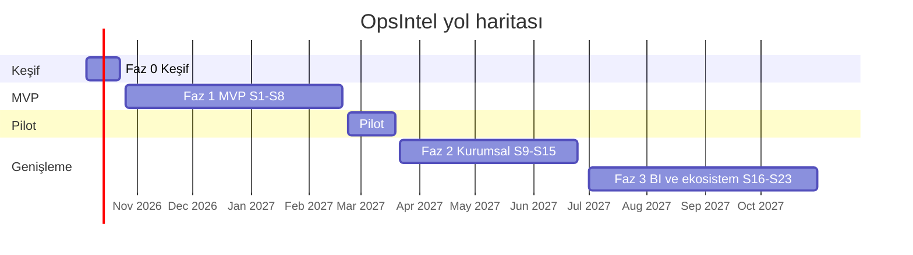

# Yol Haritası

*Kaynak: [araştırma raporu §6](../research/rapor-m365-operasyon-zekasi-platform-plani.md). Tarih: 27 Eylül 2026. Takvim ve kabul eşikleri öneridir; Faz 0 ölçümleriyle kalibre edilecektir.*

**Özet:** 3 hafta keşif, 16 hafta MVP (8 sprint), 4 hafta pilot, ardından iki genişleme fazı. Projenin kritik yolu teknoloji değil **güven ve hukuktur**; belirsizlik iki noktada yoğunlaşır ve ikisi de ilk üç haftada ölçülebilir: Conditional Access/Token Protection altında servis tarafı token edinimi ve yalnızca CPU'lu dizüstülerde Türkçe çıkarım kalitesi. **Faz 0'ı atlayıp doğrudan MVP'ye başlamak planın en pahalı hatası olur.**

## 1. Fazlar ve takvim

| Faz | Hafta | Tarih | Amaç | Çıkış kapısı |
|---|---|---|---|---|
| 0 – Keşif | H1–H3 | 5–23 Eki 2026 | Riskli varsayımları sökmek, iskelet, KVKK iş paketinin başlatılması | 5 spike için git/gitme ADR'leri |
| 1 – MVP | H4–H20 (8 sprint) | 26 Eki 2026 – 19 Şub 2027 | Salt okunur, kanıtlı operasyon kaydı; yerel onaylı aksiyon taslakları | `1.0.0-pilot` imzalı MSI |
| Pilot | H21–H24 | 22 Şub – 19 Mar 2027 | 10–20 kullanıcıyla ölçüm ve düzeltme; Mart'taki Ramazan Bayramı için tampon | [Kalite hedefleri](quality-targets.md) karşılanır, Faz 2 kararı |
| 2 – Kurumsal genişleme | H25–H38 (7 sprint) | 22 Mar – 25 Haz 2027 | M365'e yazma, tray yardımcısı, bulut katmanı, Teams, LAN, Burn/Intune | 1.1 GA |
| 3 – İş zekâsı ve ekosistem | H39–H54 (8 sprint) | Tem – Eki 2027 | BI, süreç madenciliği, MCP, entegrasyonlar, sözleşmeler, ince ayar | 1.2/2.0; AI Act değerlendirmesi 2 Ara 2027'den önce |
| 4 – Ekip/sunucu sürümü (öneri) | 2028 | — | SQL Server 2025 / Azure; .NET 12 LTS'e geçiş (.NET 10 EOL Kas 2028) | — |

*Not: Faz 3 için rapor yalnızca "Tem – Eki 2027" verir; diyagramdaki gün sınırları temsilidir.*

### Dış tarihler

| Tarih | Olay | Etki |
|---|---|---|
| 1 Ekim 2026 | EWS (Exchange Online) varsayılan kapanma başlar; 1 Nisan 2027 son | Ürün etkilenmez; müşteri görüşmelerinde avantaj |
| Kasım 2026 | `sharedWithMe` veri döndürmeyi bırakır | [ADR-0025](../adr/0025-shared-content-discovery.md) |
| Kasım 2026 | Phi Silica → Aion | Windows AI API'leri çekirdek bağımlılık yapılmaz |
| Aralık 2026 sonu | SMTP AUTH Basic varsayılan kapalı | Ürün etkilenmez |
| 2 Aralık 2027 | AB AI Act Annex III yükümlülükleri (Digital Omnibus sonrası) | [ai-act-kapsam.md](../compliance/ai-act-kapsam.md) |
| 14 Kasım 2028 | .NET 10 destek sonu | Faz 4'te .NET 12 LTS geçişi |

## 2. Ekip

| Rol | FTE | Ana sorumluluk |
|---|---|---|
| Ürün sahibi / iş analisti | 1 | Kapsam, pilot kullanıcılar, altın set etiketleme koordinasyonu, kabul |
| Teknik lider / mimar (.NET) | 1 | ADR'ler, Host çekirdeği, kimlik, güvenlik tasarımı |
| Backend geliştirici (.NET) | 2 | Graph konektörleri, normalizasyon, iş/outbox, onay/yürütücü, analitik |
| Frontend geliştirici (React/TS) | 1 | SPA, kanıt gezgini, zaman çizelgesi/akış, panolar |
| AI/NLP mühendisi (TR/EN) | 1 | Promptlar, şemalar, doğrulama, model seçimi, değerlendirme (eval) hattı |
| DevOps + kurulum/QA mühendisi | 1 | WiX, imzalama, CI, Pester matrisi, test otomasyonu |
| UX tasarımcı | 0,5 | İnceleme kuyruğu, kanıt kartları, güven UX'i |
| Güvenlik mühendisi / dış pen test | 0,5 | Tehdit modeli, kırmızı takım korpusu, localhost pen testi |
| KVKK danışmanı / DPO (dış) | 0,25 | Meşru menfaat testi, aydınlatma, DPIA, VERBİS, SS-2 |

Toplam yaklaşık **8,25 FTE**. Beş kişilik minimum ekip (teknik lider, iki backend, bir full-stack, AI mühendisi; DevOps işini de üstlenir) mümkündür; bu durumda MVP yaklaşık **24 haftaya** uzar.

## 3. Faz 0 — Keşif (H1–H3, 5–23 Ekim 2026)

Her spike bir [spike issue şablonu](../../.github/ISSUE_TEMPLATE/spike.md) ile açılır ve bir git/gitme ADR'siyle kapanır.

| Spike | Kapsam | Git kriteri (öneri) | Gitme durumunda | ADR |
|---|---|---|---|---|
| **A** WiX v7 walking skeleton | 2 servis + sertifika + `/health` | Temiz Win11 23H2 ve Server 2022'de `/qn` kurulum; iki servis Running; `/health/ready` Edge/Chrome/Firefox'ta uyarısız; kaldırmada artık kalmaz | Sertifika stratejisi veya servis hesabı (LocalService geri dönüşü) revize | [0004](../adr/0004-https-certificate-strategy.md), [0005](../adr/0005-single-msi-wix-v7.md) |
| **B** Servis tarafı kimlik | Public client PKCE + DPAPI cache + CAE claims challenge; uyumlu cihaz ve Token Protection report-only CA altında test | Arka planda sessiz yenileme ve CAE iptali doğru işleniyor; CA altında engellenmiyor | **Tray/WAM yardımcısı MVP'ye çekilir** | [0007](../adr/0007-delegated-auth-bff-pkce.md) |
| **C** Foundry Local servis içinde | `NT SERVICE` hesabıyla servis içinde çalışma, model önbellek yolu, VC++ bağımlılığı | Model yüklenir ve çıkarım yapar; VC++/WinAppSDK runtime gerekmez (gerekirse Burn kararı) | **Ollama standalone + WinSW'ye geçilir** | [0014](../adr/0014-foundry-local-model-hosting.md) |
| **D** Vektör + şifreleme | `vec0.dll` LoadExtension + SQLite3MC şifrelemesinin birlikte çalışması | Aynı bağlantıda şifreli DB + vektör sorgusu | Süreç içi .NET vektör indeksi veya başka şifreleme sağlayıcısı | [0010](../adr/0010-sqlite-fts5-vector-blob-storage.md), [0011](../adr/0011-encryption-at-rest.md) |
| **E** Türkçe çıkarım ön ölçümü | 50 başlıkta Qwen3.5-9B / Gemma 4 12B / Qwen3-30B-A3B ve bulut modeli | Sonuç CPU'lu makineler için katman politikasını belirler (kesin eşik kaynaklarda yok; S5 başlangıç çizgileri referans) | Katman 2 (KVKK sonrası) veya kapsam daraltma | [0014](../adr/0014-foundry-local-model-hosting.md), [0015](../adr/0015-extraction-contract-evidence.md) |

Ek Faz 0 teslimatları: Entra uygulama kaydı; depo ve CI iskeleti; ADR 0001–0012'nin kesinleştirilmesi; KVKK iş paketinin başlatılması; altın set için rıza ve maskeleme prosedürü; kod imzalama sertifikası satın alma sürecinin başlatılması ([ADR-0006](../adr/0006-code-signing.md)).

## 4. MVP sprint kırılımı

| Sprint (hafta, tarih) | Odak | Teslimatlar | Kabul kriterleri |
|---|---|---|---|
| **S1** (H4–H5, 26 Eki–6 Kas) | Platform çekirdeği | Host servisi, Event Log kaynağı, Kestrel loopback 6500 + registry thumbprint, Host/Origin/CSP ara katmanları, health uç noktaları; SQLite + EF geçişleri + geçiş öncesi yedek; `audit_event` hash zinciri; SetupHelper; MSI v0.1 (2 servis, ACL'ler, registry, MajorUpgrade); CI: derleme + test imzası + Pester smoke | Temiz Win11 23H2 ve Server 2022'de `msiexec /qn` sonrası iki servis Running. `https://localhost:6500/health/ready` Edge, Chrome ve Firefox'ta sertifika uyarısı olmadan açılıyor. Süreç öldürüldüğünde SCM 60 sn içinde yeniden başlatıyor. Kaldırmadan sonra servis veya sertifika kalmıyor |
| **S2** (H6–H7, 9–20 Kas) | Kimlik ve M365 bağlantısı | BFF oturum açma; ilk çalıştırma sihirbazı (admin consent bağlantısı, klasör/site seçimi, saklama süresi, model indirme); DPAPI token kasası; klasör başına mail delta, immutable ID, posta kutusu başına semafor (4), Retry-After, 410/syncStateNotFound yeniden senkronizasyonu; ham MIME → blob | 10.000 e-postalık ilk senkronizasyon hatasız, ele alınmamış 429 yok. Kesinti sonrası deltaLink'ten devam. Token iptalinde arayüz yeniden oturum açma uyarısı. Log taramasında gövde metni yok |
| **S3** (H8–H9, 23 Kas–4 Ara) | Normalizasyon ve belgeler | Başlık zinciri + conversationId + konuyla başlık yeniden kurma; `uniqueBody` + TR/EN alıntı/imza/yasal not soyucu ve ofset haritası; paragraf bazında dil tespiti; Parser alt süreci; seçili SharePoint/OneDrive sürücülerinde delta + followedSites + `/search/query` ile keşif; FTS5 trigram | Başlık yeniden kurma doğruluğu altın/sentetik sette ≥ %95. Soyucu TR/EN yanıtların ≥ %90'ında alıntı geçmişini temizliyor. Parser'a hata enjekte edildiğinde servisler ayakta |
| **S4** (H10–H11, 7–18 Ara) | AI servisi temeli | Intelligence servisi; Foundry Local; model manifesti (hash sabitli); donanım profili (GPU/NPU/CPU) → model katmanı; triage (aksiyon gerektiren / bildirim / bülten); embedding + `IVectorIndex` + RRF hibrit arama; politika kapısı (hariç tutma, etiket, özel nitelikli veri sınıflandırıcısı, "Kişisel/Özel" kategorisiyle çıkış) | Triage "aksiyon gerektiren" sınıfında kesinlik ≥ 0,85. Hariç tutulan test öğelerinin %100'ü LLM'e ulaşmıyor. 100 bin parçada arama p95 < 1 sn |
| **S5** (H12–H14, 21 Ara–8 Oca; tatil nedeniyle 3 hafta) | Kanıtlı çıkarım | Üç küçük şema (karar/risk/açık soru; taahhüt/talep/aksiyon; proje sinyali); prompt sürümleme; spotlighting; doğrulama merdiveni (alıntı eşleşmesi, mesajın başlığa aitliği, yazar kontrolü); güven kategorileri; `ExtractionRun` kaydı; Türkçe tarih normalizasyonu ("Cuma'ya kadar", "ay sonu") ve TR iş takvimi | Gösterilen öğelerin %100'ünün alıntısı kaynakta birebir. Madde düzeyi F1: taahhüt/talep ≥ 0,65, karar/risk ≥ 0,60. Termin ±1 gün doğruluğu ≥ 0,80. Kırmızı takım korpusunda enjeksiyon kaynaklı sahte öğe < %5 |
| **S6** (H15–H16, 11–22 Oca) | Projeler ve aşamalar | Proje kayıt defteri (takma adlar, kodlar, üye listesi); ilk k aday + "yeni" sınıflandırması; atanmamış havuzun kümelenmesi → proje önerisi; yapılandırılabilir aşama FSM'i + kanıtlı geçiş olayları + "kapı kartları"; OCEL biçimli olay tablosu; sağlık sürücüleri | Bilinen projelerde atama doğruluğu ≥ 0,85. Güven eşiği aşılmadan veya kullanıcı onayı olmadan aşama değişmiyor. Her sağlık sürücüsü tıklanınca kanıtına gidiyor |
| **S7** (H17–H18, 25 Oca–5 Şub) | Kullanıcı deneyimi | İşlerim, Beklediklerim; klavyeyle inceleme kuyruğu (A/E/R + gerekçe kodu + geri al); satır içi alıntılı kanıt kartları ve "Outlook'ta aç"; proje sayfası (RAID/RAIDD, karar zinciri); zaman çizelgesi ve olay akışı; temel portföy panosu; yerel aksiyon önerileri → onay → denetim; dışa aktarım (kopyala/.eml/.md); SSE; "Sor" | 5 pilot kullanıcıyla kullanılabilirlik testi. Sayfa yükleme p95 < 2 sn. CSP testlerinde uzak içerik yüklenmiyor. Her onay kaydında önce/sonra farkı ve kanıt ID'leri var |
| **S8** (H19–H20, 8–19 Şub) | Sertleştirme ve pilot sürüm | DB şifrelemesi + DPAPI anahtarı; BitLocker ön kontrolü; tanı paketi; OTel yönetici sayfası; hız sınırları; localhost pen testi (DNS rebinding, CSRF, Host başlığı); SBOM; üretim imzası; kurulum matrisi (kurulum, N-1'den yükseltme, onarım, kaldırma ± REMOVE_DATA); sessiz kurulum, Intune ve GPO belgeleri; KVKK paketi (aydınlatma, imzalı onaylar, DPIA, VERBİS güncellemesi) | Pester matrisi %100 yeşil. Pen testte açık yüksek/kritik bulgu yok. **DPO'nun canlıya geçiş kontrol listesi imzalı.** `1.0.0-pilot` yayımlandı |

> **KVKK kabul kriteri:** İmzalı aydınlatma ve BT/AI kullanım politikası canlıya geçişin önkoşuludur ([KVKK](../compliance/kvkk/README.md)).

MVP kapsamı: [mvp-scope.md](mvp-scope.md). Kalite hedefleri: [quality-targets.md](quality-targets.md). Riskler: [risk-register.md](risk-register.md).

## 5. Faz 2 ve Faz 3 özeti

| Sprint | Faz 2 (H25–H38) | Sprint | Faz 3 (H39–H54) |
|---|---|---|---|
| S9 | Yazma yürütücüsü: artımlı Mail.ReadWrite onayı, `createReply` taslakları (immutable ID), If-Match ETag, uç nokta izin listesi | S16 | KPI kataloğu: kuruluş bazında taahhüt güvenilirliği, karar hızı, açık soru yaşlanması, risk maruziyeti trendi, darboğazlar |
| S10 | To Do/Planner görevleri, katılımcısız takvim kaydı; eylem türü başına otonomi seviyesi (0–2), çok adımlı onay, acil durdurma anahtarı | S17 | Süreç haritası (directly-follows), aşama Sankey'i, OCEL 2.0 dışa aktarımı |
| S11 | Tray yardımcısı: WAM token köprüsü, Windows bildirimleri, sessiz saatler; günlük brifing | S18 | "Projelerine sor": LazyGraphRAG tarzı küresel özetler + sayısal sorular için text-to-SQL |
| S12 | Organizasyon 360; ilişki bazlı hatırlatma taslakları; karar günlüğü ve RAID dışa aktarımı (DOCX/XLSX/MD) | S19 | Salt okunur yerel MCP sunucusu (spec 2026-07-28), istemci başına token |
| S13 | Bulut katman 2 (Azure OpenAI EU DataZone, Batch), takma adlandırma, maliyet tavanları; Purview `processContent`/`contentActivities` | S20 | Entegrasyonlar: Jira/Azure DevOps'a gönderme; ERP (Logo/Netsis/SAP B1) salt okunur PO/fatura durumu |
| S14 | Teams transkriptleri (delegated, admin consent) ve toplantı hazırlık brifingi; LAN modu (kurumsal PKI, güvenlik duvarı, yönlendirme URI'leri, çok kullanıcı) | S21 | Sözleşme yükümlülük çıkarımı (CUAD kategorileri) → yenileme/fesih hatırlatmaları |
| S15 | Burn `Setup.exe`, Intune Win32 paketi, winget manifesti; **1.1 GA** | S22–S23 | Onay verisinden LoRA ince ayar hattı (opsiyonel); Event Hubs modu; Outlook web eklentisi (masaüstü); yayıncı doğrulaması + Publisher Attestation; AI Act md. 6(3) belgesi |

Not: S13'te "Batch" ifadesi rapordaki Faz 2 tablosundan alınmıştır; katman 2 ön koşulları (rapor §4) Global/Batch-Global dağıtımları dışlar — Batch'in hangi dağıtım türüyle kullanılacağı S13 öncesinde netleştirilmelidir.

Ek geliştirme önerilerinin tam listesi: [additional-developments.md](../product/additional-developments.md).

## 6. Bütçe kalemleri

Rapor kalem düzeyinde bütçe verir; toplam tutar vermez:

- WiX OSMF: kuruluş büyüklüğüne göre ayda 10–60 $
- OV kod imzalama sertifikası (bulut HSM)
- Pilot için GPU'lu iş istasyonları: 16 GB+ VRAM, 14–30B sınıfı modeller için
- Dış pen test
- KVKK hukuk danışmanlığı
- Opsiyonel Azure OpenAI tüketimi
